# Бизнес-процессы и потоки данных LSE Trading System

> **Актуальная карта архитектуры и потоков (читать первым):** [docs/ARCHITECTURE.md](docs/ARCHITECTURE.md).  
> Ниже — развёрнутые пошаговые диаграммы (Mermaid) по инициализации, котировкам, новостям, исполнению, Telegram и деплою.

Данный документ описывает основные бизнес-процессы и потоки данных системы автоматической торговли на Лондонской фондовой бирже в стандартной нотации [Mermaid](https://mermaid.js.org/), которая поддерживается в Markdown и GitHub.

## Содержание

1. [Инициализация системы и загрузка данных](#1-инициализация-системы-и-загрузка-данных)
2. [Обновление цен котировок](#2-обновление-цен-котировок)
3. [Импорт и обработка новостей](#3-импорт-и-обработка-новостей)
4. [Анализ торговых сигналов](#4-анализ-торговых-сигналов)
5. [Исполнение сделок](#5-исполнение-сделок)
6. [Управление рисками (стоп-лоссы)](#6-управление-рисками-стоп-лоссы)
7. [Генерация отчетов](#7-генерация-отчетов)
8. [Векторная база знаний](#8-векторная-база-знаний)
9. [Диаграммы взаимодействия компонентов](#9-диаграммы-взаимодействия-компонентов)
10. [Telegram бот-агент и вебхук](#10-telegram-бот-агент-и-вебхук)
11. [Развёртывание (Cloud Run и сервер БД/КБ)](#11-развёртывание-cloud-run-и-сервер-бдкб)

---

## 1. Инициализация системы и загрузка данных

### 1.1. Процесс инициализации базы данных

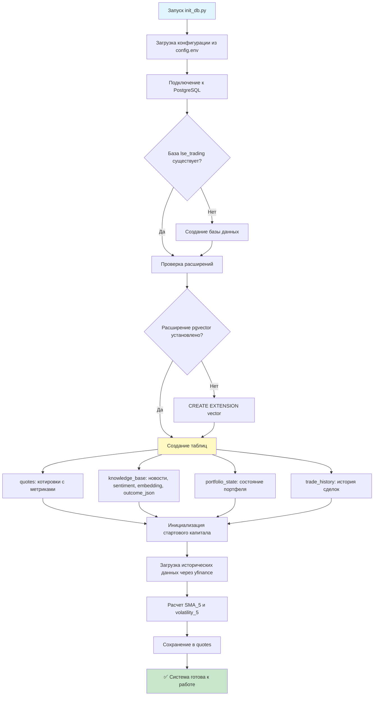

**Комментарий**: Процесс инициализации создает структуру базы данных и загружает начальные исторические данные. Расширение `pgvector` необходимо для работы с векторными embeddings в будущем. Стартовый капитал устанавливается в 100,000 USD.

### 1.2. Загрузка исторических данных

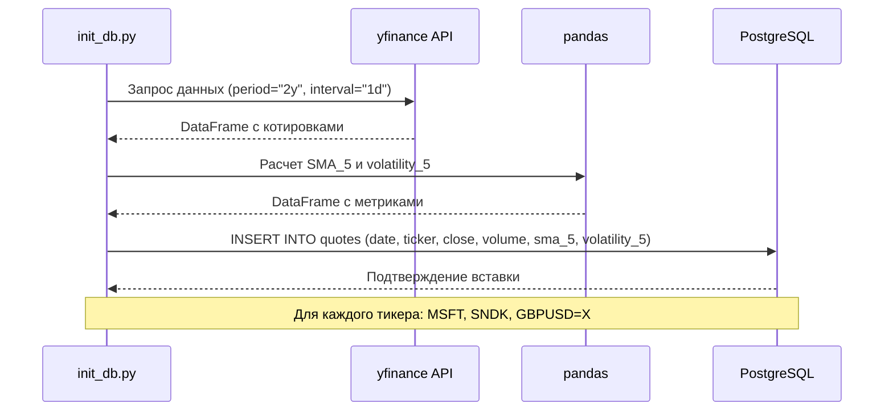

**Комментарий**: Используется библиотека `yfinance` для получения исторических данных. Метрики SMA (Simple Moving Average) и волатильность рассчитываются через pandas и сохраняются вместе с котировками для последующего технического анализа.

---

## 2. Обновление цен котировок

### 2.1. Процесс обновления цен

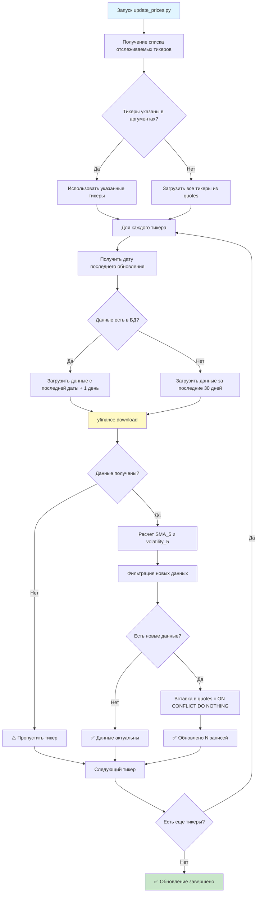

**Комментарий**: Процесс обновления цен можно запускать вручную или через cron для автоматического обновления. Скрипт умно определяет, какие данные нужно загрузить, чтобы не дублировать записи. Используется `ON CONFLICT DO NOTHING` для идемпотентности.

### 2.2. Автоматическое обновление через cron

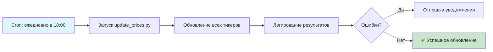

**Комментарий**: Рекомендуется настроить cron для автоматического обновления цен после закрытия торговой сессии. Это обеспечивает актуальность данных для следующего торгового дня.

---

## 3. Импорт и обработка новостей

### 3.1. Процесс добавления новостей

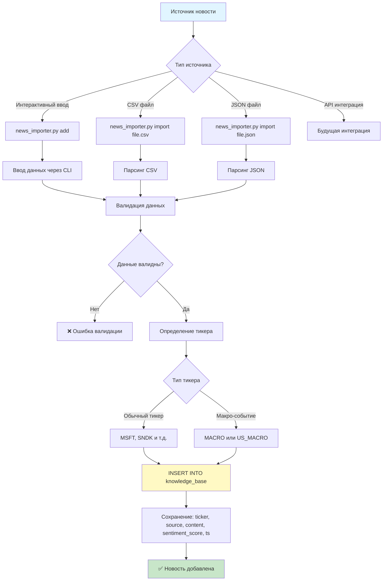

**Комментарий**: Новости добавляются в таблицу `knowledge_base` с sentiment score. Макро-события (MACRO, US_MACRO) имеют больший временной лаг влияния (72 часа) по сравнению с обычными новостями (24 часа). Sentiment score может быть указан вручную или рассчитан автоматически в будущем.

### 3.2. Временной лаг для разных типов новостей

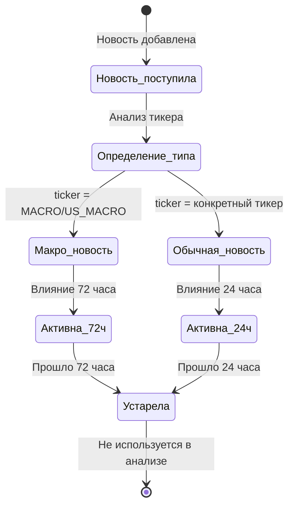

**Комментарий**: Макро-события (например, данные по инфляции, процентным ставкам) имеют более длительное влияние на рынок, поэтому учитываются в течение 72 часов. Новости по конкретным компаниям обычно влияют быстрее, поэтому временной лаг составляет 24 часа.

### 3.3. Новостной сигнал, горизонты и политика (целевой контур)

Агрегированный **новостной сигнал** (этап A), затем **fusion / арбитраж** с техникой и корреляциями (этап B), опциональные LLM, кэш по бэтчам и горизонты 1D / 3D / 5D — описаны в отдельном документе, чтобы не дублировать здесь устаревающие детали: [docs/NEWS_SIGNAL_ARCHITECTURE.md](docs/NEWS_SIGNAL_ARCHITECTURE.md).

---

## 4. Анализ торговых сигналов

### 4.1. Процесс принятия решения AnalystAgent

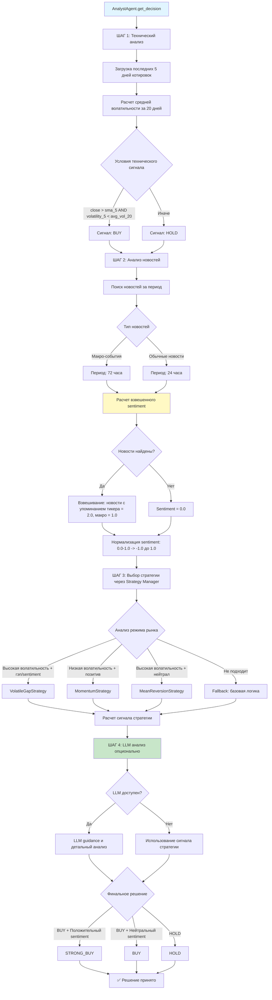

**Комментарий**: Процесс принятия решения комбинирует технический анализ (тренд и волатильность) с анализом новостей (sentiment). Взвешенный sentiment нормализуется в центрированную шкалу (-1.0 до 1.0) для удобства математических операций. Strategy Manager автоматически выбирает оптимальную стратегию на основе режима рынка (волатильность, sentiment, гэпы). LLM анализ (опционально) предоставляет дополнительное обоснование и рекомендации.

### 4.2. Расчет взвешенного sentiment

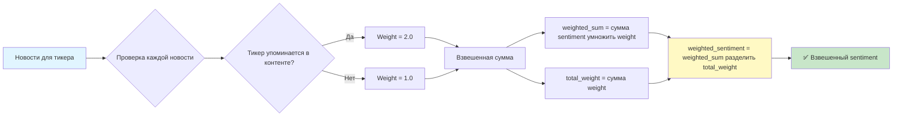

**Комментарий**: Взвешивание позволяет учитывать, что новости, напрямую упоминающие тикер, более релевантны, чем общие макро-новости. Это улучшает качество sentiment анализа.

---

## 5. Исполнение сделок

### 5.1. Процесс исполнения сделок ExecutionAgent

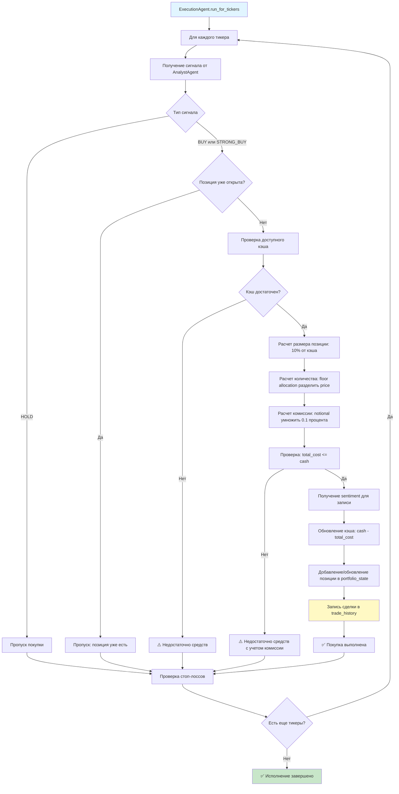

**Комментарий**: ExecutionAgent использует консервативный подход: размер позиции ограничен 10% от доступного кэша, что позволяет диверсифицировать портфель. Комиссия учитывается при расчете стоимости сделки (0.1% от номинала). Все сделки записываются в `trade_history` с сохранением sentiment на момент сделки для последующего анализа.

### 5.2. Управление позициями

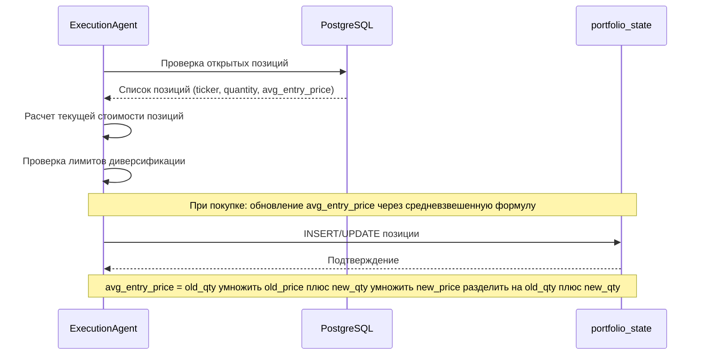

**Комментарий**: Система использует средневзвешенную цену входа для расчета средней стоимости позиции при добавлении новых лотов. Это важно для правильного расчета PnL при частичном закрытии позиции.

---

## 6. Управление рисками (стоп-лоссы)

### 6.1. Процесс проверки стоп-лоссов

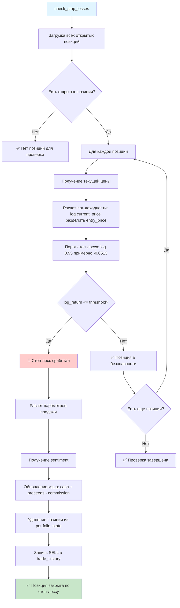

**Комментарий**: Стоп-лосс установлен на уровне 5% падения от цены входа (используется лог-доходность для корректного расчета). Это защищает от больших потерь при неблагоприятном движении цены. Лог-доходность используется вместо простого процента для более точного расчета, особенно при больших изменениях цены.

### 6.2. Расчет лог-доходности

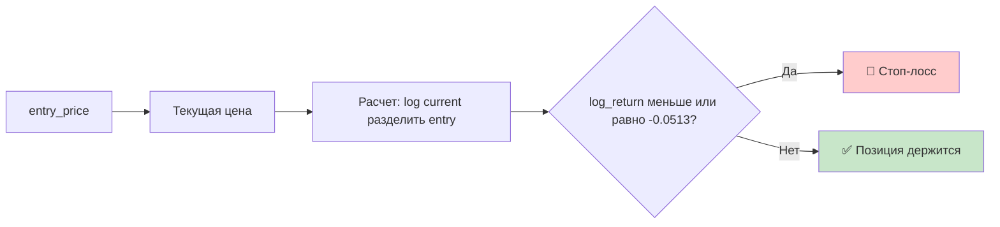

**Комментарий**: Использование лог-доходности (log-returns) является стандартной практикой в финансовых расчетах, так как она обладает свойством аддитивности и лучше отражает реальную доходность при больших изменениях цены.

---

## 7. Генерация отчетов

### 7.1. Процесс генерации отчетов

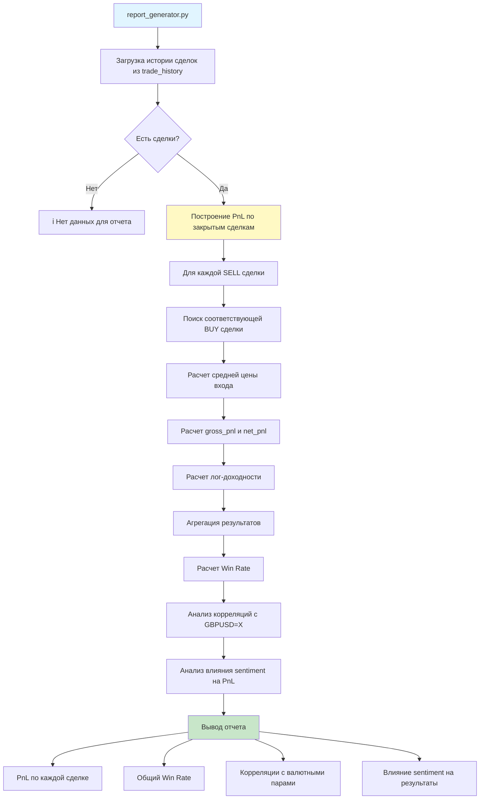

**Комментарий**: Отчеты позволяют анализировать эффективность торговой стратегии. Win Rate показывает процент прибыльных сделок, корреляции помогают понять влияние валютных факторов, а анализ sentiment показывает, насколько хорошо sentiment анализ предсказывает результаты сделок.

### 7.2. Расчет PnL по закрытым сделкам

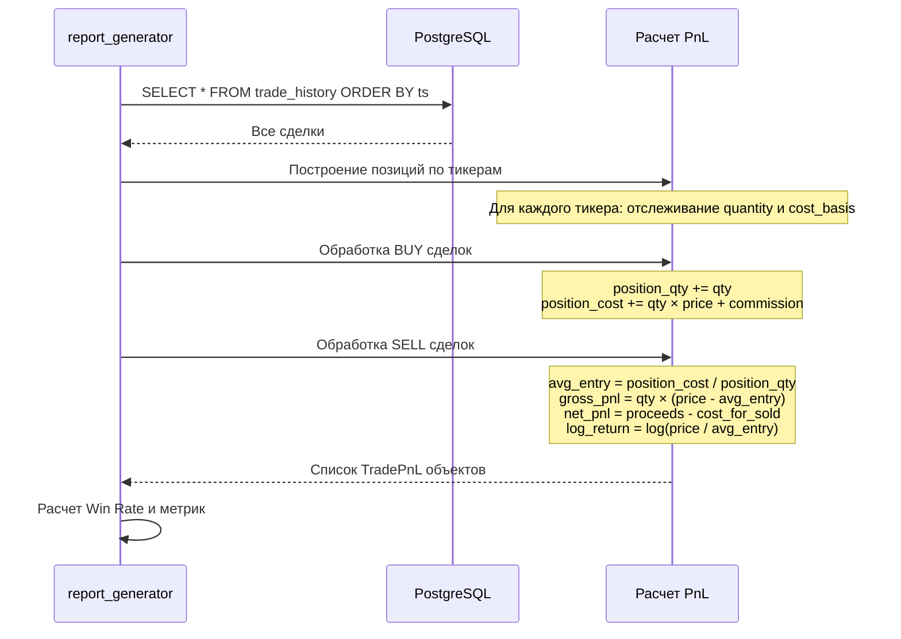

**Комментарий**: Расчет PnL использует модель средневзвешенной цены входа (FIFO-подобный подход). Это позволяет корректно рассчитывать прибыль/убыток даже при частичном закрытии позиций.

### 7.3. Анализатор эффективности сделок и автотюнинг (dataflow по времени)

Ниже — бизнес-процесс анализатора как **временной цикл**: торговля → пост‑анализ → (опционально) применение параметров → ожидание эффекта → повтор.

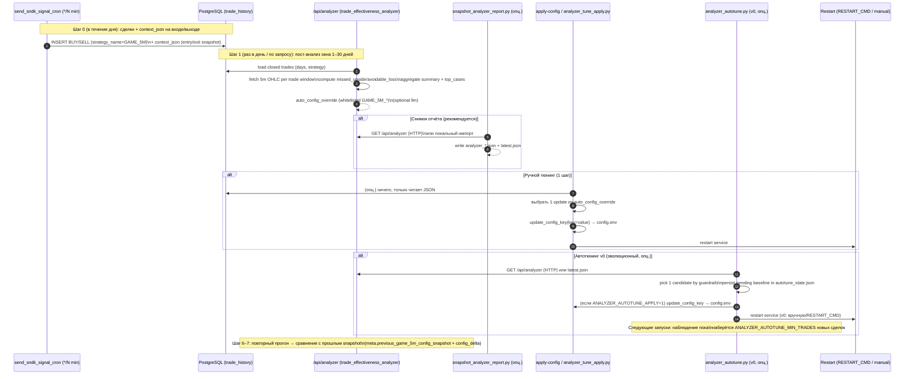

**Комментарий**:
- Анализатор — **постфактум** контур: он не “торгует”, а делает диагностику и предлагает изменения `GAME_5M_*`.
- Применять изменения рекомендуется **по одному** (чтобы понимать причинность) и сравнивать эффект на следующем окне.
- Для воспроизводимости анализатор возвращает текущие параметры в `meta.current_decision_rule_params` и “память” о прошлом прогоне (если включено).

---

## 8. Векторная база знаний

### 8.1. Процесс использования векторной БЗ (планируется)

```mermaid
flowchart TD
    A[Новость добавлена в knowledge_base] --> B[Автоматическая синхронизация]
    B --> C[Генерация embedding (sentence-transformers или API)]
    C --> D[Сохранение в knowledge_base: колонка embedding]
    
    E[AnalystAgent.get_decision] --> F[Формирование запроса]
    F --> G[Генерация embedding для запроса]
    G --> H[Векторный поиск в knowledge_base WHERE embedding IS NOT NULL]
    
    H --> I[Поиск топ-5 похожих событий]
    I --> J[Анализ исходов похожих событий]
    J --> K[Улучшение торгового решения]
    
    style A fill:#e1f5ff
    style K fill:#c8e6c9
    style C fill:#fff9c4
```

**Комментарий**: Векторный поиск реализован в той же таблице **knowledge_base** (колонка embedding). Семантический поиск и анализ исходов (outcome_json) — см. [docs/NEWS.md](docs/NEWS.md), [docs/VECTOR_KB_USAGE.md](docs/VECTOR_KB_USAGE.md).

### 8.2. Интеграция векторного поиска в анализ

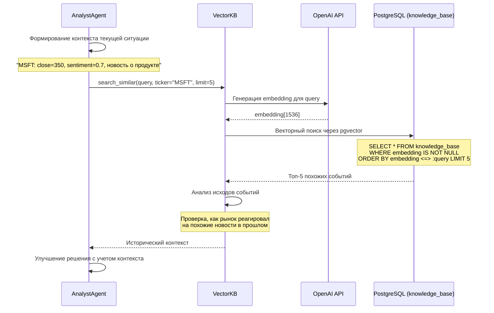

**Комментарий**: Векторный поиск позволяет находить похожие события по смыслу, а не только по ключевым словам. Это особенно полезно для анализа ситуаций, которые похожи по сути, но выражены разными словами. **Статус**: Планируется.

---

## 9. Диаграммы взаимодействия компонентов

### 9.1. Общая архитектура системы

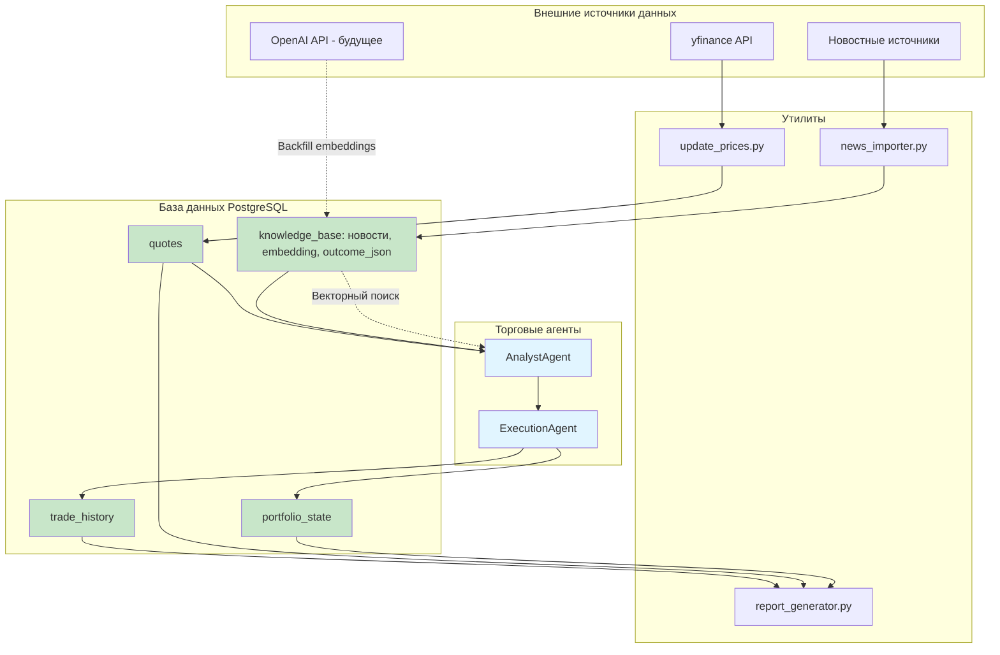

**Комментарий**: Система построена на модульной архитектуре. Каждый компонент имеет четкую ответственность: AnalystAgent анализирует, ExecutionAgent исполняет, утилиты обновляют данные и генерируют отчеты. Векторная БЗ интегрируется в процесс анализа для улучшения качества решений.

### 9.2. Поток данных: от обновления цен до исполнения сделки

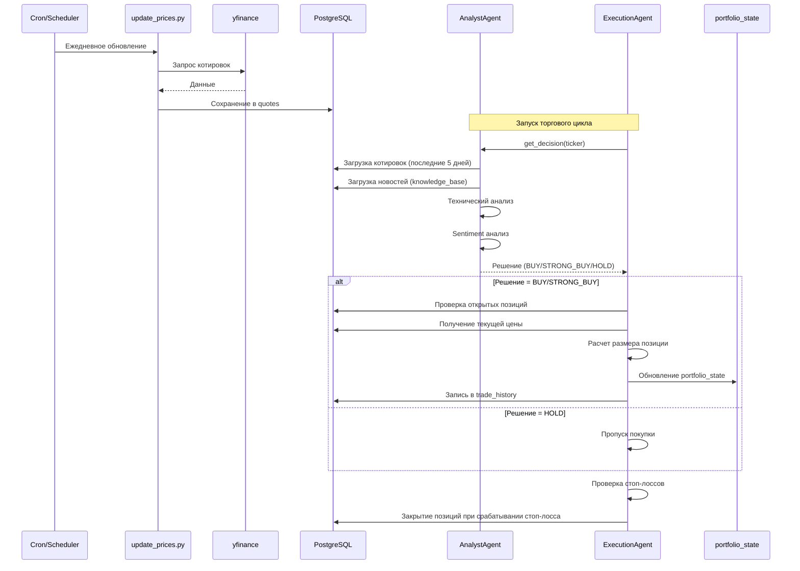

**Комментарий**: Полный цикл от обновления данных до исполнения сделок. Система работает автономно после настройки cron для обновления цен. Торговый цикл можно запускать вручную или автоматически.

### 9.3. Управление портфелем и рисками

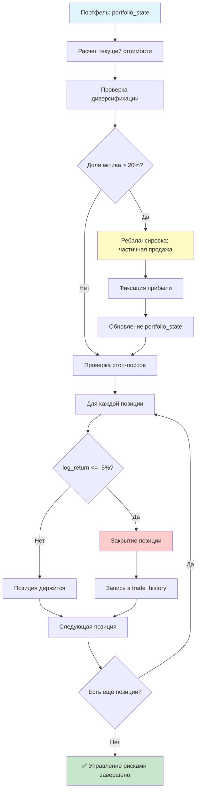

**Комментарий**: Система управления рисками включает два уровня защиты: ребалансировку портфеля (ограничение доли одного актива) и стоп-лоссы (защита от больших потерь). Ребалансировка пока не реализована, но запланирована в ROADMAP.

---

## 10. Telegram бот-агент и вебхук

### 10.1. Общий поток: пользователь → бот → сервисы LSE

```mermaid
flowchart TD
    A[Пользователь в Telegram] --> B[Сообщение / команда]
    B --> C[Telegram API → webhook URL]
    C --> D[Cloud Run: LSE Bot Service]
    
    D --> E{Тип запроса}
    E -->|Команда /signal| H[Анализ сигналов / Analyst Agent]
    E -->|Команда /news| G[Запрос к knowledge_base]
    E -->|Команда /price| P[Текущая цена из quotes]
    E -->|Команда /chart| C[График цены (matplotlib)]
    E -->|Команда /ask| A[Вопросы (LLM + анализ)]
    E -->|Команда /tickers| T[Список тикеров]
    E -->|/portfolio, /buy, /sell, /history| EX[ExecutionAgent: портфель и сделки]
    E -->|Команда /recommend| REC[Рекомендация: сигнал + параметры управления]
    
    G --> L[PostgreSQL: knowledge_base]
    H --> M[Analyst Agent + quotes, sentiment]
    P --> Q[PostgreSQL: quotes]
    C --> Q
    A --> L
    A --> LLM[LLM Service]
    A --> M
    T --> Q
    EX --> Q
    EX --> PS[portfolio_state + trade_history]
    REC --> M
    REC --> RM[risk_limits: стоп-лосс, размер позиции]
    
    L --> P[Форматирование ответа]
    M --> P
    Q --> P
    LLM --> P
    PS --> P
    RM --> P
    
    P --> Q[Ответ в Telegram]
    Q --> A
    
    style A fill:#e1f5ff
    style D fill:#fff9c4
    style Q fill:#c8e6c9
```

**Комментарий**: Бот принимает входящие обновления через webhook (HTTPS), обрабатывает команды и свободный текст, обращается к БД и агентам LSE, возвращает ответ пользователю. 

**Доступные команды:**
- `/signal <ticker>` - полный анализ (решение, цена, RSI, sentiment, стратегия)
- `/news <ticker> [N]` — новости из `knowledge_base` (окно `KB_NEWS_LOOKBACK_HOURS`, по умолч. ~14 дней): HTML в чат + файл; **draft_bias**, **news.bias**, режим Gate (как nyse GAME_5M); см. `services/kb_news_report.py`
- `/price <ticker>` - текущая цена инструмента
- `/chart <ticker> [days]` - график цены за период (дневные данные)
- `/ask <вопрос>` - задать вопрос боту (LLM для понимания естественного языка)
- `/tickers` - список отслеживаемых инструментов
- **Песочница (виртуальные сделки):** `/portfolio` - портфель и P&L; `/buy <ticker> <кол-во>` - покупка по последней цене из `quotes`; `/sell <ticker> [кол-во]` - продажа (полная или частичная); `/history [N]` - последние сделки; `/recommend <ticker>` - рекомендация по входу и параметрам управления (стоп-лосс, размер позиции).

**Где хранятся сделки:**
- `portfolio_state` - текущий кэш (CASH) и открытые позиции (ticker, quantity, avg_entry_price).
- `trade_history` - каждая сделка: ts, ticker, side (BUY/SELL), quantity, price, commission, signal_type (MANUAL / STOP_LOSS / BUY / SELL), total_value, sentiment_at_trade, strategy_name. Актуальная схема таблиц: `docs/DATABASE_SCHEMA.md`; логика портфельной игры: `docs/PORTFOLIO_GAME.md`.

**Особенности:**
- Автоматическая нормализация тикеров (GC-F → GC=F)
- Распознавание естественных названий (золото → GC=F, фунт → GBPUSD=X)
- Поддержка множественных тикеров в одном запросе
- LLM используется для `/ask` и для ответов на вопросы вида «когда открыть позицию и какие параметры советуешь»
- Работа в группах через команду `/ask`

При деплое «Cloud Run + VM» бот и API — на Cloud Run, БД и cron — на VM; возможен вариант «всё на одной VM» (см. раздел 11).

### 10.2. Маршрутизация webhook и обработчики

```mermaid
flowchart LR
    subgraph Telegram[Telegram]
        A[Update]
    end
    
    A -->|POST /webhook| B[Cloud Run: Bot API]
    
    subgraph BotAPI[LSE Bot Service]
        B --> C{Тип update}
        C -->|message| D[Router сообщений]
        C -->|callback_query| E[Обработчик кнопок]
        C -->|не message| F[Игнор / лог]
        
        D --> G{Команда или текст}
        G -->|/start, /help| H[Приветствие и справка]
        G -->|/signal| K[Handler: сигналы/анализ]
        G -->|/news| J[Handler: новости/календарь]
        G -->|/price| P[Handler: текущая цена]
        G -->|/chart| C[Handler: график цены]
        G -->|/ask| A[Handler: вопросы (LLM)]
        G -->|/tickers| T[Handler: список тикеров]
        G -->|/portfolio, /buy, /sell, /history| EX[Handler: ExecutionAgent]
        G -->|/recommend| REC[Handler: рекомендация по тикеру]
        G -->|Текст (в группах игнорируется)| M[Используйте /ask]
    end
    
    K --> N[(PostgreSQL)]
    J --> N
    P --> N
    C --> N
    A --> N
    A --> LLM[LLM Service]
    T --> N
    EX --> N
    EX --> PS[portfolio_state, trade_history]
    REC --> N
    
    N --> O[Ответ в Telegram]
    LLM --> O
    H --> O
    E --> O
    F --> O
    
    style B fill:#fff9c4
    style N fill:#e1f5ff
```

**Комментарий**: Webhook получает все типы update; основная логика — в `message`. Команды маппятся на отдельные handler'ы; произвольный текст идёт в агента с доступом к knowledge_base (новости и векторный поиск по embedding).

### 10.3. Размещение компонентов (Cloud Run + VM)

```mermaid
flowchart TB
    subgraph External[Внешний мир]
        TG[Telegram]
        CRON[Cron / Scheduler]
    end
    
    subgraph GCP[Cloud Run]
        BOT[LSE Bot Service<br/>webhook + handlers]
        API[LSE API Service<br/>отчёты, статус, данные]
    end
    
    subgraph Server[Отдельный сервер<br/>когда будет готов]
        PG[(PostgreSQL<br/>lse_trading)]
        KB[(knowledge_base)]
    end
    
    TG -->|HTTPS webhook| BOT
    CRON -->|Вызов API или скрипт| API
    
    BOT --> PG
    BOT --> KB
    API --> PG
    API --> KB
    
    style BOT fill:#fff9c4
    style API fill:#fff9c4
    style PG fill:#c8e6c9
    style KB fill:#c8e6c9
```

**Комментарий**: При варианте «Cloud Run + VM» Telegram и API работают на Cloud Run, Postgres и knowledge_base — на VM; подключение по `DATABASE_URL`. Альтернатива — всё на одной VM (см. раздел 11, `docs/DEPLOY.md` и `docs/DEPLOY_GCP.md`).

---

## 11. Развёртывание

Два варианта: **одна VM** (Postgres + cron + бот) или **Cloud Run** (бот/API) + **VM** (БД + cron). Команды, переменные окружения и сравнение стоимости — в **docs/DEPLOY.md** и **docs/DEPLOY_GCP.md**.

```mermaid
flowchart LR
    subgraph Deploy[Деплой]
        GIT[GitHub] --> BUILD[Cloud Build]
        BUILD --> RUN[Cloud Run: Bot + API]
        RUN --> SERVER[VM: Postgres + cron]
    end
    style RUN fill:#fff9c4
    style SERVER fill:#c8e6c9
```

---

## Примечания

### Использование диаграмм

1. **Mermaid поддерживается в:**
   - ✅ GitHub/GitLab (автоматически рендерится)
   - ✅ VS Code (с расширением Mermaid Preview)
   - ✅ Онлайн-редакторы: [mermaid.live](https://mermaid.live)

2. **Редактирование:**
   - Диаграммы можно редактировать прямо в Markdown
   - Для сложных диаграмм используйте [mermaid.live](https://mermaid.live) для визуализации

### Связь с кодом

Эти диаграммы соответствуют:
- `analyst_agent.py` — анализ торговых сигналов
- `execution_agent.py` — исполнение сделок
- `init_db.py` — инициализация БД
- `update_prices.py` — обновление цен
- `news_importer.py` — импорт новостей
- `report_generator.py` — генерация отчетов
- `vector_kb` / sync cron — векторный поиск по `knowledge_base.embedding` (см. [docs/VECTOR_KB_USAGE.md](docs/VECTOR_KB_USAGE.md))
- Telegram бот: webhook, handlers, команды `/signal`, `/news`, `/price`, `/chart`, `/ask`, `/tickers`, песочница: `/portfolio`, `/buy`, `/sell`, `/history`, `/recommend` (см. раздел 10)
- Документация по сделкам: `docs/DATABASE_SCHEMA.md` и `docs/PORTFOLIO_GAME.md`
- Деплой: варианты «одна VM» или «Cloud Run + VM» (см. раздел 11, `docs/DEPLOY.md` и `docs/DEPLOY_GCP.md`)
- Премаркет и игры: `setup_cron.sh` — расписание (5m каждые 5 мин, портфельная 9/13/17, премаркет 16:30 MSK). Премаркет: `scripts/premarket_cron.py`, `services/premarket.py`; актуальное описание — [docs/GAME_5M_PREMARKET_AND_IMPULSE.md](docs/GAME_5M_PREMARKET_AND_IMPULSE.md); старое резюме — [docs/archive/RESUME_PREMARKET_AND_RECENT.md](docs/archive/RESUME_PREMARKET_AND_RECENT.md)
- Уведомления в Telegram: `services/telegram_signal.py` — общая рассылка (get_signal_chat_ids, send_telegram_message). Сигналы 5m — `send_sndk_signal_cron.py`; сделки портфельной игры — `trading_cycle_cron.py` после run_for_tickers (те же TELEGRAM_SIGNAL_CHAT_IDS). В боте `/history [тикер] [N]` — фильтр по тикеру, в ответе стратегия (GAME_5M / Portfolio / Manual).

### Обновление диаграмм

При изменении бизнес-логики обновляйте соответствующие диаграммы в этом файле и краткую схему в [docs/ARCHITECTURE.md](docs/ARCHITECTURE.md). Диаграммы должны быть согласованы с кодом.

---

**Последнее обновление**: 2026-03-27  
**Версия системы**: 1.4.0

### Изменения в версии 1.4.0:
- ✅ Песочница в Telegram: `/portfolio`, `/buy`, `/sell`, `/history [тикер] [N]` — виртуальные сделки через ExecutionAgent; в `/history` — фильтр по тикеру и отображение стратегии
- ✅ Уведомления о сделках портфельной игры в те же чаты (trading_cycle_cron → telegram_signal); общий модуль `services/telegram_signal.py`
- ✅ `/recommend <ticker>` — рекомендация по входу и параметрам управления (стоп-лосс, размер позиции)
- ✅ В `/ask` — ответы на вопросы «когда открыть позицию», «какие параметры советуешь» с учётом сигнала и risk_limits
- ✅ Документация: `docs/DATABASE_SCHEMA.md` и `docs/PORTFOLIO_GAME.md` — схема БД и актуальная логика сделок
- ✅ Обновлены диаграммы раздела 10 (поток запросов и маршрутизация)

### Изменения в версии 1.3.0:
- ✅ Добавлена команда `/chart` - график цены за период (дневные данные)
- ✅ Добавлена команда `/ask` - вопросы на естественном языке с поддержкой LLM
- ✅ Улучшена нормализация тикеров (GC-F → GC=F, GBPUSD-X → GBPUSD=X)
- ✅ Поддержка множественных тикеров в одном запросе
- ✅ Распознавание естественных названий (золото → GC=F, фунт → GBPUSD=X)
- ✅ LLM используется только для команды `/ask` (понимание вопросов)
- ✅ Добавлена стратегия Neutral для неопределённых рыночных режимов
- ✅ Улучшена обработка новостей: фильтрация шума, сортировка по важности
- ✅ Обновлены диаграммы бизнес-процессов для Telegram бота

### Изменения в версии 1.2.0:
- ✅ Добавлен раздел 10: Telegram бот-агент с webhook и маршрутизацией команд
- ✅ Добавлен раздел 11: развёртывание на Cloud Run и отдельном сервере (Postgres + КБ), по образцу sc
- ✅ Ссылки на `docs/DEPLOY.md` и `docs/DEPLOY_GCP.md` для деплоя

### Изменения в версии 1.1.0:
- ✅ Добавлен Strategy Manager для автоматического выбора стратегий
- ✅ Реализована центрированная шкала sentiment (-1.0 до 1.0)
- ✅ Добавлено извлечение insight из новостей
- ✅ Интеграция strategy_name в trade_history
- ✅ Улучшено логирование выбора стратегий

