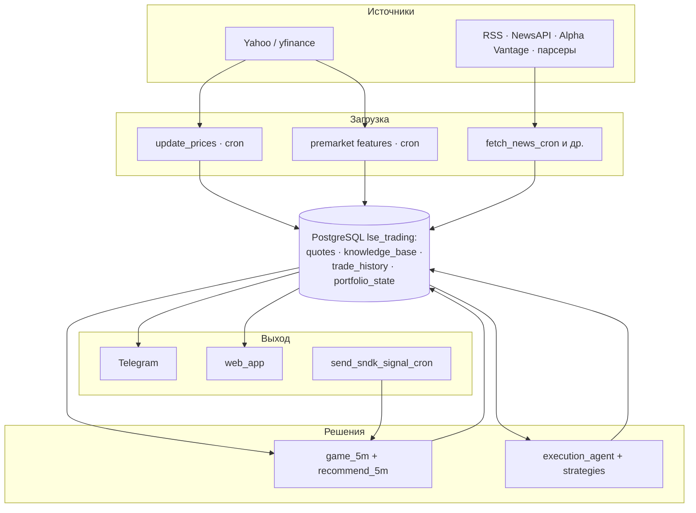
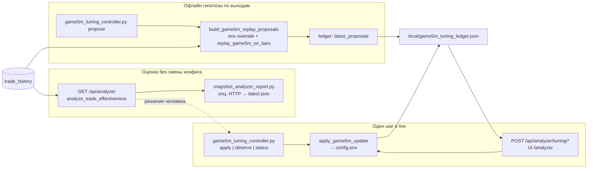

# Архитектура LSE (актуальный контур)

Краткая карта **компонентов**, **хранилищ** и **потоков данных**. Детальные пошаговые Mermaid-диаграммы — в [BUSINESS_PROCESSES.md](../BUSINESS_PROCESSES.md).

---

## 1. Компоненты

| Слой | Компоненты | Назначение |
|------|------------|------------|
| **Вход данных** | Yahoo / yfinance, RSS, NewsAPI, Alpha Vantage, парсеры; опц. импорт внешнего JSONL (NYSE) | Котировки и новости |
| **Ядро** | `execution_agent`, `services/game_5m`, `strategies/*`, `services/recommend_5m` | Решения портфельной игры, игры 5m, рекомендации |
| **Интеллект** | `services/llm_service`, Analyst path, опционально LLM на входе 5m | Объяснения, `/ask`, при `GAME_5M_ENTRY_STRATEGY=llm` |
| **Доставка** | `services/telegram_bot.py`, `web_app.py`, `scripts/send_sndk_signal_cron.py`, `trading_cycle_cron.py` | Telegram, веб-карточки 5m, кроны |
| **Настройка GAME_5M** | `services/trade_effectiveness_analyzer.py`, `services/game5m_tuning_policy.py`, `scripts/game5m_tuning_controller.py`, эндпоинты `/api/analyzer*` в `web_app.py` | Отчёт по закрытым сделкам, replay-proposals в ledger, безопасная запись `GAME_5M_*` в `config.env` |
| **Внешнее (опц.)** | Platform Game API (Kerim), `services/platform_game_api.py` | POST `/game` по команде `/game5m platform`, не в горячем пути входа |

---

## 2. Хранилища (PostgreSQL `lse_trading`)

| Таблица | Роль |
|---------|------|
| `quotes` | Дневные OHLCV + индикаторы |
| `knowledge_base` | Новости, sentiment, `embedding` (pgvector), `outcome_json` |
| `trade_history` | Все сделки; `strategy_name` отделяет **GAME_5M** от портфеля; `context_json` — снимок входа/выхода 5m |
| `portfolio_state` | Текущий портфель (симуляция) |
| `strategy_parameters` | Динамические параметры (см. `config_loader`, `utils/parameter_store.py`) |
| `premarket_daily_features` | Компактные premarket-снимки для ML; не используется для исполнения сделок |

Схема колонок: [DATABASE_SCHEMA.md](DATABASE_SCHEMA.md).

---

## 3. Поток данных (обзор)

**Игра 5m (цепочка):** Yahoo 5m → `get_decision_5m` → крон → при BUY `record_entry` + `build_full_entry_context` → при выходе `close_position` + `build_5m_close_context`. JSON сделки: [GAME_5M_DEAL_PARAMS_JSON.md](GAME_5M_DEAL_PARAMS_JSON.md).

**Портфель:** `trading_cycle_cron` → `ExecutionAgent` → те же таблицы, другие `strategy_name`. Новые `BUY` портфеля исполняются только в regular-сессию NYSE, если не включён аварийный `TRADING_CYCLE_ALLOW_OFFHOURS_BUY=true`.

**Premarket-контекст:** отдельная торговля в премаркете не является целевым режимом. `scripts/ingest_premarket_daily_features.py` сохраняет агрегированные premarket-снимки в `premarket_daily_features`; они используются как общий ML-контекст для основного trading flow обеих игр: для фильтрации входов после открытия, оценки gap continuation / gap fade, stuck-risk в `GAME_5M` и advisory ML в портфеле.

### 3.1. Пайплайн настройки параметров GAME_5M (анализатор + `game5m_tuning_controller`)

**Исполняемые пороги** везде читаются из **`config.env`** (и overlays) через **`config_loader.get_config_value`** — и крон, и веб, и офлайн-скрипты видят один merge. Запись в `config.env` для ключей GAME_5M — только через **`services/game5m_tuning_policy.apply_game5m_update`** (валидация, guardrails), вызываемую и с веба, и из CLI.

| Шаг | Компонент | Назначение |
|-----|-----------|------------|
| Сводка по закрытым | `services/trade_effectiveness_analyzer.py` | `/api/analyzer`, `/analyzer`: `summary`, hanger v2, continuation gate, CatBoost backtest, `practical_parameter_suggestions`, опц. LLM (`use_llm=1`). |
| Снимок для офлайна | `scripts/snapshot_analyzer_report.py` | JSON в `local/analyzer_snapshots/`; при заданном `ANALYZER_SNAPSHOT_URL` — HTTP к уже поднятому вебу (удобно cron на хосте без pandas). |
| Реплей-кандидаты | `scripts/game5m_tuning_controller.py propose` | Вызывает `build_game5m_replay_proposals` → ранжированный список пар `env_key` / `proposed` + `proposal_id`; пишет в **`local/game5m_tuning_ledger.json`** (`latest_proposals`). Не дублирует ежедневный ML-конвейер. |
| Применение | `apply` (CLI) или **`POST /api/analyzer/tuning/apply`** (веб) | Один ключ за раз; `observe` / **`tuning/observe`** фиксируют окно сделок; статус — **`GET .../tuning/status`**. |
| Политика | `services/game5m_tuning_policy.py` | Общие проверки для веба и controller. |

Дополнительно (альтернативные/вспомогательные пути): **`scripts/analyzer_tune_apply.py`** — применить `auto_config_override` из сохранённого JSON отчёта; **`scripts/analyzer_autotune.py`** — осторожный автоматический выбор одного шага с `ANALYZER_AUTOTUNE_APPLY`. Регламент «когда propose, когда доверять replay score»: **[GAME_5M_TUNING_REGLEMENT.md](GAME_5M_TUNING_REGLEMENT.md)**. Полная методика отчёта: **[TRADE_EFFECTIVENESS_ANALYZER.md](TRADE_EFFECTIVENESS_ANALYZER.md)**.

---

## 4. Карта документов по темам

| Тема | Документ |
|------|----------|
| Бизнес-процессы и длинные диаграммы | [BUSINESS_PROCESSES.md](../BUSINESS_PROCESSES.md) |
| Схема БД | [DATABASE_SCHEMA.md](DATABASE_SCHEMA.md) |
| Портфельная игра: алгоритм, стратегии, аллокация, тейк/стоп | [PORTFOLIO_GAME.md](PORTFOLIO_GAME.md) |
| Portfolio ML | [ML_PORTFOLIO_CATBOOST.md](ML_PORTFOLIO_CATBOOST.md) |
| Игра 5m: сделки, JSON, крон | [GAME_5M_DEAL_PARAMS_JSON.md](GAME_5M_DEAL_PARAMS_JSON.md), [CRONS_AND_TAKE_STOP.md](CRONS_AND_TAKE_STOP.md), [RUN_GAME_SERVICES.md](RUN_GAME_SERVICES.md) |
| GAME_5M: тейк, висяки, расчёты, **вход начала дня** | [GAME_5M_CALCULATIONS_AND_REPORTING.md](GAME_5M_CALCULATIONS_AND_REPORTING.md), [GAME_5M_PREMARKET_AND_IMPULSE.md](GAME_5M_PREMARKET_AND_IMPULSE.md) |
| GAME_5M: развитие hanger/stale exits/continuation (**пайплайн**) | [GAME_5M_HANGER_AND_STALE_EXIT_PLAN.md](GAME_5M_HANGER_AND_STALE_EXIT_PLAN.md) |
| Индекс документов GAME_5M / ML / анализатор | [README.md](README.md) (этот каталог `docs/`) |
| GAME_5M ML | [ML_GAME5M_CATBOOST.md](ML_GAME5M_CATBOOST.md), [GAME_5M_CATBOOST_FUSION.md](GAME_5M_CATBOOST_FUSION.md) |
| Analyzer и настройка параметров | [TRADE_EFFECTIVENESS_ANALYZER.md](TRADE_EFFECTIVENESS_ANALYZER.md), [GAME_5M_TUNING_REGLEMENT.md](GAME_5M_TUNING_REGLEMENT.md) (анализатор + `game5m_tuning_controller`, §3.1 выше) |
| Новости и KB | [NEWS.md](NEWS.md), [KNOWLEDGE_BASE_FIELDS.md](KNOWLEDGE_BASE_FIELDS.md) |
| Новостной сигнал (план: этапы A/B, горизонты, кэш бэтчей) | [NEWS_SIGNAL_ARCHITECTURE.md](NEWS_SIGNAL_ARCHITECTURE.md) |
| Деплой VM / Docker / Cloud Run | [DEPLOY.md](DEPLOY.md), [DEPLOY_GCP.md](DEPLOY_GCP.md), [MIGRATE_SERVER.md](MIGRATE_SERVER.md), [PLATFORM_GAME_DOCKER.md](PLATFORM_GAME_DOCKER.md) |
| Риски и лимиты | [RISK_MANAGEMENT.md](RISK_MANAGEMENT.md) |
| Устаревшие материалы | [archive/README.md](archive/README.md) |

Правило ведения документации: не заводить новый документ для каждой итерации игры. Стратегия и тактика развития фиксируются в профильном документе игры (`PORTFOLIO_GAME.md` или `GAME_5M_HANGER_AND_STALE_EXIT_PLAN.md`), ML-детали — в существующем ML-документе, а `ARCHITECTURE.md` обновляется при изменении потоков исполнения, границ компонентов, хранилищ, cron-режимов или правил включения/блокировки сделок.

---

## 5. Режимы работы бота

- **Polling (по умолчанию в docker-compose):** контейнер `lse-bot` запускает `run_telegram_bot.py`.
- **Webhook:** альтернатива, см. [TELEGRAM_BOT_SETUP.md](TELEGRAM_BOT_SETUP.md) и [DEPLOY_GCP.md](DEPLOY_GCP.md).

---

## 6. Версионирование логики 5m

- `recommend_5m.py`: `decision_rule_version` / параметры в `get_decision_5m` — часть полей уходит в `context_json` для воспроизводимости.
- Выходы по тейку: флаги `GAME_5M_EXIT_ONLY_TAKE` / `PORTFOLIO_EXIT_ONLY_TAKE` в `config.env` (см. `config.env.example`).
