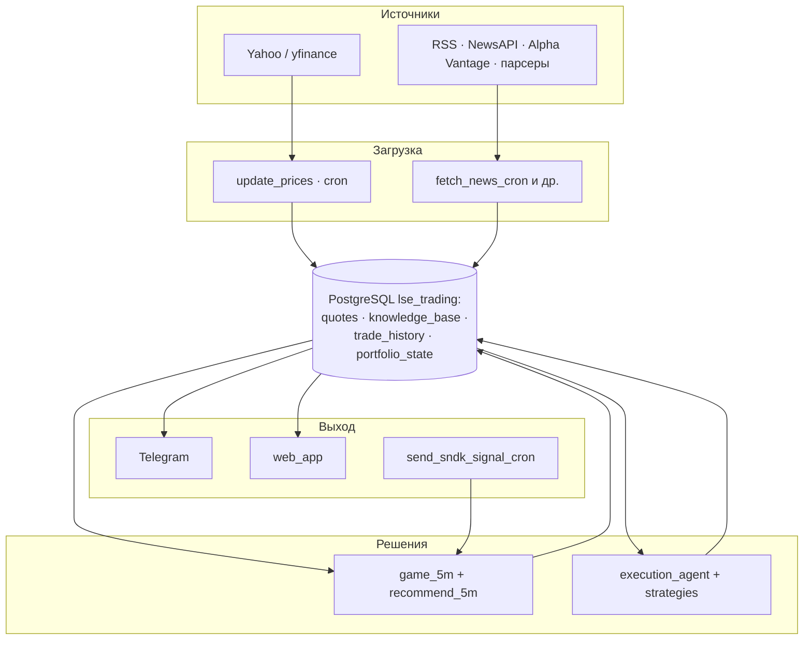

# Архитектура LSE (актуальный контур)

Краткая карта **компонентов**, **хранилищ** и **потоков данных**. Детальные пошаговые Mermaid-диаграммы — в [BUSINESS_PROCESSES.md](../BUSINESS_PROCESSES.md).

---

## 1. Компоненты

| Слой | Компоненты | Назначение |
|------|------------|------------|
| **Вход данных** | Yahoo / yfinance, RSS, NewsAPI, Alpha Vantage, парсеры; опц. импорт внешнего JSONL (NYSE) | Котировки и новости |
| **Ядро** | `execution_agent`, `services/game_5m`, `strategies/*`, `services/recommend_5m` | Решения портфельной игры, игры 5m, рекомендации |
| **Интеллект** | `services/llm_service`, Analyst path, опционально LLM на входе 5m | Объяснения, `/ask`, при `GAME_5M_ENTRY_STRATEGY=llm` |
| **Доставка** | `services/telegram_bot.py`, `web_app.py`, `scripts/send_sndk_signal_cron.py`, `trading_cycle_cron.py` | Telegram, веб-карточки 5m, кроны |
| **Внешнее (опц.)** | Platform Game API (Kerim), `services/platform_game_api.py` | POST `/game` по команде `/game5m platform`, не в горячем пути входа |

---

## 2. Хранилища (PostgreSQL `lse_trading`)

| Таблица | Роль |
|---------|------|
| `quotes` | Дневные OHLCV + индикаторы |
| `knowledge_base` | Новости, sentiment, `embedding` (pgvector), `outcome_json` |
| `trade_history` | Все сделки; `strategy_name` отделяет **GAME_5M** от портфеля; `context_json` — снимок входа/выхода 5m |
| `portfolio_state` | Текущий портфель (симуляция) |
| `strategy_parameters` | Динамические параметры (см. `config_loader`, `utils/parameter_store.py`) |

Схема колонок: [DATABASE_SCHEMA.md](DATABASE_SCHEMA.md).

---

## 3. Поток данных (обзор)

**Игра 5m (цепочка):** Yahoo 5m → `get_decision_5m` → крон → при BUY `record_entry` + `build_full_entry_context` → при выходе `close_position` + `build_5m_close_context`. JSON сделки: [GAME_5M_DEAL_PARAMS_JSON.md](GAME_5M_DEAL_PARAMS_JSON.md).

**Портфель:** `trading_cycle_cron` → `ExecutionAgent` → те же таблицы, другие `strategy_name`.

---

## 4. Карта документов по темам

| Тема | Документ |
|------|----------|
| Бизнес-процессы и длинные диаграммы | [BUSINESS_PROCESSES.md](../BUSINESS_PROCESSES.md) |
| Схема БД | [DATABASE_SCHEMA.md](DATABASE_SCHEMA.md) |
| Портфельная игра: алгоритм, стратегии, аллокация, тейк/стоп | [PORTFOLIO_GAME.md](PORTFOLIO_GAME.md) |
| Игра 5m: сделки, JSON, крон | [GAME_5M_DEAL_PARAMS_JSON.md](GAME_5M_DEAL_PARAMS_JSON.md), [CRONS_AND_TAKE_STOP.md](CRONS_AND_TAKE_STOP.md), [RUN_GAME_SERVICES.md](RUN_GAME_SERVICES.md) |
| Новости и KB | [NEWS.md](NEWS.md), [KNOWLEDGE_BASE_FIELDS.md](KNOWLEDGE_BASE_FIELDS.md) |
| Новостной сигнал (план: этапы A/B, горизонты, кэш бэтчей) | [NEWS_SIGNAL_ARCHITECTURE.md](NEWS_SIGNAL_ARCHITECTURE.md) |
| Деплой VM / Docker / Cloud Run | [DEPLOY.md](DEPLOY.md), [DEPLOY_GCP.md](DEPLOY_GCP.md), [MIGRATE_SERVER.md](MIGRATE_SERVER.md), [PLATFORM_GAME_DOCKER.md](PLATFORM_GAME_DOCKER.md) |
| Риски и лимиты | [RISK_MANAGEMENT.md](RISK_MANAGEMENT.md) |
| Устаревшие материалы | [archive/README.md](archive/README.md) |

---

## 5. Режимы работы бота

- **Polling (по умолчанию в docker-compose):** контейнер `lse-bot` запускает `run_telegram_bot.py`.
- **Webhook:** альтернатива, см. [TELEGRAM_BOT_SETUP.md](TELEGRAM_BOT_SETUP.md) и [DEPLOY_GCP.md](DEPLOY_GCP.md).

---

## 6. Версионирование логики 5m

- `recommend_5m.py`: `decision_rule_version` / параметры в `get_decision_5m` — часть полей уходит в `context_json` для воспроизводимости.
- Выходы по тейку: флаги `GAME_5M_EXIT_ONLY_TAKE` / `PORTFOLIO_EXIT_ONLY_TAKE` в `config.env` (см. `config.env.example`).
