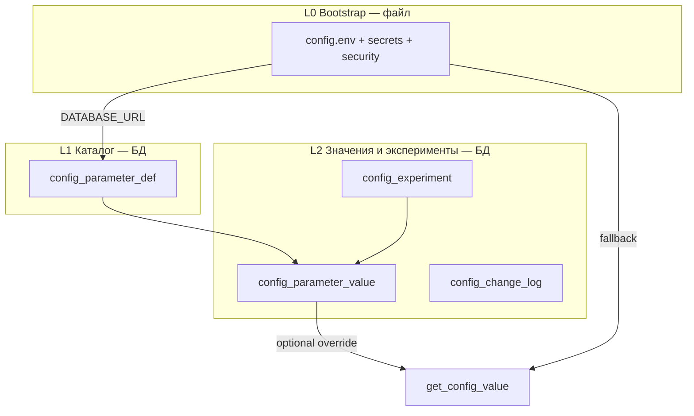

# Архитектура config registry (гибрид file + PostgreSQL)

Как эволюционировать от монолитного `config.env` к реестру параметров в БД **без** переноса секретов и без потери деплоя через git.

**Rollout:** [CONSOLIDATION_NEXT_PLAN.md](CONSOLIDATION_NEXT_PLAN.md) (фаза 4); архив: [archive/ARCHITECTURE_OPTIMIZATION_ROLLOUT_PLAN.md](archive/ARCHITECTURE_OPTIMIZATION_ROLLOUT_PLAN.md).

---

## 1. Три уровня (L0 / L1 / L2)



| Уровень | Хранение | Назначение |
|---------|----------|------------|
| **L0** | `config.env`, `config.secrets.env`, `config.security.env` | Секреты, инфра, пути, bootstrap |
| **L1** | `config_parameter_def` | Каталог: тип, фаза, contour_id, лимиты шага, editable |
| **L2** | `config_parameter_value`, `config_experiment`, `config_change_log` | Прод-значения, A/B tune, audit |

**Правило:** процесс **всегда** стартует с L0 (`DATABASE_URL`). L2 подключается флагами.

---

## 2. Что остаётся в файле (никогда в БД)

- `DATABASE_URL`, API keys (`OPENAI_*`, `NEWSAPI_*`, …)
- `TELEGRAM_BOT_TOKEN`, proxy с credentials
- `RESTART_CMD`, порты, пути к `.cbm`
- Всё из `CONFIG_ENV_WEB_BLOCKLIST` ([config_loader.py](../config_loader.py))

---

## 3. Что выгодно в БД

| Задача | Таблица |
|--------|---------|
| «Что означает ключ GAME_5M_*?» | `config_parameter_def` |
| «Кто менял и когда?» | `config_change_log` |
| «Один active experiment на game_5m» | `config_experiment` |
| Promote после арбитра | experiment → `config_parameter_value` + dual-write file |
| Per-ticker шаблоны | `def` с pattern `GAME_5M_TAKE_PROFIT_PCT_{TICKER}` |

---

## 4. Схема таблиц (целевая)

### `config_parameter_def` (фаза 6)

| Колонка | Пример |
|---------|--------|
| `key` PK | `GAME_5M_MULTIDAY_ENTRY_GATE_MODE` |
| `value_type` | `enum` / `float` / `bool` / `int` / `string` |
| `allowed_values` | `none,log_only,apply` |
| `scope` | `game_5m` / `infra` |
| `phase` | `D` / `E` |
| `contour_id` | `multiday_lr_entry_gate` |
| `editable` | bool |
| `step_policy` | jsonb (лимиты как в `game5m_tuning_policy`) |
| `description_ru` | текст для UI |

Сид: `scripts/seed_config_parameter_def.py` ← `config.env.example` + deny keys.

### `config_change_log` (фаза 7)

Append-only: `key`, `old_value`, `new_value`, `source`, `actor`, `experiment_id`, `created_at`.

Источники: `update_config_key`, `apply_game5m_update`, promote, rollback.

### `config_experiment` (фаза 8)

| Поле | |
|------|--|
| `experiment_id`, `scope`, `key` | |
| `value_old`, `value_new` | |
| `status` | `pending` / `observing` / `promoted` / `rolled_back` |
| `contour_id`, `arbiter_verdict` | |
| `min_trades`, `trades_observed` | |

Один active experiment на `scope=game_5m` (как file ledger сейчас).

### `config_parameter_value` (фаза 12)

Текущее прод-значение для whitelist-ключей: `key`, `value`, `effective_at`, `source`.

---

## 5. Чтение: `get_config_value` (фаза 12)

Порядок при `CONFIG_REGISTRY_DB_READ_ENABLED=true`:

1. `os.environ` (как сейчас)
2. `config_parameter_value` — если `key` в whitelist префиксов
3. merged `config.env` (как сейчас)

Иначе — только 1 и 3 (текущее поведение).

---

## 6. Запись: dual-write

На период миграции (фазы 8–12):

1. `INSERT/UPDATE config_experiment` или `config_parameter_value`
2. `update_config_key` → `config.env` (для git deploy и перезапуска)
3. `INSERT config_change_log`

**Почему dual-write:** `git pull` на VM не должен откатывать promote без явного merge.

Документировать: после promote — commit `config.env` или export из БД.

---

## 7. Связь с promotion_gate

```
policy_gate.promotion.eligible
  → promotion_gate.candidates[]
    → config_experiment (pending)
      → observe N trades
        → promoted → config_parameter_value + config.env
```

Autotune (`analyzer_autotune.py`) в фазе 11 берёт кандидата **только** из `promotion_plan`, не парсит сырой LLM JSON.

---

## 8. Feature flags

```env
CONFIG_PARAMETER_DEF_ENABLED=true      # API/UI каталога
CONFIG_CHANGE_LOG_ENABLED=false
CONFIG_EXPERIMENT_DB_ENABLED=false
CONFIG_REGISTRY_DB_READ_ENABLED=false
CONFIG_REGISTRY_DB_READ_KEYS=GAME_5M_MULTIDAY_
```

---

## 9. Миграция с file ledger

Текущие JSON:

- `local/autotune_state.json`
- `local/.../tune_state.json`
- game5m tuning ledger (`game5m_tuning_controller`)

Фаза 8: при `CONFIG_EXPERIMENT_DB_ENABLED=true` — писать в БД; file — fallback или dual-write 2 недели.

Скрипт одноразового import (опционально): `scripts/import_config_experiments_from_ledger.py`.

---

## 10. Риски и mitigations

| Риск | Mitigation |
|------|------------|
| Рассинхрон file vs БД | dual-write + change_log |
| Кэш `load_config` | `clear_load_config_cache()` после write; TTL или invalidate по experiment |
| Несколько инстансов | L2 обязателен для tune keys |
| Случайный autotune | `PROMOTION_GATE` + deny keys + один active experiment |

---

## 11. Связанные документы

- [TRADE_EFFECTIVENESS_ANALYZER.md](TRADE_EFFECTIVENESS_ANALYZER.md) — autotune, tune_apply
- [ANALYZER_CONTOUR_ARCHITECTURE.md](ANALYZER_CONTOUR_ARCHITECTURE.md) — contour_id в def
- [config_loader.py](../config_loader.py) — `is_editable_config_env_key`, blocklist
