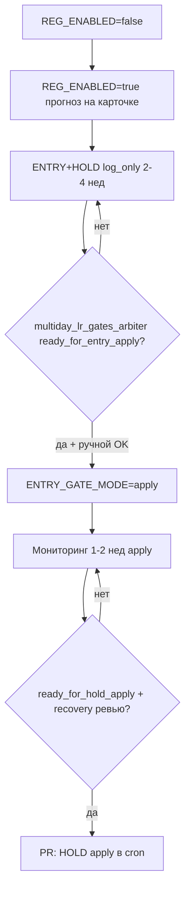

# План внедрения multiday ridge gates (GAME_5M, фаза D)

**Статус:** согласован поэтапный rollout — **сейчас ждём накопления log-only телеметрии** перед `apply`.  
**Связанные документы:** [GAME_5M_MULTIDAY_LR_RIDGE.md](GAME_5M_MULTIDAY_LR_RIDGE.md) (модель и фазы A–E), [GAME_5M_MULTIDAY_LR_FEATURE_ENRICHMENT_PLAN.md](GAME_5M_MULTIDAY_LR_FEATURE_ENRICHMENT_PLAN.md) (v3-признаки), [ML_CALIBRATION_PHASES.md](ML_CALIBRATION_PHASES.md).

---

## 1. Цель и границы

| Что делаем | Чего не делаем |
|------------|----------------|
| Два **гейта политики** поверх уже посчитанного multiday-прогноза: **вход** (ослабить BUY) и **удержание** (отложить часть `TIME_EXIT_EARLY`). | Не переобучаем ridge и не меняем λ / feature set в этом плане — это фазы B–C и enrichment. |
| Сначала **log_only** (контрфакт в `context_json` / логах), затем **apply** только после арбитра и ручного OK. | Не включаем `apply` автоматически по cron/анализатору — config вручную. |

Код: `services/multiday_lr_gate.py`, арбитр `build_multiday_lr_gates_arbiter` в `services/analyzer_ml_arbiter.py`, UI — карточка **«Арбитр multiday gates»** в `templates/analyzer.html`.

---

## 2. Текущее состояние (на момент плана)

| Компонент | Статус |
|-----------|--------|
| Расчёт прогноза на карточке 5m | Зависит от `GAME_5M_MULTIDAY_LR_REG_ENABLED` (по умолчанию **false** в проде). |
| Гейт **входа** (`finalize_technical_decision_with_multiday` в `get_decision_5m`) | Реализован: `none` / `log_only` / **apply** (BUY/STRONG_BUY → HOLD). |
| Гейт **удержания** (`evaluate_multiday_hold_gate` в `send_sndk_signal_cron`) | Телеметрия в `exit_context_json.multiday_lr_hold_gate`; **`apply` в кроне не откладывает выход** (явный warning + `hold_gate_apply_not_implemented`). |
| Арбитр выборки | `multiday_lr_gates_arbiter` в отчёте анализатора + сводка в `ml_production_arbiter`. |
| Unit-тесты | `tests/test_multiday_lr_gate.py`, `tests/test_multiday_lr_gates_arbiter.py`. |

**Целевой режим на период накопления** (в `config.env` на боте):

```env
GAME_5M_MULTIDAY_LR_REG_ENABLED=true
GAME_5M_MULTIDAY_ENTRY_GATE_MODE=log_only
GAME_5M_MULTIDAY_HOLD_GATE_MODE=log_only
```

Пороги по умолчанию — в `config.env.example` (τ, кворум горизонтов, список `exit_detail`).

---

## 3. Предпосылки (что должно быть зелёным до apply)

### 3.1 Модель и данные (фазы A–C)

- [ ] Достаточно дневных **quotes** (и при v2 — **premarket_daily_features**) по GAME_5M тикерам.
- [ ] В анализаторе `multiday_lr_reality_check.walkforward_production_verdict` ≠ **`not_ready`** (пороги: pooled OOS 1d, см. `_multiday_walkforward_verdict` в `analyzer_ml_arbiter.py`).
- [ ] (Опционально, отдельная ветка enrichment) ingest 023–025 + walk-forward v2 vs v3*; включение `GAME_5M_MULTIDAY_LR_USE_*_DB` только по `multiday_env_recommendations`, не параллельно с первым включением гейтов.

### 3.2 Политика (фаза D)

- [ ] Оба гейта в **`log_only`** минимум **2–4 недели** активной торговли GAME_5M (см. пороги арбитра ниже).
- [ ] Регулярный прогон **анализатора эффективности** (тот же `strategy`/окно, что для операционных решений).
- [ ] Согласование с контуром **recovery CatBoost** (`TIME_EXIT_EARLY`): hold apply — **после** стабилизации entry apply и ревью D4b (см. `GAME_5M_TIME_EXIT_RECOVERY_PLAN.md`).

---

## 4. Логика гейтов (согласованные правила)

### 4.1 Вход (`GAME_5M_MULTIDAY_ENTRY_*`)

**would_hold = true**, если выполняется **любое** из:

- `multiday_lr_horizon_1d_pct_vs_spot` < **−τ_1d** (default τ_1d = 0.25%);
- не менее **N** горизонтов из {1d, 2d, 3d} < **−τ** (default τ = 0.15%, N = 2).

При **apply**: `technical_decision_effective` BUY/STRONG_BUY → **HOLD** (после CatBoost fusion).  
Телеметрия в BUY `context_json`: `multiday_lr_entry_gate_*`.

### 4.2 Удержание (`GAME_5M_MULTIDAY_HOLD_*`)

Только для `exit_detail` из `GAME_5M_MULTIDAY_HOLD_EXIT_DETAILS` (default: `early_derisk`, `stale_reversal`).  
Не срабатывает, если `pnl_current_pct` ≤ `GAME_5M_MULTIDAY_HOLD_MAX_LOSS_PCT` (default −4%).

**would_defer_exit = true**, если ≥ **M** горизонтов > **+τ_pos** (default τ_pos = 0.20%, M = 2).

При **apply** (ещё **не в проде**): отложить закрытие по `TIME_EXIT_EARLY` на этой итерации крона — отдельный PR.

---

## 5. Пороги арбитра (когда разрешать apply)

Источник: `build_multiday_lr_gates_arbiter` — **ориентиры**, не авто-переключатель.

| Метрика | Порог | Назначение |
|---------|-------|------------|
| BUY с `multiday_lr_entry_gate_status=ok` | ≥ **12** | Минимальная выборка для входа |
| Из них `would_hold=true` | ≥ **6** | Оценка контрфакта фильтра |
| TIME_EXIT_EARLY с `multiday_lr_hold_gate` в SELL | ≥ **8** | Телеметрия удержания |
| Из них `would_defer_exit=true` | ≥ **5** | Оценка defer |
| Экономический критерий | **0.20 п.п.** | mean PnL would_hold ≤ mean PnL pass + 0.20 → **caution** (не включать entry apply) |
| Walk-forward | ≠ `not_ready` | Иначе entry apply → **caution**, даже при хорошем PnL контрфакта |

Вердикты: `insufficient_data` → `ready_for_entry_apply` / `ready_for_hold_apply` → `monitoring` после включения apply.

---

## 6. Пошаговый rollout (согласованная последовательность)



### Шаг 0 — Baseline (сейчас допустимо)

- `GAME_5M_MULTIDAY_LR_REG_ENABLED=false`, гейты `none`.
- Только офлайн walk-forward / обучение артефактов.

### Шаг 1 — Прогноз в прод без влияния на сделки

1. Включить `GAME_5M_MULTIDAY_LR_REG_ENABLED=true`.
2. Гейты оставить `none`.
3. Проверить карточки 5m и логи: поля `multiday_lr_horizon_*`, без ошибок `multiday_lr_forecast_*`.
4. Прогон анализатора: `walkforward_production_verdict` и блок multiday LR.

**Критерий перехода:** прогноз стабильно есть на BUY; OOS не `not_ready` (или осознанное «caution» с документированным риском).

### Шаг 2 — Накопление телеметрии (**текущий этап ожидания**)

1. `GAME_5M_MULTIDAY_ENTRY_GATE_MODE=log_only`
2. `GAME_5M_MULTIDAY_HOLD_GATE_MODE=log_only`
3. Перезапуск **lse-bot** / крона после смены env.
4. Еженедельно (или после N новых закрытий): анализатор → **«Арбитр multiday gates»** + `ml_production_arbiter`.

**Проверки оператора:**

- BUY `context_json` содержит `multiday_lr_entry_gate_status`, `multiday_lr_entry_gate_would_hold`.
- SELL `TIME_EXIT_EARLY` содержит `exit_context_json.multiday_lr_hold_gate`.
- В логах: `MULTIDAY_ENTRY_GATE`, `MULTIDAY_HOLD_GATE` (без `apply`).

**Критерий перехода к шагу 3:** `entry_gate.verdict == ready_for_entry_apply`, `overall_verdict` ∈ {`ready_entry_step`, `ready_hold_step`}, нет `caution` по PnL would_hold.

### Шаг 3 — Entry apply (первое влияние на сделки)

1. Ручное решение оператора (чеклист ниже).
2. `GAME_5M_MULTIDAY_ENTRY_GATE_MODE=apply`
3. `HOLD_GATE` оставить **log_only**.
4. Мониторинг **1–2 недели**: доля BUY→HOLD, PnL vs контрфакт предыдущего окна, регрессии по тикерам.

**Откат:** `ENTRY_GATE_MODE=log_only` или `none` без отключения REG.

### Шаг 4 — Hold apply (после стабилизации entry)

**Предусловия:**

- Entry apply ≥ 1–2 недели без деградации.
- `hold_gate.verdict == ready_for_hold_apply`.
- Сверка с `time_exit_early_review` и `recovery_ml_time_exit_early` (не дублировать противоречащие defer).

**Работа в коде (ещё TODO):**

- В `send_sndk_signal_cron.py` при `mode=apply` и `would_defer_exit` — **не вызывать** `close_position` на этой итерации (с лимитом попыток / таймаутом, чтобы не зависнуть в позиции).
- Unit/integration тест на defer + запись `applied=true` в `multiday_lr_hold_gate`.

**Критерий готовности:** отдельный PR + 1 неделя log_only после merge на staging/прод с флагом apply.

### Шаг 5 — Enrichment v3 (параллельный трек, не блокирует шаги 1–3)

По [GAME_5M_MULTIDAY_LR_FEATURE_ENRICHMENT_PLAN.md](GAME_5M_MULTIDAY_LR_FEATURE_ENRICHMENT_PLAN.md): ingest → walk-forward → `USE_*_DB=true` только если OOS v3 лучше v2. **Не менять τ гейтов** одновременно с включением v3 — сначала стабилизировать apply на v2.

---

## 7. Чеклист перед ENTRY apply (ручной sign-off)

- [ ] `multiday_lr_reality_check.walkforward_production_verdict` ∈ {`ready`, `caution`} — не `not_ready`
- [ ] `multiday_lr_gates_arbiter.entry_gate.verdict` = **`ready_for_entry_apply`**
- [ ] mean PnL **would_hold** не хуже **pass** более чем на 0.20 п.п. (арбитр не в `caution` по этому критерию)
- [ ] n_gate_ok ≥ 12, n_would_hold ≥ 6 (или больше по согласованию с командой)
- [ ] CatBoost fusion / macro / entry_advice — нет известного конфликта «всё HOLD из-за multiday»
- [ ] Записан план отката и дата ревью (+7 / +14 дней)

---

## 8. Мониторинг после apply

| Что смотреть | Где |
|--------------|-----|
| Доля `multiday_lr_entry_gate_applied=true` | BUY `context_json`, логи `MULTIDAY_ENTRY_GATE` |
| PnL сделок с applied vs без | Анализатор, следующий прогон `multiday_lr_gates_arbiter` (`monitoring`) |
| OOS деградация | `multiday_lr_reality_check` |
| Ранние выходы | `TIME_EXIT_EARLY`, hold_gate после шага 4 |
| Сводка ML | `ml_production_arbiter.conclusion_ru` |

**Откат (в порядке усиления):**

1. `ENTRY_GATE_MODE=log_only` / `HOLD_GATE_MODE=log_only`
2. `GAME_5M_MULTIDAY_*_GATE_MODE=none`
3. `GAME_5M_MULTIDAY_LR_REG_ENABLED=false` (полное отключение сигнала)

---

## 9. Переменные окружения (шпаргалка)

| Переменная | Значения | Этап |
|------------|----------|------|
| `GAME_5M_MULTIDAY_LR_REG_ENABLED` | false → true | Шаг 1 |
| `GAME_5M_MULTIDAY_ENTRY_GATE_MODE` | none → log_only → apply | 2 → 3 |
| `GAME_5M_MULTIDAY_HOLD_GATE_MODE` | none → log_only → apply | 2 → 4 (после PR) |
| `GAME_5M_MULTIDAY_ENTRY_TAU_1D_PCT` | 0.25 | Калибровка только офлайн/арбитр |
| `GAME_5M_MULTIDAY_ENTRY_TAU_PCT` | 0.15 | |
| `GAME_5M_MULTIDAY_ENTRY_NEGATIVE_HORIZONS_MIN` | 2 | |
| `GAME_5M_MULTIDAY_HOLD_TAU_PCT` | 0.20 | |
| `GAME_5M_MULTIDAY_HOLD_POSITIVE_HORIZONS_MIN` | 2 | |
| `GAME_5M_MULTIDAY_HOLD_MAX_LOSS_PCT` | -4.0 | |
| `GAME_5M_MULTIDAY_HOLD_EXIT_DETAILS` | early_derisk,stale_reversal | |

---

## 10. Ориентировочные сроки

| Этап | Оценка | Зависимость |
|------|--------|-------------|
| Шаг 1 | 1–3 дня после включения REG | Деплой, quotes |
| Шаг 2 log_only | **2–4 недели** | Частота BUY и TIME_EXIT_EARLY |
| Шаг 3 entry apply | +1–2 недели мониторинга | Арбитр `ready_for_entry_apply` |
| Шаг 4 hold apply | +PR + 1–2 недели | Entry стабилен, recovery ревью |

Сроки сдвигаются, если мало сделок GAME_5M в окне анализатора — тогда расширить окно отчёта или дождаться большего N.

---

## 11. Связанные файлы

| Файл | Роль |
|------|------|
| `services/multiday_lr_gate.py` | Правила entry/hold, apply входа |
| `services/recommend_5m.py` | Вызов `finalize_technical_decision_with_multiday` |
| `scripts/send_sndk_signal_cron.py` | Hold gate телеметрия на SELL |
| `services/analyzer_ml_arbiter.py` | `build_multiday_lr_gates_arbiter`, walk-forward |
| `services/trade_effectiveness_analyzer.py` | Прокидывание в отчёт |
| `templates/analyzer.html` | UI блок gates arbiter |
| `config.env.example` | Документированные defaults |

---

## 12. История решений

| Дата | Решение |
|------|---------|
| 2026-05 | Согласован rollout: log_only → арбитр по выборке → entry apply → hold apply (отдельный PR). v3 enrichment — параллельно, без одновременного apply гейтов. |
