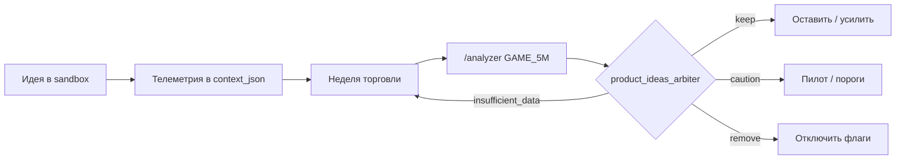

# GAME_5m: песочница идей и арбитр анализатора

## Принцип

1. **Идея** попадает в реестр (`services/product_ideas_registry.py`) со статусом **sandbox**.
2. Код пишет **телеметрию** в `context_json` на BUY (и при необходимости на SELL).
3. Раз в 3–7 дней **`/analyzer`** (или крон) считает **`product_ideas_arbiter`** по закрытым сделкам.
4. Вердикт **keep / caution / remove / insufficient_data** — оператор **вручную** выключает флаги или переводит в прод.
5. **remove** → отключить `GAME_5M_*` / убрать UI; не ждать «само рассосётся».

Анализатор **не меняет** `config.env` (как `ml_production_arbiter`).

## Отличие от `ml_production_arbiter`

| Блок | Что оценивает |
|------|----------------|
| `ml_production_arbiter` | ML-модели: multiday ridge OOS, CatBoost entry, recovery .cbm |
| `product_ideas_arbiter` | **Продуктовые правила**: макро VIX/Forex, прогноз гэпа сектора, defer TIME_EXIT_EARLY (план) |

## Идеи в реестре (2026-05)

| id | Суть | Телеметрия на входе | Арбитр смотрит |
|----|------|---------------------|----------------|
| `macro_vix_forex_risk` | Пороги VIX/Forex/нефть → AVOID/CAUTION/bias | `macro_risk_level`, `macro_equity_gap_bias`, `macro_indicators` | Средний `realized_pct` AVOID vs ALLOW; TIME_EXIT_EARLY при bias UP |
| `macro_predicted_sector_gap` | OLS-прогноз гэпа SMH (опционально) | `macro_predicted_sector_gap_pct` | Совпадение знака pred vs PnL; PnL при pred≥+0.3% |
| `macro_defer_time_exit_early` | Не резать до open при гэп вверх | (план) `macro_defer_early_exit_applied` | Контрфакт + `time_exit_early_review` |

## Метрики эффективности (по идее)

### macro_vix_forex_risk

- **Гипотеза:** входы при `macro_risk_level=AVOID` в среднем **хуже**, чем ALLOW/CAUTION.
- **Провал:** AVOID **лучше** по PnL → **remove**.
- **Мало данных:** n &lt; 8 в корзине → **insufficient_data**, копить сделки.

### macro_predicted_sector_gap

- **Гипотеза:** знак `macro_predicted_sector_gap_pct` согласован с исходом сделки.
- **Не путать** с гэпом на open SMH (нужен отдельный бэктест `analyze_macro_gap_indicators.py` по датам).
- Включение: `GAME_5M_MACRO_PREDICT_SECTOR_GAP_ENABLED=true` (по умолчанию **false**).

## Офлайн-анализ гэпа (исследование)

`scripts/analyze_macro_gap_indicators.py` — корреляции и OLS **гэпа на open**, не заменяет арбитр по сделкам.

## Где смотреть в отчёте

JSON: `product_ideas_arbiter.reviews[]`, `overall_verdict`, `conclusion_ru`.  
Текст Telegram/Web: секция **«Арбитр продуктовых идей (песочница)»** после ML-арбитра.

## Цикл решения

См. также: `docs/GAME_5M_MACRO_RISK.md`, `docs/TRADE_EFFECTIVENESS_ANALYZER.md`.
