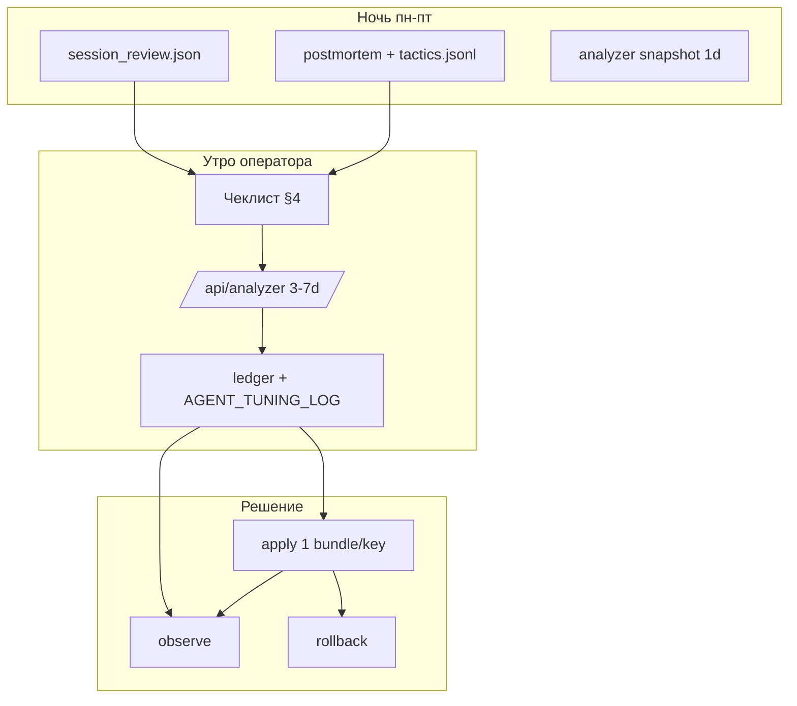

# GAME_5M — типовой анализ торговой сессии

Регулярный чеклист **после каждой US RTH-сессии** (пн–пт): что смотреть, в каком порядке, какие отчёты использовать для оптимизации входа и удержания.

**Связанные документы:**
- [GAME_5M_TUNING_REGLEMENT.md](GAME_5M_TUNING_REGLEMENT.md) — правила live-экспериментов (один bundle, observe, rollback).
- [GAME_5M_AGENT_TUNING_LOG.md](GAME_5M_AGENT_TUNING_LOG.md) — журнал применённых изменений на проде.
- [TRADE_EFFECTIVENESS_ANALYZER.md](TRADE_EFFECTIVENESS_ANALYZER.md) — поля анализатора.
- [GAME_5M_CATBOOST_FUSION.md](GAME_5M_CATBOOST_FUSION.md) — entry CatBoost / fusion.

---

## 1. Цели анализа

После сессии ответить на четыре вопроса:

1. **Вход** — были ли сделки с низким MFE, ложные срабатывания fusion (тег **A**)?
2. **Удержание** — отдали ли прибыль или долго держали минус до EOD (теги **B**, **C**)?
3. **Данные** — расхождения цен / телеметрии (тег **D**)?
4. **Что менять** — один пакет на **вход** *или* **выход**, не оба сразу.

Иерархия источников: **факты в БД** → post-mortem / session review → **анализатор** → replay proposals → решение в tuning ledger.

---

## 2. Автоматика (cron, пн–пт вечером MSK)

После закрытия RTH на GCP VM выполняется цепочка (см. `crontab/lse-docker.crontab`):

| Время (MSK) | Задача | Лог / артефакт |
|-------------|--------|----------------|
| **23:35** | Session review + **trade post-mortem** + snapshot анализатора (1d) | `logs/game5m_daily_review.log` |
| **23:30** | `analyzer_autotune` (без auto-apply) | `logs/autotune.log` |
| **23:40** | Tuning **observe** (если есть active experiment) | `logs/game5m_tuning.log` |
| **23:48** | Дневной ML pipeline (датасеты entry) | `logs/game5m_daily_ml_pipeline.log` |

**Утром аналитика** начинается с уже готовых файлов в `/app/logs/ml/ml_data_quality/` (в контейнере `lse-bot`).

### 2.1. Ключевые JSON-артефакты (после 23:35)

| Файл | Назначение |
|------|------------|
| `last_game5m_daily_session_review.json` | Сводка дня: закрытия, TIME_EXIT, EOD-flat, late BUY, gap MAE 14/30d |
| `last_game5m_trade_postmortem.json` | Post-mortem **последней** сессии: сделки, теги A/B/C/D, MFE/MAE |
| `game5m_trade_postmortem_sessions.jsonl` | **История** post-mortem по дням (rolling) |
| `last_game5m_postmortem_tactics.json` | Rolling 14d: фокус entry/exit, рекомендации тактики |
| `local/game5m_tuning_ledger.json` | `postmortem_tactics`, `active_experiment`, proposals |
| `analyzer_snapshot_*.json` (если есть) | Снимок `/api/analyzer?days=1` |

Просмотр на VM:

```bash
ssh gcp-lse
docker exec lse-bot cat /app/logs/ml/ml_data_quality/last_game5m_postmortem_tactics.json | python3 -m json.tool
docker exec lse-bot tail -30 /home/ai8049520/lse/logs/game5m_daily_review.log
```

Ручной пересчёт за конкретный день:

```bash
docker exec lse-bot python3 /app/scripts/game5m_daily_session_review.py --session-date YYYY-MM-DD
docker exec lse-bot python3 /app/scripts/game5m_trade_postmortem.py --session-date YYYY-MM-DD --window-days 14
```

---

## 3. Теги post-mortem (быстрая диагностика)

| Тег | Смысл | Куда копать |
|-----|--------|-------------|
| **A** | Слабый вход: MFE &lt; 1%, fusion пропустил плохой BUY | `GAME_5M_CATBOOST_HOLD_BELOW_P`, ветки `buy_rth_momentum`, train entry_bar |
| **B** | Плохой выход: был MFE ≥ 1.5%, итог сильно хуже | soft-take, continuation ML, hanger |
| **C** | Долгое удержание: EOD-flat в минусе, глубокий MAE | ранний loss-cut при SELL, hold/recovery |
| **D** | Данные: bar MFE vs сохранённый mfe | `price_5m` vs quote при `record_entry` |

**Правило приоритета:** если в rolling 14d доминирует **A** → следующий эксперимент только на **вход**; если **B+C** → только на **выход/удержание**.

---

## 4. Порядок работы после сессии (чеклист 20–40 мин)

### Шаг 0. Дождаться cron (или запустить вручную)

Убедиться, что в `game5m_daily_review.log` есть блоки `game5m_daily_session_review` и `game5m_trade_postmortem` за сегодня.

### Шаг 1. Post-mortem tactics (5 мин)

1. Открыть **Analyzer** → блок **GAME_5M tuning** → «Обновить статус»  
   или API: `GET /api/analyzer/tuning/status`
2. Прочитать:
   - `postmortem_tactics.training_focus` — `entry/fusion` или `exit/hold`
   - `tactic_recommendations[]` — приоритет и `suggested_actions`
3. Дополнительно: `GET /api/game5m/postmortem-tactics?window_days=14`

**Записать в** [GAME_5M_AGENT_TUNING_LOG.md](GAME_5M_AGENT_TUNING_LOG.md): дата сессии, фокус, 1–2 предложения «что болит».

### Шаг 2. Session review (3 мин)

Файл: `last_game5m_daily_session_review.json`

Проверить:

- `summary.closes_n`, `avg_pnl_by_exit`
- `time_exit_details` (EOD-flat loss vs weak_signal)
- `late_buy_after_block_cutoff_n` — были ли входы после cutoff
- `eod_flat_near_take_n` — закрыли ли у тейка зря

### Шаг 3. Разбор сделок с тегами (5–10 мин)

Файл: `last_game5m_trade_postmortem.json` → массив `trades[]`

Для каждой сделки с тегами:

- `ticker`, `pnl_pct`, `mfe_pct`, `mae_pct`
- `entry_branch`, `catboost_p_good`
- `notes[]`

Спорные кейсы → **шаг 4 (focused analyzer)** с `trade_ids` или `tickers`.

### Шаг 4. Анализатор — основной отчёт (10–15 мин)

**UI:** `/analyzer`  
**API:**

```http
GET /api/analyzer?strategy=GAME_5M&days=3&use_llm=0&light=0
```

Рекомендуемое окно: **3 дня** после сессии (свежие сделки + контекст); для тренда — **7–14 дней**.

#### Секции, которые смотреть в первую очередь

| Секция JSON | Вопрос |
|-------------|--------|
| `summary` | win rate, avg log-return, число закрытий |
| `game5m_catboost_fusion_entry_review` | would_hold, покрытие P на входах |
| `game5m_hanger_v2_review` | состояния hanger vs исход |
| `time_exit_early_review` | преждевременные выходы |
| `continuation_gate_review` | defer take |
| `practical_parameter_suggestions` | кандидаты ключей `GAME_5M_*` |
| `game5m_gap_forecast_arbiter` | если были overnight / gap |

Опционально LLM (`use_llm=1`) — только **после** просмотра метрик; для тяжёлого разбора одной сделки:

```http
GET /api/analyzer/focused?strategy=GAME_5M&days=5&tickers=CIEN&use_llm=1
```

### Шаг 5. Решение: менять / не менять (5 мин)

| Ситуация | Действие |
|----------|----------|
| `active_experiment.status = pending_effect` | **Не apply** нового; дождаться observe или сделать observe вручную |
| Post-mortem + analyzer согласны (entry) | Один пакет: fusion / momentum guard / bundle с entry-ключами |
| Согласны (exit) | Один пакет: take / EOD / SELL loss-cut / continuation |
| Только 1–2 сделки, нет тренда в 14d | **observe** — записать в лог, не менять config |
| Нужны числа по выходным порогам | Дождаться воскресного `propose` или запустить вручную (§6) |

**Применение:** Analyzer → tuning → Apply proposal **или** Apply bundle **или**

```bash
docker exec lse-bot python3 /app/scripts/game5m_tuning_controller.py apply --proposal-id ...
```

После apply — обязательно **observe** через 8+ новых закрытий (`cron` 23:40 или вручную `observe`).

### Шаг 6. Зафиксировать итог сессии

Шаблон записи в `GAME_5M_AGENT_TUNING_LOG.md`:

```markdown
## Сессия YYYY-MM-DD

- Post-mortem: фокус `entry/fusion` | теги A=_ B=_ C=_
- Session review: closes=_ TIME_EXIT=_ EOD-flat=_
- Analyzer (3d): главный вывод одной строкой
- Решение: observe | apply bundle X | ничего
- Следующая проверка: дата + метрика успеха
```

---

## 5. Недельный ритм (дополнение к ежедневному)

| Когда | Что | Артефакт |
|-------|-----|----------|
| **Вс 06:35** | Replay **propose** (exit-сетка) | `game5m_tuning_ledger.json` → `latest_proposals` |
| **Вс 06:40** | Weekly tactic review | `last_weekly_game5m_tactic_review.json` |
| **Пн–пт 23:40** | Tuning observe | ledger `observations[]` |

Раз в неделю (15 мин):

1. `GET /api/analyzer?strategy=GAME_5M&days=14`
2. Прочитать `last_weekly_game5m_tactic_review.json` — `recommendations_ru`, `postmortem_recommendations_ru`
3. Сверить с rolling `last_game5m_postmortem_tactics.json`
4. Если `propose` дал сильный кандидат — запланировать **один** apply на следующую неделю

```bash
docker exec lse-bot cat /app/logs/ml/ml_data_quality/last_weekly_game5m_tactic_review.json | python3 -m json.tool
```

---

## 6. Все отчёты для оптимизации (справочник)

### 6.1. Ежедневные (после каждой сессии)

| Отчёт | Путь / API | Контур |
|-------|------------|--------|
| Trade post-mortem | `last_game5m_trade_postmortem.json` | вход + выход (теги) |
| Post-mortem tactics | `last_game5m_postmortem_tactics.json`, `/api/game5m/postmortem-tactics` | очередь train |
| Daily session review | `last_game5m_daily_session_review.json` | день, EOD, late BUY |
| Analyzer snapshot | `ml_data_quality/analyzer_snapshot_*.json` | снимок 1d |
| Tuning status | `/api/analyzer/tuning/status` | experiment + postmortem |

### 6.2. Анализатор (по запросу)

| Отчёт | API / UI | Контур |
|-------|----------|--------|
| Полный | `/api/analyzer?days=N&strategy=GAME_5M` | сводка + GAME_5M блоки |
| Узкий | `/api/analyzer/focused?tickers=&trade_ids=` | расследование |
| ML arbiters | `sections=ml_arbiters` | multiday / gap / product ideas |
| Экспорт | `scripts/export_analyzer_report.py` | офлайн JSON |

### 6.3. Недельные / ML

| Отчёт | Путь | Контур |
|-------|------|--------|
| Weekly tactic review | `last_weekly_game5m_tactic_review.json` | bundle, hold-to-gap |
| Replay proposals | `game5m_tuning_ledger.json` → `latest_proposals` | выходные пороги |
| ML train readiness | `ml_train_readiness.jsonl` | готовность контуров |
| Gap forecast metrics | `last_gap_forecast_metrics.json` | overnight gap |
| Multiday WF | `last_multiday_wf_game5m.json` | OOS multiday |

### 6.4. Логи cron (при сбоях)

| Лог | Содержимое |
|-----|------------|
| `logs/game5m_daily_review.log` | session review + post-mortem markdown |
| `logs/cron_sndk_signal.log` | решения cron по тикерам (блокировки fusion) |
| `logs/game5m_tuning.log` | propose / observe |
| `logs/autotune.log` | analyzer_autotune |

---

## 7. Связь отчётов с действиями



**Не смешивать:**

- **Post-mortem A** → не чинить только EOD-flat (это следствие).
- **Replay propose** → только **выходные** `GAME_5M_*`; вход — через fusion / entry ML.
- **Два apply подряд** → нельзя интерпретировать, что сработало.

---

## 8. Быстрые команды (prod)

```bash
# Статус tuning + post-mortem
curl -sS 'http://127.0.0.1:8080/api/analyzer/tuning/status' | python3 -m json.tool

# Post-mortem tactics
curl -sS 'http://127.0.0.1:8080/api/game5m/postmortem-tactics?window_days=14' | python3 -m json.tool

# Analyzer 3 дня (лёгкий)
curl -sS 'http://127.0.0.1:8080/api/analyzer?strategy=GAME_5M&days=3&use_llm=0&light=1' | python3 -m json.tool | head -80

# Observe active experiment
docker exec lse-bot python3 /app/scripts/game5m_tuning_controller.py observe --days 5
```

---

## 9. Критерии «сессия разобрана»

- [ ] Прочитан `last_game5m_postmortem_tactics.json` или блок post-mortem в tuning status
- [ ] Просмотрены все `trades[]` с тегами за день
- [ ] Открыт analyzer за 3–7d, просмотрены `summary` + релевантные GAME_5M секции
- [ ] Запись в `GAME_5M_AGENT_TUNING_LOG.md` (даже если решение — «observe»)
- [ ] Не более **одного** запланированного изменения config; при pending experiment — только observe

---

*Документ введён для регулярного использования после каждой торговой сессии. При изменении cron или путей артефактов обновлять §2 и §6.*
