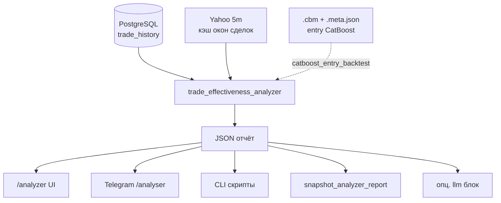

# GAME_5M Tuning Reglement

Цель регламента — менять параметры GAME_5M как **измеримые** live-эксперименты, а не как ручной перебор. Один эксперимент отвечает на один вопрос: улучшает ли **конкретное** изменение результат без роста нежелательного риска.

**Центральная система принятия решений о настройке** — **анализатор эффективности сделок** (`services/trade_effectiveness_analyzer.py`): единый расчёт метрик по закрытым сделкам и снимку правил из `config.env`, доступный с веба, из Telegram и из CLI. Replay proposals и nightly ML **питаются теми же фактами** (закрытые GAME_5M, `context_json`, бары), но **не заменяют** анализатор: они дают узкие срезы (реплей выхода / обучение входа). Ниже §2 расписывает пайплайны анализатора; §3+ — как подключать replay и live-apply к этому циклу.

## 1. Три контура (не путать)

| Контур | Что делает | Когда смотреть |
|--------|------------|----------------|
| **`/api/analyzer`** (+ опц. LLM) | Закрытые сделки, метрики окна 5m, hanger v2, continuation gate, CatBoost backtest на сохранённом `context_json` | После сессии / раз в несколько дней; перед сменой порогов «по ощущениям». |
| **`run_daily_game5m_ml_pipeline.py`** | Датасеты stuck/continuation + обучение **entry** CatBoost + строка в `game5m_daily_ml_report.jsonl` | По cron после закрытия US; **не** строит replay proposals. |
| **Replay proposals** (`services/game5m_replay_proposals.py` + `game5m_tuning_controller.py propose`) | Офлайн: сетка кандидатов по **выходным/тейковым** `GAME_5M_*`, для каждого — временный `os.environ` + `replay_game5m_on_bars` по последним сделкам; ранжирование по сумме/штрафам **delta log-return** | **Вручную** или отдельный cron (например 1× в неделю вне RTH); когда накопилось достаточно закрытых GAME_5M и нужен **числовой** приоритет правок до live-теста. |

Сегодня replay proposals **не запускались автоматически**: в репозитории нет включения `propose` в дневной ML-скрипт. Это осознанно: прогон тяжёлый (БД + реплей по многим сделкам и кандидатам), результат — гипотеза, а не деплой.

## 2. Анализатор: центральная система и пайплайны

Источник кода: `analyze_trade_effectiveness` / `analyze_trade_effectiveness_focused` в `services/trade_effectiveness_analyzer.py`. В ответе всегда есть **`meta.current_decision_rule_params`** — фактические пороги, с которыми сравнивать LLM и replay.

### 2.1. Общий поток данных



1. Загрузка **закрытых** сделок за `days` (1–30), фильтр `strategy` (`GAME_5M` / `ALL` / …).
2. По тикерам окна — **5m OHLC** (yfinance) для метрик `missed_upside`, `avoidable_loss`, MFE окна и т.д.
3. Параллельно — блоки GAME_5M: **hanger v2**, **continuation gate**, **CatBoost backtest** (если модель и флаги доступны на хосте веба).
4. Агрегаты + топ-кейсы + **практические подсказки** по ключам `GAME_5M_*` + опц. **LLM** (структурированный JSON при `use_llm=1`).
5. **`auto_config_override`** — машинные кандидаты для осторожного применения (белый список ключей).

Полная методика полей: [TRADE_EFFECTIVENESS_ANALYZER.md](TRADE_EFFECTIVENESS_ANALYZER.md). Архитектурный срез с controller: [ARCHITECTURE.md](ARCHITECTURE.md) §3.1.

### 2.2. Пайплайн A — полный отчёт (основной)

| Элемент | Описание |
|---------|----------|
| **Вход** | `GET /api/analyzer?days=N&strategy=GAME_5M&use_llm=0|1&include_trade_details=0|1` |
| **Назначение** | Общая картина: `summary`, `top_cases`, `practical_parameter_suggestions`, `critical_case_analysis`, `game_5m_config_hints`, `entry_underperformance_review`, `game5m_hanger_v2_review`, `continuation_gate_review`, `catboost_entry_backtest` |
| **Когда** | После торговой сессии или раз в 2–5 дней; перед планированием `propose` или `apply` — «что болит» (тейк, stale, missed, weak prob_up). |
| **LLM** | Галочка в UI / `use_llm=1`: приоритеты и `in_algorithm_parameter_changes`; не подменяет метрики. Лимит ответа: `ANALYZER_LLM_MAX_COMPLETION_TOKENS` (через merged config). |

### 2.3. Пайплайн B — узкий отчёт (тикеры / trade_id)

| Элемент | Описание |
|---------|----------|
| **Вход** | `GET /api/analyzer/focused?days=&tickers=T1,T2&trade_ids=&use_llm=1` или `scripts/analyze_trades_focused.py` |
| **Назначение** | Разбор конкретных провалов или одного тикера без шума всего портфеля; LLM в фокус-режиме с упором на **`config_env_proposals`**. |
| **Когда** | Расследование после крупного убытка; сверка рекомендаций модели с фактом по списку `trade_id`. |

### 2.4. Пайплайн C — снимки и офлайн-цикл

| Элемент | Описание |
|---------|----------|
| **Скрипт** | `scripts/snapshot_analyzer_report.py` — тот же JSON, что API (локальный импорт **или** HTTP при `ANALYZER_SNAPSHOT_URL`). |
| **Артефакты** | `local/analyzer_snapshots/*.json`, `latest.json` (в `.gitignore`). |
| **Связка** | `analyzer_hypothesis_candidates.py` → нумерованный список кандидатов; **`analyzer_tune_apply.py`** — применить один пункт из `auto_config_override` / отчёта; **`analyzer_autotune.py`** — осторожный автоматический один шаг (`ANALYZER_AUTOTUNE_APPLY`). |
| **Когда** | Cron на хосте без тяжёлых зависимостей; архив «до/после» для `diff_analyzer_snapshots.py`. |

### 2.5. Пайплайн D — веб tuning и тот же ledger, что у controller

| Элемент | Описание |
|---------|----------|
| **UI** | `/analyzer` — блок GAME_5M tuning. |
| **API** | `GET /api/analyzer/tuning/status`, `POST .../tuning/apply`, `observe`, `rollback`. |
| **Файл** | `local/game5m_tuning_ledger.json` (в контейнере часто `/app/local/...`) — **`game5m_tuning_controller.py` пишет сюда же** (`latest_proposals`, `active_experiment`, `history`). |
| **Политика** | Те же проверки, что у CLI: `apply_game5m_update` из `game5m_tuning_policy.py`. |

### 2.6. Как анализатор связывает контуры настройки

1. **Диагностика** (A или B) → формулируем гипотезу («ужесточить STRONG_BUY», «сократить max days», «поднять min take»).
2. **Replay** (§3) → числовой ранг по прошлому хвосту **только для выходных** параметров в сетке; сверить с блоками hanger / continuation / `summary`.
3. **Один apply** (веб или CLI) → observe → снова **анализатор** на новом окне сделок → решение оставить / откатить.
4. **Nightly ML** → качество entry-модели и датасетов; `catboost_entry_backtest` в анализаторе проверяет согласованность скора с фактом **на тех же закрытиях**, не дублируя JSONL.

## 3. Replay proposals: назначение и ограничения

Реализация: `build_game5m_replay_proposals()` в `services/game5m_replay_proposals.py`.

- Берёт последние закрытые сделки `GAME_5M` (по умолчанию до **120** за **30** дней), **исключая** «ложные тейки» от старого `session_high` (`is_false_take_profit_by_session_high`), если не передан флаг `--include-false-takes`.
- Строит ограниченную сетку значений для ключей: **`GAME_5M_TAKE_PROFIT_PCT`**, **`GAME_5M_TAKE_MOMENTUM_FACTOR`**, **`GAME_5M_TAKE_PROFIT_MIN_PCT`**, **`GAME_5M_MAX_POSITION_DAYS`**, и пер-тикерные **`GAME_5M_TAKE_PROFIT_PCT_<TICKER>`** для тикеров в выборке.
- Для каждой пары (ключ, кандидат) реплеит выход по 5m-барам из БД (`load_bars_5m_for_replay`), сравнивает **log-return** с фактом.
- **Не меняет** `config.env`: только расчёт в памяти с временными env overrides (`env_overrides`).
- **Не моделирует** новые входы, новости, смену ветки STRONG_BUY — только переигрыш **выходной** логики при том же входе/цене.

Интерпретация: высокий `score` и положительный `total_delta_log_ret` означают «на этом срезе сделок альтернативный порог мог бы улучшить суммарный log-return», с оговорками по **режиму рынка** и **переобучению на хвост**.

## 4. Когда запускать `propose`

Минимум:

- есть доступ к **той же БД**, что и прод (закрытые сделки + 5m бары для реплея);
- после серии закрытий (например конец недели), когда анализатор уже показал проблемную зону (тейк, max days, factor).

Команда (read-only, пишет только ledger):

```bash
# из корня репо, venv с зависимостями проекта
python scripts/game5m_tuning_controller.py propose --days 30 --max-trades 120 --top-n 12 --horizon-tail-days 1
```

Опции по смыслу:

- `--include-false-takes` — только если осознанно хотите включить спорные тейки в расчёт.
- `--ledger /path/to/game5m_tuning_ledger.json` — если не дефолт `local/game5m_tuning_ledger.json`.

Docker (пример):

```bash
docker compose exec -T lse python3 scripts/game5m_tuning_controller.py propose --days 30 --max-trades 120 --top-n 12
```

После `propose` в ledger появляется `latest_proposals` с полями `proposals[]` (`proposal_id`, `env_key`, `proposed`, `current`, `score`, `metrics`, `evidence`).

Просмотр:

```bash
python scripts/game5m_tuning_controller.py status --top-n 8
```

## 5. Отбор одного кандидата и apply

Правила:

- не применять **несколько** сильных изменений сразу;
- приоритет — выход и удержание (тейк, factor, min take, max days), согласованно с планом hanger/stale (`docs/GAME_5M_HANGER_AND_STALE_EXIT_PLAN.md`);
- replay **score — не приказ**, а гипотеза: перед продом сверить с анализатором и здравым смыслом.

Изменение в live — **только** через controller (валидация ключа и шага — `services/game5m_tuning_policy.py`):

```bash
python scripts/game5m_tuning_controller.py apply --proposal-id <proposal_id> --observe-days 2
```

Смягчённый шаг вручную (то же правило валидации):

```bash
python scripts/game5m_tuning_controller.py apply --key GAME_5M_TAKE_PROFIT_MIN_PCT --value 2.5 --observe-days 2
```

`--dry-run` — проверить без записи в `config.env`. При активном эксперименте `pending_effect` повторный `apply` без `--force` будет отклонён.

## 6. Окно наблюдения

- минимум **1** полный торговый день;
- лучше **2–3** дня;
- либо до накопления **8–20** новых закрытых GAME_5M (как в `observe --min-new-trades`).

Пока эксперимент активен, не менять другие параметры, сильно влияющие на вход/выход.

Фиксация наблюдения:

```bash
python scripts/game5m_tuning_controller.py observe --days 2 --min-new-trades 8
python scripts/game5m_tuning_controller.py status
```

Смотреть: число новых закрытий, total/avg log-return, win rate, распределение по `exit_signal`, затронутые тикеры; сравнить с `baseline_summary` в ledger. **Повторный прогон анализатора** на том же `days` после окна — главная проверка согласованности с гипотезой replay.

## 7. Решение: оставить / продлить / откатить

Оставить изменение, если:

- достаточно новых сделок;
- avg/total log-return **лучше** baseline;
- нет всплеска плохих выходов (stale, преждевременный тейк там, где раньше был плюс);
- нет деградации по ключевым тикерам.

Продлить наблюдение, если сделок мало или эффект нейтральный.

Откатить (вернуть старое значение в `config.env` вручную или через политику отката веба), если live расходится с replay, растут зависания или ухудшился PnL.

## 8. Связь с вебом

На странице анализатора блок **GAME_5M tuning** использует тот же дух «один параметр, observe»: API `/api/analyzer/tuning/*` и файл `local/game5m_tuning_ledger.json`. Controller по умолчанию пишет в **тот же** `game5m_tuning_ledger.json` — не плодите второй ledger без необходимости.

## 9. Пример эксперимента (2026-04-29)

Replay top direction: снизить минимальный take-profit.

Live-тест на 2026-04-29 → 2026-04-30:

```env
GAME_5M_TAKE_PROFIT_MIN_PCT=2.5
```

Мягкий шаг между `3.0` и replay-кандидатом `2.0`: проверить, уменьшит ли более ранняя фиксация просадки и пропуски выхода, не убивая сильные движения.

## 10. Рекомендуемый график (операционно)

| Частота | Действие |
|---------|----------|
| **Ежедневно** (cron) | `run_daily_game5m_ml_pipeline` — датасеты + entry CatBoost + JSONL. |
| **2–5× в неделю** | Пайплайн **A** (`/analyzer` или снимок): качество сделок, hanger v2, continuation gate, CatBoost backtest. |
| **По инциденту** | Пайплайн **B** (focused) + при необходимости LLM. |
| **0–2× в неделю** | `game5m_tuning_controller.py propose` — когда нужен ранжированный список **выходных** порогов по реплею; затем один `apply` + observe + снова анализатор. |

Если неделя прошла без `propose` — это нормально: инструмент вспомогательный, а не обязательный ежедневный шаг.
