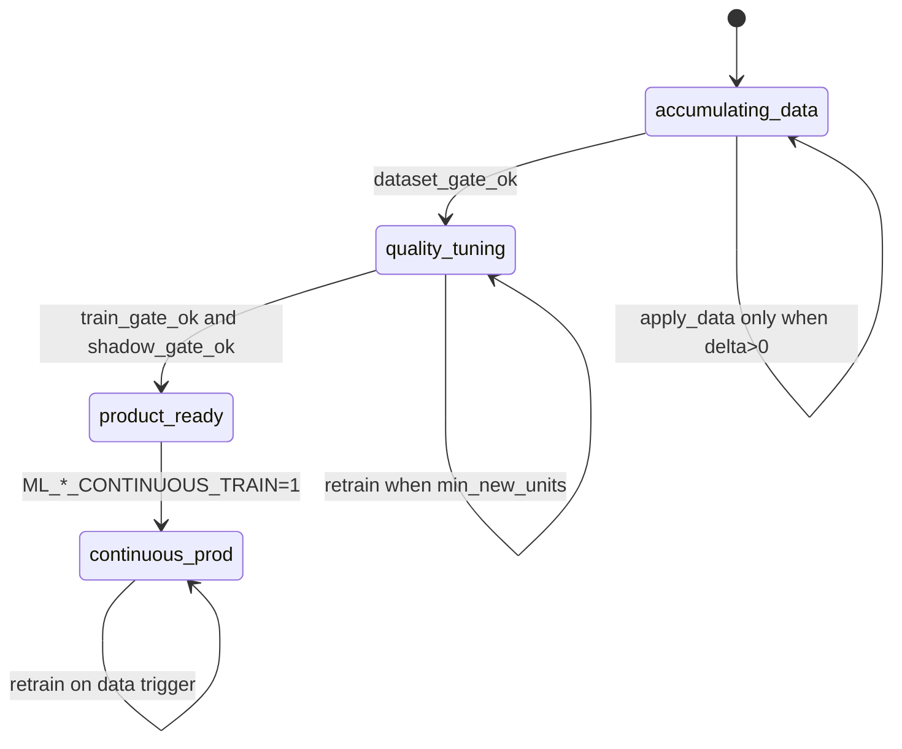

# Единый каркас ML: readiness + переобучение по накоплению данных

> **Матрица всех контуров, cron и слои L1–L3:** [ML_AND_DECISION_ARCHITECTURE.md](ML_AND_DECISION_ARCHITECTURE.md). Этот файл — deep-dive по **слою L1 (retrain)**.

**Статус:** зафиксировано в prod с коммита `3ad797b` (2026-06-01).  
**Аудитория:** разработка, ops, продукт.  
**Связь с readiness:** гейты отвечают на «**можно ли** использовать контур»; каркас переобучения — «**когда** обновлять данные и `.cbm` по мере накопления фактов». Это **два слоя одной концепции**, не дублирующие cron.

**Цель:** все обучаемые контуры LSE следуют **одному контракту** (фазы, артефакты, cron, analyzer).  
**Период переобучения** — не фиксированный «каждые 6h», а **data-driven**: train когда накопилось достаточно новых наблюдений; time-based — только fallback и слот `--full` / shadow.

**Код:** `services/ml_contour_refresh.py`, `services/ml_contour_deltas.py`, `services/ml_contour_runner.py`, `scripts/run_ml_refresh_dispatcher.py`.

Связанные документы:

- [ML_DATA_QUALITY_PIPELINE.md](ML_DATA_QUALITY_PIPELINE.md) — JSONL гейты, `last_*` метрики, analyzer
- [OPEN_PATH_MVP_AND_EARNINGS_AUTOPREP_PLAN.md](OPEN_PATH_MVP_AND_EARNINGS_AUTOPREP_PLAN.md) — earnings + open-path product gates
- [TRADE_ML_DATASETS_AND_TARGETS_RU.md](TRADE_ML_DATASETS_AND_TARGETS_RU.md) — сетки и таргеты

---

## 0. Два слоя readiness (концепция)

| Слой | Вопрос | Артефакты | Где смотреть |
|------|--------|-----------|--------------|
| **Product / quality gates** | Достаточно ли данных и метрик, чтобы контур считался готовым? | `last_earnings_intelligence_readiness.json`, `last_open_path_readiness.json`, `ml_train_readiness.jsonl` | Analyzer: earnings grid, open-path ETA, таблица гейтов |
| **Retrain orchestration** | Пора ли **пересобрать** dataset / переобучить модель на новых фактах? | `last_<contour>_ml_refresh.json`, `ml_contours_status.json` | Analyzer: «Переобучение ML по контурам»; `GET /api/ml/data-quality` |

**Правила:**

1. **Гейт `ready=true` не включает** runtime (`*_CATBOOST_ENABLED`) — только advisory / decision stack readiness.
2. **Train без гейта** допустим (накопление, dry-run); **continuous train после product gate** — только при `ML_*_CONTINUOUS_TRAIN=1` или эквиваленте.
3. **Poll частый (6h), train редкий** — частота train = f(Δ данных), не f(tick cron).
4. ETA до product-ready (open-path) и **фаза** контура в `ml_contours_status` — одна картина прогресса для ops.

```text
  [новые сделки / labels / ERD rows]
           │
           ▼
  evaluate_retrain_trigger  ──► apply-data / train / skip
           │
           ▼
  write_*_readiness / ml_train_readiness.jsonl  ──► gates (quality)
           │
           ▼
  ml_contours_status.json + analyzer
```

---

## 1. Контракт контура (`MlContourSpec`)

Каждый ML-контур регистрируется в `ML_CONTOUR_REGISTRY` с полями:

| Поле | Смысл |
|------|--------|
| `contour_id` | Стабильный id (`game5m_entry`, `earnings_grid`, …) |
| `display_name_ru` | Подпись в analyzer |
| `data_unit` | Единица «новизны»: `closed_trade`, `labeled_event`, `labeled_session`, `daily_row`, `forecast_row`, … |
| `refresh_script` | Оркестратор (`scripts/run_*_ml_refresh.py`) |
| `readiness_path` | JSON гейтов (или ключ в `last_earnings_intelligence_readiness.json`) |
| `train_metrics_path` | `last_*_train_metrics.json` |
| `refresh_log_path` | `last_*_ml_refresh.json` |
| `product_gate_key` | Ключ overall product-ready в gates |
| `min_new_units` | Config: `ML_<ID>_RETRAIN_MIN_NEW_UNITS` |
| `max_staleness_hours` | Config: `ML_<ID>_RETRAIN_MAX_STALENESS_HOURS` |
| `poll_interval_hours` | Как часто cron **проверяет** триггер (не обязательно train) |
| `full_cron` | Слот weekly full + shadow (если применимо) |
| `supports_shadow` | Нужен offline shadow перед product |
| `supports_continuous` | После product gate — train на всей истории при каждом apply-data |

---

## 2. Фазы жизненного цикла (единые для всех)



| Фаза | Cron делает | Train |
|------|-------------|-------|
| `accumulating_data` | label/build/dataset в БД или CSV | dry-run или skip |
| `quality_tuning` | apply-data при `delta ≥ min_new` | incremental `.cbm` / JSON model |
| `product_ready` | то же + shadow на full-слоте | incremental + valid gates |
| `continuous_prod` | после product gate | **каждый** успешный apply-data (вся история, walk-forward valid) |

ETA в analyzer: оценка `days_to_target` по темпу `delta / lookback_days` (как `open_path_product_eta.py`).

---

## 3. Триггер переобучения (ядро)

На каждом tick cron (poll) вызывается `evaluate_retrain_trigger(contour_id)`:

```text
should_apply_data  = (new_units_since_last_apply ≥ min_new_units) OR (staleness ≥ max_staleness)
should_train       = should_apply_data AND phase ∈ {quality_tuning, product_ready, continuous_prod}
                     OR full_cron_slot
                     OR (continuous_prod AND apply_data succeeded)
should_full_shadow = full_cron_slot AND phase ≥ quality_tuning
```

**`new_units_since_last_*`** считается от метки в `last_*_ml_refresh.json` (`last_apply_at_utc`, `data_watermark`).

Источники watermark по контуру:

| contour_id | watermark | SQL / источник |
|------------|-----------|----------------|
| `game5m_entry` | `max(closed_at)` closed GAME_5M BUY | `trade_history` |
| `portfolio` | `max(date)` portfolio BUY context | `trade_history` |
| `event_reaction_regression` | `count(*)` labeled ERD since watermark | `event_reaction_dataset` |
| `earnings_grid` | новые `llm_scenario_v0` rows | `event_reaction_dataset.updated_at` |
| `open_path` | rule labels после close | `game5m_open_path_labels.created_at` |
| `multiday_lr` | новые daily rows по universe | `quotes` |
| `recovery` | строки JSONL export | файл + `trade_history` |
| `gap_forecast` | `n_complete` в log | `game5m_gap_forecast_daily` |

**Важно:** фиксированный `*/6 * * *` остаётся как **poll**, но train внутри скрипта выполняется **только если триггер true** (кроме явного `--full`).

---

## 4. Единые артефакты (под `/app/logs/ml/ml_data_quality/`)

| Файл | Содержимое |
|------|------------|
| `last_<contour>_ml_refresh.json` | `{finished_at_utc, trigger, new_units, apply_data, train_ran, full, phase}` |
| `last_<contour>_train_metrics.json` | метрики train (как сейчас) |
| `<contour>_readiness_history.jsonl` | опционально: снимки для ETA |
| `ml_contours_status.json` | агрегат для analyzer (все контуры, фаза, ETA, last_refresh) |

Readiness по-прежнему может быть **общим** (`last_earnings_intelligence_readiness.json` для earnings + open-path prereq) или **отдельным** — каркас не ломает текущие файлы.

---

## 5. Config.env (шаблон ключей)

```bash
# --- Unified retrain (per contour; ID = UPPER contour_id) ---
# ML_GAME5M_ENTRY_RETRAIN_MIN_NEW_UNITS=8      # новых закрытых GAME_5M сделок
# ML_GAME5M_ENTRY_RETRAIN_MAX_STALENESS_HOURS=168
# ML_GAME5M_ENTRY_RETRAIN_POLL_HOURS=6
# ML_GAME5M_ENTRY_CONTINUOUS_TRAIN=0           # 1 после product gate

# ML_EARNINGS_GRID_RETRAIN_MIN_NEW_UNITS=3     # новых LLM scenario labels
# ML_EARNINGS_GRID_RETRAIN_MAX_STALENESS_HOURS=6
# ML_EARNINGS_GRID_CONTINUOUS_TRAIN=1          # после overall_earnings_autoprep_ready

# ML_OPEN_PATH_* — уже есть OPEN_PATH_ML_* (alias в каркасе)
# ML_EVENT_REACTION_REGRESSION_*
# ML_PORTFOLIO_*
# ML_MULTIDAY_LR_*
# ML_RECOVERY_*
# ML_GAP_FORECAST_*  — без .cbm; retrain = refit OLS / пересчёт baseline
```

Старые ключи (`EARNINGS_ML_REFRESH_*`, `OPEN_PATH_ML_*`) сохраняются как **aliases** на переходный период.

---

## 6. Cron (prod, `crontab/lse-docker.crontab`)

**Единый poll (data-driven):**

```cron
# Каждые 6h: все ACTIVE контуры — train только если evaluate_retrain_trigger
15 */6 * * * flock -n /tmp/lse_ml_refresh_dispatcher.lock \
  docker exec lse-bot python scripts/run_ml_refresh_dispatcher.py \
  >> …/logs/ml_refresh_dispatcher.log 2>&1
```

**ACTIVE контуры в dispatcher (8/8):** `open_path`, `earnings_grid`, `game5m_entry`, `portfolio`, `event_reaction_regression`, `multiday_lr`, `recovery`, `gap_forecast`.

**Nightly / full (принудительный `--full` или ops-флаги):**

| Cron MSK | Скрипт | Контур |
|----------|--------|--------|
| `23:40` пн–пт | `run_daily_game5m_ml_pipeline.py` | datasets only (stuck + continuation CSV) |
| `23:45` пн–пт | `label_open_path_scenarios.py` | open-path labels |
| `23:47` пн–пт | `run_ml_refresh_dispatcher.py --slot nightly` | game5m_entry, open_path, event_reaction, earnings_grid, portfolio |
| `23:50` пн–пт | `run_ml_train_readiness_cron.py` | JSONL gates + `ml_contours_status` |
| `23:48` вс | `run_open_path_ml_refresh.py --full` | open-path shadow + continuous |

Per-contour lock в dispatcher: `/tmp/lse_ml_refresh_<contour_id>.lock` (`flock -n` внутри `run_ml_refresh_dispatcher.py`).

**Удалено при миграции:** отдельные `*/6` cron для `run_earnings_ml_refresh` и `run_open_path_ml_refresh` — их заменяет dispatcher.

---

## 7. Analyzer и API

**Блок «ML: готовность и качество данных»** (`/analyzer`):

| UI | Источник | Слой |
|----|----------|------|
| Таблица гейтов `ml_train_readiness.jsonl` | cron 23:50 | quality gates |
| Earnings intelligence grid + open-path ETA | `last_*_readiness.json` | product gates |
| **«Переобучение ML по контурам»** | `ml_contours_status.json` | retrain orchestration |

**API:** `GET /api/ml/data-quality?strategy=GAME_5M`

- `earnings_grid_readiness`, `readiness_latest` — gates
- `ml_contours_status` — aggregate всех 8 контуров (в т.ч. registry-only)
- `cache_meta` — TTL read `report_daily.json` (~6h); `?refresh=1` — полный пересчёт

**Кнопки:**

- **Обновить блок** — cache read
- **Полный перерасчёт** — `?refresh=1`
- *(план)* **POST /api/ml/refresh?contour=…** — ops

**Ручная проверка на prod:**

```bash
docker exec lse-bot python scripts/run_ml_refresh_dispatcher.py --dry-run
docker exec lse-bot python scripts/run_ml_refresh_dispatcher.py --contour multiday_lr --full
docker exec lse-bot cat /app/logs/ml/ml_data_quality/ml_contours_status.json | jq '.contours[] | {id:.contour_id, phase, train:.trigger.should_train}'
ssh ai8049520@104.154.205.58 "docker exec lse-bot curl -sS 'http://127.0.0.1:8080/api/ml/data-quality' | jq '.ml_contours_status.contours | length'"
```

---

## 8. Матрица контуров (prod 2026-06-01)

| contour_id | Quality gates | Refresh script | Dispatcher | Continuous после gate |
|------------|---------------|----------------|------------|------------------------|
| `open_path` | ✅ `open_path_readiness.py` + ETA | ✅ trigger | ✅ | ✅ `OPEN_PATH_ML_CONTINUOUS_TRAIN` |
| `earnings_grid` | ✅ `earnings_intelligence_readiness.py` | ✅ trigger | ✅ | config `ML_EARNINGS_GRID_CONTINUOUS_TRAIN` |
| `game5m_entry` | ✅ `ml_train_readiness.jsonl` | ✅ trade Δ | ✅ | если gate.ready → `continuous_prod` |
| `portfolio` | ✅ JSONL | ✅ trade Δ | ✅ | если gate.ready |
| `event_reaction_regression` | ✅ JSONL | ✅ ERD Δ | ✅ | — |
| `multiday_lr` | ⚠️ analyzer arbiter | ✅ quotes Δ | ✅ poll + weekly_full | config `ML_MULTIDAY_LR_CONTINUOUS_TRAIN` |
| `recovery` | ❌ D4 stats | ✅ TIME_EXIT Δ | ✅ poll + weekly_full | log-only (D4b pending) |
| `gap_forecast` | ⚠️ analyzer arbiter | ✅ DB complete rows | ✅ poll + nightly `--full` | caution / baseline |

**Дефолты `ML_*_RETRAIN_MIN_NEW_UNITS`:** open_path 5 · earnings_grid 3 · game5m_entry 8 · **game5m_entry_bar_v2 500** · **game5m_continuation 10** · portfolio 5 · event_reaction 10.

---

## 9. Псевдокод оркестратора (единый для каждого контура)

```python
def run_contour_refresh(contour_id: str, *, full: bool = False) -> int:
    spec = get_contour_spec(contour_id)
    state = load_refresh_log(spec)
    trigger = evaluate_retrain_trigger(spec, state, force_full=full)
    phase = resolve_phase(contour_id)

    if trigger.should_apply_data or full:
        run_pipeline_step("label", spec, dry_run=phase == "accumulating_data")
        run_pipeline_step("build_dataset", spec, dry_run=...)
        write_watermark(spec, "apply")

    if trigger.should_train or full:
        rc = run_pipeline_step("train", spec, dry_run=phase == "accumulating_data")
        if rc == 0:
            write_watermark(spec, "train")

    if trigger.should_full_shadow or full:
        run_pipeline_step("shadow", spec)
        run_pipeline_step("readiness", spec)

    write_refresh_log(spec, trigger, phase)
    append_contours_status_aggregate()
    return 0
```

Существующие `run_open_path_ml_refresh.py` / `run_earnings_ml_refresh.py` постепенно сводятся к вызовам `run_contour_refresh` + contour-specific step hooks.

---

## 10. Definition of Done (каркас переобучения)

**Сделано (prod):**

- [x] Registry + `evaluate_retrain_trigger` + тесты
- [x] Trigger в `run_open_path_ml_refresh.py`, `run_earnings_ml_refresh.py`
- [x] Wrappers: game5m_entry, portfolio, event_reaction_regression
- [x] `run_ml_refresh_dispatcher.py` + cron `15 */6`
- [x] `ml_contours_status.json` + таблица в analyzer
- [x] `run_ml_train_readiness_cron.py` → aggregate после JSONL
- [x] TTL cache `/api/ml/data-quality` (`ML_DATA_QUALITY_REPORT_CACHE_HOURS`)
- [x] Config keys в `config.env.example`

**Backlog (в рамках той же концепции readiness):**

- [x] Refresh scripts: multiday_lr, recovery, gap_forecast
- [x] `run_ml_refresh_dispatcher.py --slot nightly` (cron 23:47)
- [ ] `continuous_learning` UI block для earnings_grid (как open-path)
- [ ] `POST /api/ml/refresh?contour=` для ops

---

## 11. Принципы (не нарушать)

1. **Log-returns** и **transaction costs** в shadow/metrics — как в остальном LSE.
2. **Dry-run по умолчанию** вне product/continuous фазы.
3. **Гейт ≠ автовключение** runtime (`*_CATBOOST_ENABLED` не переключается readiness JSON).
4. **Poll частый, train редкий** — частота train = f(накопление данных), не f(cron tick).
5. Обратная совместимость путей JSON и cron на время миграции.
