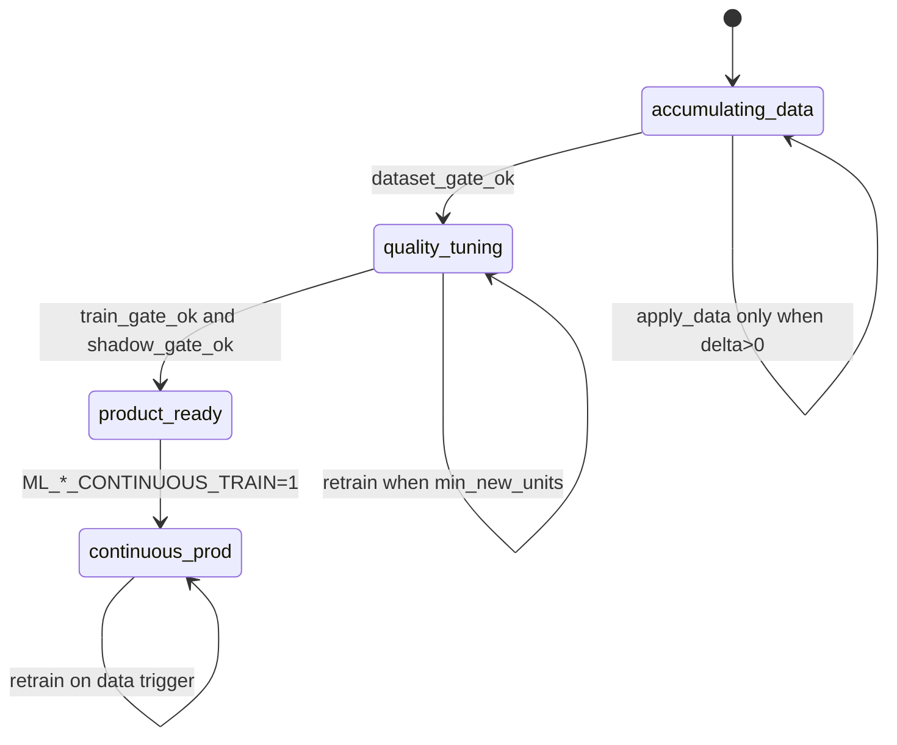

# Единый каркас ML: readiness + переобучение по накоплению данных

**Цель:** все обучаемые контуры LSE следуют **одному контракту** (фазы, артефакты, cron, analyzer).  
**Период переобучения** — не фиксированный «каждые 6h», а **data-driven**: train когда накопилось достаточно новых наблюдений; time-based — только fallback и слот full/shadow.

**Эталон реализации:** `open_path` + `earnings_grid` (уже близки к целевому виду).  
**Код каркаса:** `services/ml_contour_refresh.py`, диспетчер (фаза 2): `scripts/run_ml_refresh_dispatcher.py`.

Связанные документы: [ML_DATA_QUALITY_PIPELINE.md](ML_DATA_QUALITY_PIPELINE.md), [OPEN_PATH_MVP_AND_EARNINGS_AUTOPREP_PLAN.md](OPEN_PATH_MVP_AND_EARNINGS_AUTOPREP_PLAN.md), [TRADE_ML_DATASETS_AND_TARGETS_RU.md](TRADE_ML_DATASETS_AND_TARGETS_RU.md).

---

## 1. Контракт контура (`MlContourSpec`)

Каждый ML-контур регистрируется в `ML_CONTOUR_REGISTRY` с полями:

| Поле | Смысл |
|------|--------|
| `contour_id` | Стабильный id (`game5m_entry`, `earnings_grid`, …) |
| `display_name_ru` | Подпись в analyzer |
| `data_unit` | Единица «новизны»: `closed_trade`, `labeled_event`, `labeled_session`, `daily_row`, `forecast_row`, … |
| `refresh_script` | Оркестратор (`scripts/run_*_ml_refresh.py`) |
| `readiness_path` | JSON гейтов (или ключ в `last_earnings_intelligence_readiness.json`) |
| `train_metrics_path` | `last_*_train_metrics.json` |
| `refresh_log_path` | `last_*_ml_refresh.json` |
| `product_gate_key` | Ключ overall product-ready в gates |
| `min_new_units` | Config: `ML_<ID>_RETRAIN_MIN_NEW_UNITS` |
| `max_staleness_hours` | Config: `ML_<ID>_RETRAIN_MAX_STALENESS_HOURS` |
| `poll_interval_hours` | Как часто cron **проверяет** триггер (не обязательно train) |
| `full_cron` | Слот weekly full + shadow (если применимо) |
| `supports_shadow` | Нужен offline shadow перед product |
| `supports_continuous` | После product gate — train на всей истории при каждом apply-data |

---

## 2. Фазы жизненного цикла (единые для всех)



| Фаза | Cron делает | Train |
|------|-------------|-------|
| `accumulating_data` | label/build/dataset в БД или CSV | dry-run или skip |
| `quality_tuning` | apply-data при `delta ≥ min_new` | incremental `.cbm` / JSON model |
| `product_ready` | то же + shadow на full-слоте | incremental + valid gates |
| `continuous_prod` | после product gate | **каждый** успешный apply-data (вся история, walk-forward valid) |

ETA в analyzer: оценка `days_to_target` по темпу `delta / lookback_days` (как `open_path_product_eta.py`).

---

## 3. Триггер переобучения (ядро)

На каждом tick cron (poll) вызывается `evaluate_retrain_trigger(contour_id)`:

```text
should_apply_data  = (new_units_since_last_apply ≥ min_new_units) OR (staleness ≥ max_staleness)
should_train       = should_apply_data AND phase ∈ {quality_tuning, product_ready, continuous_prod}
                     OR full_cron_slot
                     OR (continuous_prod AND apply_data succeeded)
should_full_shadow = full_cron_slot AND phase ≥ quality_tuning
```

**`new_units_since_last_*`** считается от метки в `last_*_ml_refresh.json` (`last_apply_at_utc`, `data_watermark`).

Источники watermark по контуру:

| contour_id | watermark | SQL / источник |
|------------|-----------|----------------|
| `game5m_entry` | `max(closed_at)` closed GAME_5M BUY | `trade_history` |
| `portfolio` | `max(date)` portfolio BUY context | `trade_history` |
| `event_reaction_regression` | `count(*)` labeled ERD since watermark | `event_reaction_dataset` |
| `earnings_grid` | `llm_scenario_labels` + feature rows | readiness snapshot |
| `open_path` | premarket sessions + rule labels | `game5m_open_path_labels` |
| `multiday_lr` | новые daily rows по universe | `quotes` |
| `recovery` | строки JSONL export | файл + `trade_history` |
| `gap_forecast` | `n_complete` в log | `game5m_gap_forecast_daily` |

**Важно:** фиксированный `*/6 * * *` остаётся как **poll**, но train внутри скрипта выполняется **только если триггер true** (кроме явного `--full`).

---

## 4. Единые артефакты (под `/app/logs/ml/ml_data_quality/`)

| Файл | Содержимое |
|------|------------|
| `last_<contour>_ml_refresh.json` | `{finished_at_utc, trigger, new_units, apply_data, train_ran, full, phase}` |
| `last_<contour>_train_metrics.json` | метрики train (как сейчас) |
| `<contour>_readiness_history.jsonl` | опционально: снимки для ETA |
| `ml_contours_status.json` | агрегат для analyzer (все контуры, фаза, ETA, last_refresh) |

Readiness по-прежнему может быть **общим** (`last_earnings_intelligence_readiness.json` для earnings + open-path prereq) или **отдельным** — каркас не ломает текущие файлы.

---

## 5. Config.env (шаблон ключей)

```bash
# --- Unified retrain (per contour; ID = UPPER contour_id) ---
# ML_GAME5M_ENTRY_RETRAIN_MIN_NEW_UNITS=8      # новых закрытых GAME_5M сделок
# ML_GAME5M_ENTRY_RETRAIN_MAX_STALENESS_HOURS=168
# ML_GAME5M_ENTRY_RETRAIN_POLL_HOURS=6
# ML_GAME5M_ENTRY_CONTINUOUS_TRAIN=0           # 1 после product gate

# ML_EARNINGS_GRID_RETRAIN_MIN_NEW_UNITS=3     # новых LLM scenario labels
# ML_EARNINGS_GRID_RETRAIN_MAX_STALENESS_HOURS=6
# ML_EARNINGS_GRID_CONTINUOUS_TRAIN=1          # после overall_earnings_autoprep_ready

# ML_OPEN_PATH_* — уже есть OPEN_PATH_ML_* (alias в каркасе)
# ML_EVENT_REACTION_REGRESSION_*
# ML_PORTFOLIO_*
# ML_MULTIDAY_LR_*
# ML_RECOVERY_*
# ML_GAP_FORECAST_*  — без .cbm; retrain = refit OLS / пересчёт baseline
```

Старые ключи (`EARNINGS_ML_REFRESH_*`, `OPEN_PATH_ML_*`) сохраняются как **aliases** на переходный период.

---

## 6. Cron (целевая схема)

**Фаза 1 (минимальные изменения):** существующие `run_*_ml_refresh.py` внутри вызывают `evaluate_retrain_trigger` — поведение снаружи то же.

**Фаза 2:** один poll-диспетчер:

```cron
# Каждые 6h: проверка всех контуров (train только по триггеру)
15 */6 * * * docker exec lse-bot python scripts/run_ml_refresh_dispatcher.py

# Nightly: full/shadow слоты по registry.full_cron
50 23 * * 1-5 docker exec lse-bot python scripts/run_ml_refresh_dispatcher.py --slot nightly
0  6 * * 0   docker exec lse-bot python scripts/run_ml_refresh_dispatcher.py --slot weekly_full
```

Per-contour locks: `/tmp/lse_ml_refresh_<contour_id>.lock`.

---

## 7. Analyzer (единый блок)

Под блоком «ML: готовность» — таблица **всех контуров**:

| Контур | Фаза | ETA | Новых с last train | Last train | Continuous | Действие |
|--------|------|-----|-------------------|------------|------------|----------|
| Open-path | accumulating | ~79 d | 3 sessions | 2026-06-01 | off | … |

Данные: `GET /api/ml/data-quality` → `ml_contours_status` (агрегат из `services/ml_contour_refresh.py`).

Кнопки:

- **Обновить блок** — cache read (как сейчас)
- **Полный перерасчёт** — `?refresh=1`
- **Переобучить контур** — `POST /api/ml/refresh?contour=game5m_entry` (ops, с lock)

---

## 8. Матрица миграции контуров

| contour_id | Readiness сегодня | Refresh сегодня | Шаг 1 | Шаг 2 | Шаг 3 |
|------------|-------------------|-----------------|-------|-------|-------|
| `open_path` | ✅ полный | ✅ 6h+nightly | alias keys → unified | ETA уже есть | — |
| `earnings_grid` | ✅ полный | ✅ 6h+23:52 | trigger by labels delta | `continuous_learning` block | peer/reg sub-contours |
| `game5m_entry` | ⚠️ ml_train_readiness | ⚠️ daily pipeline | `run_game5m_entry_ml_refresh.py` | min 8 new trades | shadow backtest gate |
| `portfolio` | ⚠️ ml_train_readiness | ⚠️ nightly dry-run | wrapper + trade delta | continuous after gate | — |
| `event_reaction_regression` | ⚠️ ml_train_readiness | ⚠️ 23:51 full only | wrapper + ERD delta | decouple from earnings grid | — |
| `multiday_lr` | ⚠️ analyzer arbiter | ❌ manual | registry + quotes delta | nightly refit JSON | readiness in jsonl |
| `recovery` | ❌ | ❌ stats only | export delta trigger | train in refresh script | D4 gate |
| `gap_forecast` | ⚠️ arbiter | ❌ log only | refit on n_complete delta | no cbm | telemetry only |

**Приоритет внедрения:** game5m_entry → portfolio → event_reaction → multiday_lr → recovery → gap_forecast.

---

## 9. Псевдокод оркестратора (единый для каждого контура)

```python
def run_contour_refresh(contour_id: str, *, full: bool = False) -> int:
    spec = get_contour_spec(contour_id)
    state = load_refresh_log(spec)
    trigger = evaluate_retrain_trigger(spec, state, force_full=full)
    phase = resolve_phase(contour_id)

    if trigger.should_apply_data or full:
        run_pipeline_step("label", spec, dry_run=phase == "accumulating_data")
        run_pipeline_step("build_dataset", spec, dry_run=...)
        write_watermark(spec, "apply")

    if trigger.should_train or full:
        rc = run_pipeline_step("train", spec, dry_run=phase == "accumulating_data")
        if rc == 0:
            write_watermark(spec, "train")

    if trigger.should_full_shadow or full:
        run_pipeline_step("shadow", spec)
        run_pipeline_step("readiness", spec)

    write_refresh_log(spec, trigger, phase)
    append_contours_status_aggregate()
    return 0
```

Существующие `run_open_path_ml_refresh.py` / `run_earnings_ml_refresh.py` постепенно сводятся к вызовам `run_contour_refresh` + contour-specific step hooks.

---

## 10. Критерии готовности каркаса (Definition of Done)

- [x] `services/ml_contour_refresh.py` — registry + trigger + aggregate status
- [x] `evaluate_retrain_trigger` покрыт тестами (delta, staleness, full slot, continuous)
- [x] `open_path` и `earnings_grid` используют trigger (не train «вслепую» каждые 6h)
- [x] `run_game5m_entry_ml_refresh.py` + portfolio + event_reaction wrappers
- [x] `ml_contours_status.json` + секция в analyzer
- [x] `run_ml_train_readiness_cron.py` обновляет aggregate после JSONL
- [x] `run_ml_refresh_dispatcher.py` + cron `15 */6`
- [x] Config keys в `config.env.example`
- [ ] multiday_lr / recovery / gap_forecast refresh scripts (registry-only)
- [ ] `POST /api/ml/refresh?contour=` (ops)

---

## 11. Принципы (не нарушать)

1. **Log-returns** и **transaction costs** в shadow/metrics — как в остальном LSE.
2. **Dry-run по умолчанию** вне product/continuous фазы.
3. **Гейт ≠ автовключение** runtime (`*_CATBOOST_ENABLED` не переключается readiness JSON).
4. **Poll частый, train редкий** — частота train = f(накопление данных), не f(cron tick).
5. Обратная совместимость путей JSON и cron на время миграции.
