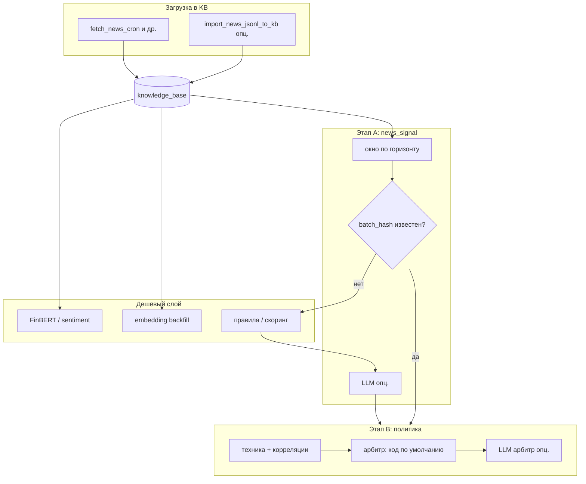

# Новостной сигнал: целевая архитектура, dataflow и имплементация

Документ фиксирует **роли слоёв** (сигнал vs арбитраж), **горизонты**, **хранение бэтчей** и **текущее состояние** кода в LSE. Детали сбора в `knowledge_base`: [NEWS.md](NEWS.md), поля таблицы: [KNOWLEDGE_BASE_FIELDS.md](KNOWLEDGE_BASE_FIELDS.md).

---

## 1. Текущее состояние (что уже есть)

| Компонент | Статус |
|-----------|--------|
| `knowledge_base` с расширениями (`exchange`, `symbol`, `external_id`, `raw_payload`, …) | Есть (миграции `db/knowledge_pg/`) |
| Импорт внешнего потока (NYSE JSONL → KB) | `scripts/import_news_jsonl_to_kb.py` — дедуп, тег `exchange`, `raw_payload.nyse_jsonl`, исправление «slug» провайдера (`yfinance`) и матч тикера (`^VIX` / `VIX`) |
| Sentiment / FinBERT / эмбеддинги | Кроны backfill, pgvector — см. [VECTOR_KB_USAGE.md](VECTOR_KB_USAGE.md), [SENTIMENT_NEWS.md](SENTIMENT_NEWS.md) |
| Построитель **агрегированного новостного сигнала** с горизонтами и LLM-слоем | **План** (ниже) |
| Таблица **`news_signal_batch`** (или аналог) для кэша бэтчей | **План** |

JSONL на сервере — **не обязателен** в постоянном контуре: канон — запись **напрямую в PostgreSQL**. Файл остаётся удобным для офлайн-экспорта и отладки.

---

## 2. Целевые слои

### 2.1. Этап A — новостной сигнал (interpretation)

**Вход:** подмножество строк `knowledge_base` за окно времени и тикер(ы) / универс.

**Выход:** структурированный объект `news_signal` (JSON), например:

- агрегированное направление / сила / темы;
- список **`knowledge_base.id`**, вошедших в окно;
- числовые скоры (FinBERT / правила) **до** опционального LLM;
- опционально блок LLM: краткий digest, uncertainty, конфликтующие факты.

**Роль LLM на этапе A (если включён):** сжать смысл окна в схему, **не** решать вход в позицию. Календарь и геополитика в духе NYSE — **контекст для промпта / режимные флаги**, а не прямое прибавление к bias (см. §6).

### 2.2. Этап B — арбитраж / политика (fusion)

**Вход:** `news_signal` + техника + корреляции + лимиты + (опц.) состояние позиции.

**Выход:** решение политики: разрешение на действие, агрессия, veto, флаги для тэйка.

**Роль LLM на этапе B:** **опционально и редко** — когда сигналы конфликтуют или режим повышенного риска; вход в модель — **агрегаты и структуры**, не сырой поток всех статей. По умолчанию арбитр — **детерминированный код** (пороги, veto, взвешивание).

### 2.3. Связь с анализатором эффективности

LLM в **trade effectiveness analyzer** — отдельный контур (оценка сделок и параметров `GAME_5M_*`), не путать с онлайн-новостным арбитром.

---

## 3. Горизонты и «устаревание»

Различать:

| Понятие | Назначение |
|---------|------------|
| **Горизонт сигнала** | За какой интервал агрегируется поток: `1D`, `3D`, `5D` (точно зафиксировать: календарные дни vs торговые сессии vs скользящие часы). |
| **Возраст новости** | `ts` в KB — отбор в окно. |
| **TTL кэша** | Как долго действителен сохранённый `news_signal` с тем же `batch_hash` без пересчёта LLM. |

Долгие тенденции (3–5 дней) — это **отдельные бэтчи** с тем же контрактом JSON, но другим окном и, при необходимости, **дневным сжатием** перед LLM, чтобы не раздувать контекст.

---

## 4. Хранение: бэтч vs «на лету»

**Рекомендация:** сохранять результат этапа A **на каждый логический бэтч**:

- ключ: `(ticker или scope, horizon_code, window_start, window_end)`;
- `batch_hash` = хэш от множества `knowledge_base.id` + версия построителя / промпта;
- при **совпадении хэша** — не вызывать LLM повторно.

Построитель сигнала при каждом вызове **сначала** проверяет кэш по `batch_hash`, затем при необходимости пересчитывает и пишет строку (планируемая таблица вроде `news_signal_batch`).

---

## 5. Dataflow (целевой)

Исполнение GAME_5M / бот подключаются к **этапу B** (флаги, veto), а не к сырому потоку новостей на каждом тике — так экономятся токены и задержка.

---

## 6. Календарь и геополитика (как в NYSE)

Корректная модель: **не добавлять в bias напрямую**, а:

- подмешивать в **контекст** LLM на этапе A (интерпретация);
- выставлять **режимные флаги** (calendar_risk, geo_risk) для veto / снижения агрессии на этапе B.

Так снижается риск ложных срабатываний от «одной цифры за календарь».

---

## 7. Внешние LLM / Ollama

- **Облачный API** (в т.ч. ProxyAPI) — для редких вызовов и хорошего качества рассуждения.
- **Ollama на отдельном GPU-хосте** — опционально; на сервере без GPU не опираться на тяжёлый локальный инференс в прод-контуре.

Контракт вызова (схема JSON) должен быть **одинаковым** для смены бэкенда.

---

## 8. Этапы имплементации (чеклист)

1. **Импорт и схема KB** — новые источники, стабильный дедуп, без slug вместо id статьи. *(частично сделано для NYSE-потока)*
2. **Пайплайн этапа A без LLM** — выборка по окну, FinBERT/правила, JSON `news_signal`, запись бэтча + `batch_hash`.
3. **Кэш и инвалидация** при новых новостях или смене версии построителя.
4. **Этап B в коде** — fusion с техникой и корреляциями; LLM арбитр за флагом.
5. **Опционально LLM на этапе A** — только при лимите токенов и сжатом входе.
6. **Интеграция с ботом** — запрос сигнала по команде / по тикеру, не на каждом решении о входе.

---

## 9. Связанные файлы кода (на сегодня)

| Файл | Назначение |
|------|------------|
| `scripts/import_news_jsonl_to_kb.py` | Импорт JSONL в KB (опциональный мост) |
| `scripts/fetch_news_cron.py` | Основной сбор новостей в KB |
| `scripts/sync_vector_kb_cron.py`, `scripts/add_sentiment_to_news_cron.py` | Эмбеддинги / сентимент |

Сестринский репозиторий **NYSE** — сборщик с большим числом источников и бот; логику сигнала при переносе в LSE ориентировать на **чтение из PostgreSQL**, а не на файловый контур.
