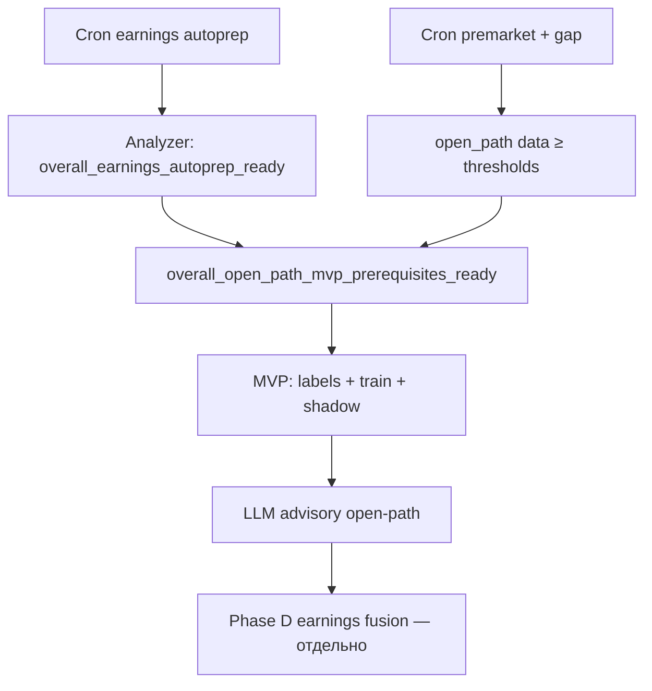

# Earnings автоподготовка → Open-path MVP (классификация входа у open)

**Аудитория:** продукт, разработка, ops.  
**Связанные документы:**

- [EARNINGS_PRODUCT_ROADMAP.md](./earnings-event-agent-lse/EARNINGS_PRODUCT_ROADMAP.md)
- [EARNINGS_PLAN_2026-06-01.md](./earnings-event-agent-lse/EARNINGS_PLAN_2026-06-01.md)
- [GAME_5M_DECISION_ARCHITECTURE.md](./GAME_5M_DECISION_ARCHITECTURE.md)
- `crontab/lse-docker.crontab`

**Принцип:** сначала **закрыть earnings autoprep** (cron + analyzer gates), затем **MVP open-path classifier** — только advisory/shadow, без Phase D trading.

---

## 1. Два контура готовности в `/analyzer`

| Gate | Что означает | Где смотреть |
|------|----------------|--------------|
| **`overall_earnings_autoprep_ready`** | Cron-пайплайн earnings сам поднимает базу и сетку: materials → labels → features → scenario + **peer spillover** + shadow product-tier | Earnings intelligence grid |
| **`overall_open_path_mvp_prerequisites_ready`** | Autoprep ✓ **и** накоплена история premarket/gap для GAME_5M | Тот же блок + строка «Можно начинать MVP open-path» |

Под-гейты (уже были):

- **`overall_grid_ready`** — sources + features + scenario dataset + classifier (минимальный ML grid)
- **`overall_peer_spillover_ready`** — `peer_spillover_dataset` + `peer_spillover_regressor`
- **`overall_trading_shadow_ready`** — shadow sign/PnL (технический gate, min n=6 по config)

Autoprep использует **более жёсткий product-tier shadow** (по умолчанию n_matured≥50, sign≥58%).

---

## 2. Cron: автоподготовка календаря и обучающей базы

Все скрипты уже в `crontab/lse-docker.crontab`. Оператору **не нужно** вручную гонять цепочку, кроме разового backfill или debug.

### 2.1 Materials autoprep (каждые 2 ч) — **один скрипт**

| Cron | Скрипт | Шаги |
|------|--------|------|
| `:15 */2` | **`run_earnings_intelligence_autoprep.py`** | 1) yfinance KB calendar 2) sync registry 3) ingest HTML/PDF 4) LLM extract 5) readiness JSON |

Лог: `logs/earnings_autoprep.log` · снимок: `last_earnings_intelligence_autoprep.json`

**Ручные шаги не нужны** — analyzer показывает gates и время последного autoprep.

Cron по умолчанию **`--new-events-only`**: sync/ingest/extract только для календарных событий **без LLM extraction** (новая дата в KB или pipeline ещё не закрыт). Уже обработанные события не перекачиваются. Backfill: `run_earnings_intelligence_autoprep.py --all-events`.

### 2.2 Materials (legacy — заменено autoprep)

~~`:18/:20/:25` три отдельных cron~~ → объединено в §2.1.

### 2.3 Event calendar + ERD skeleton (ночь)

| Cron | Скрипт | Результат |
|------|--------|-----------|
| `23:32` | `ingest_market_regime_daily.py` | режим рынка |
| `23:33` | `build_event_reaction_dataset.py --from-kb-earnings` | скелет ERD из KB EARNINGS |
| `23:36` | `backfill_event_reaction_labeling.py` (quotes_regime_v1) | outcomes UP/DOWN/FLAT |
| `23:37` | `backfill_event_reaction_labeling.py` (quotes_regime_earnings_v1) | earnings_v1 features |

### 2.4 ML grid + spillover (каждые 6 h + nightly full)

| Cron | Скрипт | Шаги |
|------|--------|------|
| `:30 */6` | `run_earnings_ml_refresh.py` | apply labels → outcomes → earnings_v1 → train scenario → **build_peer_spillover_dataset** → **train_peer_spillover_regressor** → readiness JSON |
| `23:52` | `run_earnings_ml_refresh.py --full` | + shadow report + полный retrain .cbm |

`run_earnings_ml_refresh.py` включает:

1. `apply_earnings_scenario_labels.py` — LLM hints → `final_label`
2. `backfill_event_reaction_labeling.py` — outcomes + features
3. `train_event_reaction_scenario_classifier.py` — **сетка сценариев**
4. `build_peer_spillover_dataset.py` — **база spillover**
5. `train_peer_spillover_regressor.py` — **ML spillover**
6. `write_earnings_intelligence_readiness` — gates для analyzer

### 2.5 Качество + weekly prod eval

| Cron | Скрипт |
|------|--------|
| `23:53` | `run_ml_data_quality_report.py` → `/analyzer` earnings block |
| **Sun 06:00** | `run_earnings_intelligence_prod_eval.py` — полный prod eval (materials → ERD → ML → shadow) |

### 2.6 Задел под open-path MVP (уже в cron)

| Cron | Скрипт | Для MVP |
|------|--------|---------|
| `12/14/15/16 MSK` | `ingest_premarket_daily_features.py` | фичи PM |
| `15:20 / 16:40` | `ingest_game5m_gap_forecast.py` premarket/open | факт/прогноз гэпа |
| **Sun 05:30** | `seed_quotes_for_event_reaction_dataset.py` | закрыть no_quotes в ERD |

## 3. Реалистичность по объёму календаря

Earnings universe ~21–28 тикеров → **~1 отчёт/квартал/тикер**.

| Метрика | Сейчас (prod snapshot) | Gate autoprep | Roadmap «stable» |
|---------|------------------------|---------------|------------------|
| LLM scenario labels | ~25 | **≥40** (`ML_READINESS_EARNINGS_AUTOPREP_MIN_LLM_LABELS`) | 80–120 |
| Shadow matured | ~36 | **≥50** | 50+ rolling |
| Peer spillover rows | ~162 | ≥100 (dataset gate) | растёт с событиями |
| Premarket trading days | ~18 | **≥60** для open-path | 60+ |
| Gap forecast open rows | ~208 | **≥120** для open-path | 200+ |

**Вывод:**

- **Grid + spillover ML** — уже на prod, gates green при nightly cron.
- **Autoprep product-tier** — **2–4 недели** (shadow 36→50, labels 25→40, CIEN/DELL/NBIS).
- **Open-path MVP train** — **~6–8 недель** непрерывного premarket/gap cron (18→60 дней).
- **Stable earnings classifier (80 labels)** — **Q3 2026** без массового historical backfill.

Календарь **не даст** сотни earnings-rows быстро; open-path опирается на **ежедневные** premarket/gap rows, не на отчёты.

---

## 4. MVP open-path classifier (после `overall_open_path_mvp_prerequisites_ready`)

### 4.1 Классы предиктов (v0, 6 классов)

Rule-labels после close; модель учится на snapshot **09:25 ET**.

| Класс | Rule (упрощённо) | Смысл для входа |
|-------|------------------|-----------------|
| `open_follow_through_up` | gap≥+0.8% и log(close/open)≥+0.3% | гэп вверх держится |
| `open_gap_up_fade` | gap≥+0.8% и close≤open или fade≥1.5% | не chase |
| `open_gap_down_bounce` | gap≤−0.8% и log(close/open)≥+0.5% | отскок после gap down |
| `open_gap_down_continuation` | gap≤−0.8% и log(close/open)≤−0.3% | слабость |
| `open_flat_chop` | \|gap\|<0.8% | без edge |
| `open_strong_gap_chase` | gap≥+4% + fade/chop | TAKE-watch / осторожность |

Пороги — config, калибровка walk-forward на `game5m_gap_forecast_daily` + quotes.

### 4.2 Фичи

- `premarket_daily_features` (gap, return, range, gap_vs_vol, VWAP, volume)
- `game5m_gap_forecast_daily` (PM gap, pred_ticker, pred_sector)
- multiday 1d bias, macro risk, KB bias (из карточки)
- опционально: earnings spillover advisory если отчёт ≤5 дн.

### 4.3 Pipeline (новые артефакты)

| # | Артефакт | Cron |
|---|----------|------|
| 1 | `game5m_open_path_labels` table | nightly `label_open_path_scenarios.py` (новый) |
| 2 | `build_open_path_dataset.py` | в `run_open_path_ml_refresh.py` (новый) |
| 3 | CatBoost multiclass | weekly после ≥200 rows |
| 4 | Shadow vs fact close/open | как earnings shadow |
| 5 | LLM/HTML advisory | после shadow gate |

### 4.4 Gates MVP (shadow only)

- train rows ≥ **200**
- shadow n ≥ **80**, sign ≥ **55%**
- class acc ≥ **35%** (6 классов)
- **не** подключать к decision_stack apply до отдельного backtest

---

## 5. Последовательность работ



### Sprint «закрыть текущий план» (до MVP)

1. Дождаться **overall_earnings_autoprep_ready** в analyzer (cron уже крутится).
2. Runbook + Telegram alert (Phase C ops).
3. Labels backlog CIEN/DELL/NBIS + weekly prod_eval мониторинг.
4. **Не** Phase D, **не** open-path train до зелёного `open_path_mvp_prerequisites`.

### Sprint «open-path MVP» (после зелёного gate)

1. DDL + `label_open_path_scenarios.py` + nightly cron.
2. Analyzer gate `open_path_classifier_dataset`.
3. Shadow-only CatBoost + секция в analyzer.
4. Подключить блок в LLM/HTML (как premarket context).

---

## 6. Config keys

```env
# Earnings autoprep (product-tier)
ML_READINESS_EARNINGS_AUTOPREP_MIN_LLM_LABELS=40
ML_READINESS_EARNINGS_AUTOPREP_MIN_SHADOW_MATURED=50
ML_READINESS_EARNINGS_AUTOPREP_MIN_SIGN_ACCURACY=0.58

# Open-path MVP prerequisites
OPEN_PATH_MVP_MIN_PREMARKET_TRADING_DAYS=60
OPEN_PATH_MVP_MIN_GAP_FORECAST_OPEN_ROWS=120

# Cron flags (already used)
EARNINGS_ML_REFRESH_APPLY_DATA=1
EARNINGS_ML_REFRESH_INCREMENTAL_TRAIN=1
ML_READINESS_TRAIN_MODE=full
```

---

## 7. Smoke checklist

```bash
# Analyzer API (GAME_5M, sections ml_arbiters)
curl -s 'http://127.0.0.1:8080/api/analyzer?strategy=GAME_5M&sections=ml_arbiters&light=0' \
  | jq '.earnings_grid_readiness | {autoprep: .overall_earnings_autoprep_ready, open_path: .overall_open_path_mvp_prerequisites_ready, peer: .overall_peer_spillover_ready, grid: .overall_grid_ready}'

# Readiness file
cat /app/logs/ml/ml_data_quality/last_earnings_intelligence_readiness.json \
  | jq '.gates | {autoprep: .overall_earnings_autoprep_ready, open_path: .overall_open_path_mvp_prerequisites_ready, reasons: .earnings_autoprep.reasons}'
```

**PASS для перехода к MVP:** `overall_open_path_mvp_prerequisites_ready == true`.

---

*Обновлять при изменении cron, gates или классов open-path v0.*
