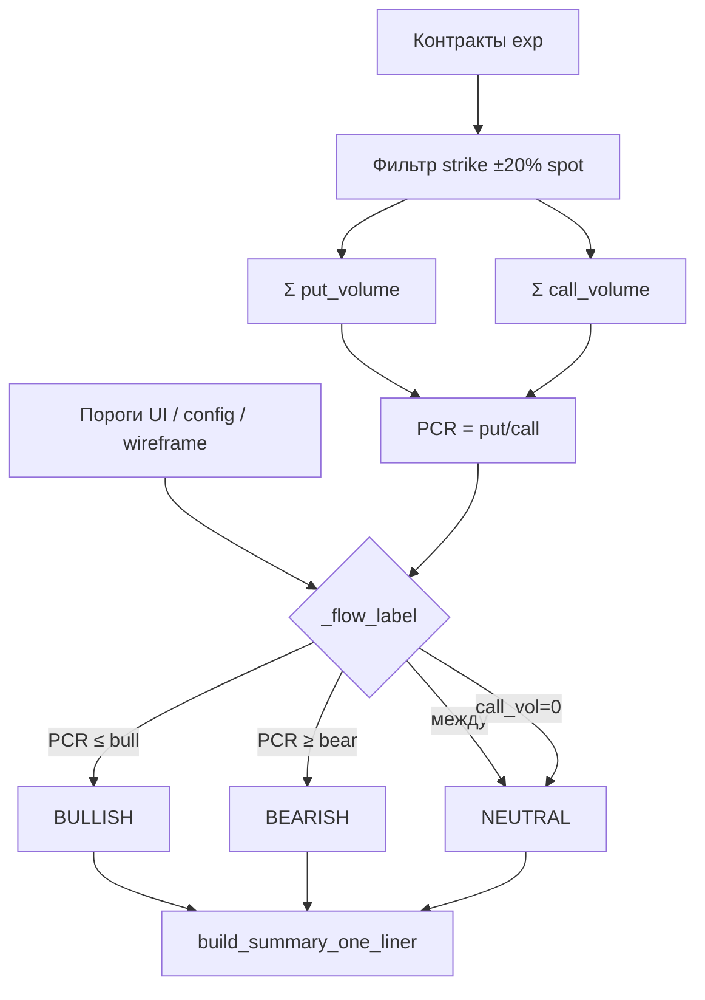

# Option Money Map — план и эксплуатация

**Статус:** фазы 1–5 в prod (коммит `f8c457e`, 2026-06-24).  
**Веб:** `/options` (редирект → `/options/map`), `/options/tools` (сентимент + калькулятор).

## Цель

Один экран: **тикер → фраза «где деньги» → ползунок экспираций → ползунок даты снимка → график OI**. Без LLM и лишних метрик в лице пользователя.

## Фазы

| Фаза | Статус | Содержание |
|------|--------|------------|
| **1** | ✅ | Подписи калькулятора (страйк ≠ вход) |
| **2** | ✅ | `GET /api/options/map/{ticker}`, страница `/options/map` |
| **3** | ✅ | Таблица `options_chain_oi_snapshot`, `scripts/snapshot_options_chain_oi.py` |
| **4** | ✅ | Миграция 031 на prod, cron пн–пт 23:30 UTC |
| **5** | ✅ | Ползунок «дата снимка» из БД + `plate_shift_ru` vs предыдущий день |
| **6** | ✅ | `/options` → редирект на `/options/map`; сентимент/калькулятор на `/options/tools` |

**История OI:** настоящие прошлые недели **нельзя** скачать из Polygon snapshot API (только текущий снимок). Накопление — только через ежедневный cron. Фейковый backfill с прошлыми датами не делаем.

---

## Реальный пример: MU, экспирация 2026-06-26

Данные с prod, Polygon Options Starter (2026-06-24).

### Live-карта (сейчас)

Запрос: `GET /api/options/map/MU?expiration_date=2026-06-26`

| Поле | Значение | Как читать в торговле |
|------|----------|------------------------|
| Spot | **$1 093** | Текущая цена акции (stocks snapshot) |
| Put-плита | **$900–$1 100** | Где накоплен put OI ниже/около spot — зоны, где рынок «страхует» падение |
| Call-потолок | **$1 100–$1 300** | Где сидит call OI — уровни, где много ставок на рост / продаж covered call |
| PCR volume | **0.72** | Свежее больше call, чем put → `BULLISH` поток |
| Топ put OI | K **$1 000** — 8 480 контрактов | Крупная «подушка» — частый магнит при откатах |
| Топ call OI | K **$1 200** — 7 821 контрактов | Потолок интереса на рост |

One-liner (шаблон, без LLM):

> Spot $1 093 · рынок — ожидание роста. Put-плита (поддержка): $900–$1 100. Call-потолок: $1 100–$1 300. Свежее активнее call (ставки на рост).

### Сентимент на той же экспирации (`/options`, Polygon)

| Метрика | Значение |
|---------|----------|
| Label / score | **BULLISH** / **0.43** |
| PCR vol (±15%) | **0.65** |
| PCR OI (±15%) | **0.78** |
| Max pain | **$1 050** |
| Ключевой OI | K **$1 050** — 18 858 (call-heavy); K **$1 100** — put/call ≈ 50/50 |

Карта и сентимент смотрят на одну доску, но **разные окна**: карта ±20%, сентимент ±15% + score с NTM ±8%.

### Архивный снимок (cron → БД)

Запрос: `GET /api/options/map/MU?expiration_date=2026-06-26&snapshot_date=2026-06-24`

| Поле | Значение |
|------|----------|
| Spot в снимке | **$1 103.50** |
| Put OI K $1 000 | **8 480** |
| Call OI K $1 100 | **4 566** |
| Строк в БД | **760** |

`plate_shift_ru` появится, когда в БД будет **≥2 дат** снимка на ту же пару (тикер + экспирация). Сейчас одна дата — сдвиг не считается.

### Сверка yfinance (та же exp, `/options`)

| | Polygon | yfinance |
|--|---------|----------|
| Spot | $1 093 | $1 052 |
| Score | BULLISH 0.43 | NEUTRAL 0.14 |
| PCR vol | 0.65 | 0.89 |
| OI / max pain | да | OI ≈ 0 → только volume-таблица |

**Вывод для трейдинга:** объёмы по страйкам часто близки; **плиты и max pain** — только Polygon. При сравнении двух колонок смотрите баннер «Разный spot» (если Δ > $5).

---

## Как собирается one-liner (вкладка «Расчёт»)

Шаблон **без LLM**. Поля API: `summary_one_liner_ru`, `one_liner_breakdown` (шаги + `intro_ru` + `caveats_ru`).

| Часть фразы | Метрика | Правило |
|-------------|---------|---------|
| **Spot $…** | `underlying_price` / spot из БД | Цена акции на момент снимка |
| **Put-плита** | put **open interest** | Топ-3 страйка ниже spot (≤ spot×1.01) с max put OI; в тексте min…max страйков |
| **Call-потолок** | call **open interest** | Топ-3 страйка выше spot (≥ spot×0.99) с max call OI |
| **рынок — ожидание …** | PCR **volume** | put_vol / call_vol в окне ±20%; bullish если PCR ≤ порог, bearish если ≥ |
| **Свежее активнее …** | тот же PCR | Текстовая расшифровка BULLISH/BEARISH/NEUTRAL |

**Пороги PCR (по умолчанию 0.87 / 1.15):** стартовая эвристика wireframe (нейтральная полоса вокруг PCR=1). Настройка: слайдеры на `/options/map` (localStorage per ticker) или query `pcr_volume_bullish_max` / `pcr_volume_bearish_min`; глобально — `OPTIONS_MAP_PCR_VOL_*` в config.

**Объективная калибровка (cron):** ежедневно после OI-снимка считаются квантили PCR volume по истории `options_chain_oi_snapshot` (то же окно ±20%). При ≥10 снимках на пару ticker+exp: **p25 → bullish_max**, **p75 → bearish_min**; иначе wireframe. Артефакт: `last_options_map_cron_stats.json` (см. § Cron stats).

**Калибровка по исходам сделок (будущее):** сопоставление PCR/flow_label на входе с `realized_pct` GAME_5M — отдельный шаг поверх cron-статистики.

---

## Метод: bullish / bearish / neutral (PCR volume)

Этот раздел описывает **только** блок one-liner **«рынок — ожидание …»** и хвост **«Свежее активнее …»** на Money Map.  
Put-плита и call-пotолок считаются **отдельно** по open interest и **не влияют** на BULLISH/BEARISH/NEUTRAL.

**Код:** `services/options_money_map.py` — `_filter_contracts_for_analysis` (окно), суммирование volume, `_flow_label`, `build_summary_one_liner`.

### Что измеряем

| Вопрос | Ответ метода |
|--------|----------------|
| Что такое «настроение» на карте? | Классификация **внутридневного потока сделок** put vs call в окне страйков вокруг spot |
| Какая метрика? | **PCR volume** = `put_volume / call_volume` (паритет = 1.0) |
| Что **не** используется для bias? | Open interest, max pain, sentiment score, LLM |
| Где в API? | `flow_label` (`BULLISH` / `BEARISH` / `NEUTRAL`), `flow_ru`, `pcr_volume`, `pcr_thresholds` |

PCR volume отвечает на вопрос: *«Сегодня в ATM-окне больше покупали/продавали puts или calls?»*  
Это **не прогноз цены** и **не сигнал входа** — только описание потока для one-liner.

### Алгоритм (6 шагов)

```
1. Берём все контракты выбранной экспирации (live Polygon или cron-снимок из БД).
2. Фильтр страйков: strike ∈ [spot × (1 − 0.20), spot × (1 + 0.20)]  — окно ±20%.
3. put_volume  = Σ volume по строкам contract_type = put  в окне.
4. call_volume = Σ volume по строкам contract_type = call в окне.
5. PCR volume  = put_volume / call_volume  (если call_volume > 0; иначе PCR = null → NEUTRAL).
6. Сравниваем PCR с порогами → flow_label → русский текст в one-liner.
```

Для Money Map **не отбрасываются** строки с нулевым OI/volume на этапе окна (`drop_zero_oi_volume=False`) — в сумму попадает любой ненулевой volume в окне.

### Пороги и приоритет

| Источник | Когда применяется |
|----------|-------------------|
| Query / слайдеры UI | `pcr_volume_bullish_max`, `pcr_volume_bearish_min` в URL или localStorage per ticker |
| `config.env` | `OPTIONS_MAP_PCR_VOL_BULLISH_MAX`, `OPTIONS_MAP_PCR_VOL_BEARISH_MIN` |
| Wireframe | **0.87** / **1.15** — нейтральная полоса ≈±15% вокруг PCR=1 |
| Cron (рекомендация) | p25 / p75 по истории снимков — см. § Cron stats; в one-liner только после «Применить в слайдеры» |

Правило классификации (`_flow_label`):

| Условие | `flow_label` | Фраза «рынок — …» | `flow_ru` |
|---------|--------------|-------------------|-----------|
| `call_volume = 0` или PCR не считается | `NEUTRAL` | без явного перекоса | баланс put/call по объёму |
| `PCR ≥ bearish_min` | `BEARISH` | ожидание снижения | свежее активнее put (защита / ставки на снижение) |
| `PCR ≤ bullish_max` | `BULLISH` | ожидание роста | свежее активнее call (ставки на рост) |
| `bullish_max < PCR < bearish_min` | `NEUTRAL` | без явного перекоса | баланс put/call по объёму торгов |

**Важно:** проверка идёт **сначала bearish**, потом bullish. При дефолтных 0.87 / 1.15 «нейтральная полоса» — это **0.87 < PCR < 1.15** (строго между порогами).

### Пример расчёта 1 — BULLISH (MU, prod)

Данные из live-карты MU, exp 2026-06-26 (см. § Реальный пример выше).

**Исходные:**

| Параметр | Значение |
|----------|----------|
| Spot | **$1 093** |
| Окно ±20% | **$874 – $1 312** (страйки только в этом диапазоне) |
| Пороги (wireframe) | bullish ≤ **0.87**, bearish ≥ **1.15** |

**Допустим, после суммирования volume в окне** (иллюстрация; фактические суммы на prod могут отличаться, PCR на карте = **0.72**):

| leg | volume в окне |
|-----|---------------|
| put | **7 200** |
| call | **10 000** |

**Расчёт:**

```
PCR volume = 7 200 / 10 000 = 0.72

0.72 ≤ 0.87  →  BULLISH
0.72 < 1.15  →  (bearish не срабатывает)
```

**One-liner (фрагменты):**

- «**рынок — ожидание роста**» ← `flow_label = BULLISH`
- «**Свежее активнее call (ставки на рост)**» ← `flow_ru`
- Хвост: «**PCR vol 0.72 · пороги ≤0.87 / ≥1.15**»

Полная строка (шаблон):

> Spot $1 093 · рынок — ожидание роста. Put-плита (поддержка): $900–$1 100. Call-потолок: $1 100–$1 300. Свежее активнее call (ставки на рост). · PCR vol 0.72 · пороги ≤0.87 / ≥1.15

Put-плита ($900–$1 100) и call-потолок ($1 100–$1 300) в этом примере взяты **из топ-3 OI**, не из PCR — bias был бы **тем же**, даже если плиты сместятся.

### Пример расчёта 2 — BEARISH (учебный)

Spot **$500**, пороги **0.87 / 1.15**, в окне ±20%:

| leg | volume |
|-----|--------|
| put | **12 500** |
| call | **10 000** |

```
PCR = 12 500 / 10 000 = 1.25
1.25 ≥ 1.15  →  BEARISH
```

One-liner: «рынок — **ожидание снижения**» · «**Свежее активнее put** …» · PCR vol 1.25 · пороги ≤0.87 / ≥1.15

### Пример расчёта 3 — NEUTRAL (учебный)

| leg | volume |
|-----|--------|
| put | **9 500** |
| call | **10 000** |

```
PCR = 0.95
0.87 < 0.95 < 1.15  →  NEUTRAL
```

One-liner: «рынок — **без явного перекоса**» · «**Баланс put/call по объёму торгов**» · PCR vol 0.95 · …

### Пример 4 — кастомные пороги из UI

Если пользователь сдвинул слайдеры на **0.95 / 1.20**, для MU с PCR **0.72**:

```
0.72 ≤ 0.95  →  по-прежнему BULLISH
```

Если PCR был бы **0.90**:

```
0.90 > 0.87 (дефолт)  →  NEUTRAL при wireframe
0.90 ≤ 0.95 (UI)      →  BULLISH при кастомном bullish_max
```

Поэтому при изменении порогов меняется **только** текст «рынок — …» и хвост PCR; плиты OI не пересчитываются.

### Схема потока данных



### Не путать с другими «сентиментами» в LSE

| Контур | Окно | Метрика | Где |
|--------|------|---------|-----|
| **Money Map flow** | ±**20%** | PCR **volume**, пороги 0.87/1.15 (или UI/cron) | `/options/map`, `flow_label` |
| Options tools sentiment | ±**15%** | Несколько PCR + **score** ±0.35, max pain | `/options/tools` |
| GAME_5M decision gate | ±15% (sentiment) | `OPTIONS_SENTIMENT_PCR_VOL_*`, shadow/log_only | decision stack |

На одной экспирации MU карта может показать **BULLISH** (PCR vol 0.72, окно 20%), а `/options/tools` — **BULLISH 0.43** с PCR vol **0.65** (окно 15%) — это **ожидаемо**, не баг.

### Проверка на prod

```bash
curl -s "http://127.0.0.1:8080/api/options/map/MU?expiration_date=2026-06-26" \
  | python3 -c "
import sys, json
d = json.load(sys.stdin)
print('flow_label', d.get('flow_label'))
print('pcr_volume', d.get('pcr_volume'))
th = d.get('pcr_thresholds') or {}
print('thresholds', th.get('pcr_volume_bullish_max'), th.get('pcr_volume_bearish_min'))
print('one_liner', (d.get('summary_one_liner_ru') or '')[:120], '...')
"
```

В UI: вкладка **«Расчёт one-liner»** → шаг **«рынок — … и поток (PCR volume)»** — те же формулы и числа, что в API.

---

## API

```
GET /api/options/map/MU?expiration_date=2026-06-26
GET /api/options/map/MU?expiration_date=2026-06-26&snapshot_date=2026-06-24
GET /api/options/map/MU/snapshots?expiration_date=2026-06-26
```

Ответ (ключевые поля): `summary_one_liner_ru`, **`one_liner_breakdown`** (пошаговый разбор для вкладки «Расчёт» в UI), `support_plate`, `resistance_ceiling`, `chart_bars`, `chart_scope` (порог OI для графика), `available_expirations`, `available_snapshot_dates`, `is_live`, `plate_shift_ru`, `flow_label`, `pcr_volume`.

**Вкладка «Расчёт one-liner»** (`/options/map`): шаблон без LLM; показывает spot, окно ±20%, топ-3 put/call OI, PCR volume и пороги. **Пороги PCR** настраиваются per ticker в UI (localStorage) и через query `pcr_volume_bullish_max` / `pcr_volume_bearish_min`; глобальный дефолт — `OPTIONS_MAP_PCR_VOL_*` в config (wireframe 0.87 / 1.15). Калибровка по сделкам — отдельная будущая задача.

**График OI:** в `chart_bars` только страйки с OI ≥ `max(200, 5% от максимума)` — убирает «расческу» из мелких уровней; плиты put/call считаются по полной доске. На UI под ползунками — подписи дат экспирации и снимка (Live + даты из БД).

Источник live: **Polygon** (или yfinance на `/options/tools`). Архив cron: **`options_chain_oi_snapshot`** (`source=yfinance`).

---

## Cron OI

**Зачем:** Polygon не отдаёт OI за прошлые даты — только ежедневные снимки дают ползунок «время».

| Компонент | Путь |
|-----------|------|
| DDL | `db/knowledge_pg/sql/031_options_chain_oi_snapshot.sql` |
| Скрипт | `scripts/snapshot_options_chain_oi.py` |
| Cron на VM | `scripts/cron_options_chain_oi.sh` → `30 23 * * 1-5` UTC |

```bash
# dry-run
docker exec lse-bot python scripts/snapshot_options_chain_oi.py --ticker MU --dry-run

# вручную (как cron)
docker exec lse-bot python scripts/snapshot_options_chain_oi.py --ticker MU --json

# список дат в БД
docker exec lse-postgres psql -U postgres -d lse_trading -c \
  "SELECT snapshot_date, COUNT(*) FROM options_chain_oi_snapshot
   WHERE ticker='MU' GROUP BY 1 ORDER BY 1 DESC;"
```

Watchlist по умолчанию: **GAME_5M + portfolio** (акции; без `^VIX`, `CL=F`, forex). Override: `OPTIONS_OI_WATCHLIST` в config.env.

```bash
curl -s http://127.0.0.1:8080/api/options/tickers | python3 -m json.tool
```

**Ожидание по времени:** ~5 будних дней → первая демонстрация сдвига плит; ~6 недель → полноценная лента для MU.

---

## Cron stats (калибровка PCR)

**Зачем:** wireframe 0.87 / 1.15 — стартовые пороги; для объективного подбора per ticker нужна история PCR volume из тех же cron-снимков, что и ползунок «дата».

| Компонент | Путь |
|-----------|------|
| Логика | `services/options_map_cron_stats.py` |
| CLI / cron | `scripts/analyze_options_map_cron_stats.py` |
| Обёртка cron | `scripts/cron_options_map_stats.sh` |
| Расписание VM | `45 23 * * 1-5` UTC (через 15 мин после OI snapshot) |
| JSON-артефакт | `/app/logs/ml/ml_data_quality/last_options_map_cron_stats.json` |

**Метод:** для каждого `(ticker, expiration_date, snapshot_date)` — PCR volume = put_vol / call_vol в окне ±20% spot (как Money Map). По серии снимков: квантили p10–p90; при `snapshot_count ≥ 10` предлагаются **p25 → bullish_max**, **p75 → bearish_min**. Поле `ticker_rollup` — лучшая экспирация по числу снимков на тикер.

```bash
# вручную (как cron)
docker exec lse-bot python scripts/analyze_options_map_cron_stats.py --days 90

# один тикер
docker exec lse-bot python scripts/analyze_options_map_cron_stats.py --days 90 --ticker MU

# локально (если есть БД)
python3 scripts/analyze_options_map_cron_stats.py --days 90 --json-out local/logs/ml_data_quality/last_options_map_cron_stats.json
```

**Как читать отчёт:** `ticker_exp_series[].suggested_thresholds` — готово ли (`ready`), источник (`quantile_p25_p75` или `wireframe_fallback`), пороги и `wireframe_comparison.delta_*`. Пока история <10 дней на серию — смотрите только квантили в `pcr_volume_stats`, пороги остаются wireframe.

**UI:** на вкладке «Расчёт one-liner» показывается блок **«Рекомендовано из cron»** с p25/p75 порогами и кнопкой «Применить в слайдеры PCR». Автоподстановка при загрузке карты не делается — только по клику.

**Не путать с:** sentiment score на `/options/tools` (окно ±15%) и decision gate (`OPTIONS_SENTIMENT_PCR_VOL_*`).

---

## Чеклист тестов (prod)

```bash
# страницы
curl -s -o /dev/null -w "%{http_code}\n" http://127.0.0.1:8080/options/map
curl -s -o /dev/null -w "%{http_code}\n" http://127.0.0.1:8080/options/tools
curl -s -o /dev/null -w "%{http_code} redirect\n" -L http://127.0.0.1:8080/options

# live map
curl -s "http://127.0.0.1:8080/api/options/map/MU?expiration_date=2026-06-26" \
  | python3 -c "import sys,json;d=json.load(sys.stdin);assert d['status']=='ok' and d['is_live'];print('OK live', d['spot'])"

# snapshots list
curl -s "http://127.0.0.1:8080/api/options/map/MU/snapshots?expiration_date=2026-06-26"

# archive (если есть дата в БД)
curl -s "http://127.0.0.1:8080/api/options/map/MU?expiration_date=2026-06-26&snapshot_date=2026-06-24" \
  | python3 -c "import sys,json;d=json.load(sys.stdin);assert d['status']=='ok' and not d['is_live'];print('OK archive', d['snapshot_date'])"

# cron
crontab -l | grep options_chain_oi
crontab -l | grep options_map_stats

# PCR stats artifact (после ≥1 прогона cron)
docker exec lse-bot cat /app/logs/ml/ml_data_quality/last_options_map_cron_stats.json | python3 -c "import sys,json;d=json.load(sys.stdin);print(d.get('status'), d.get('summary'))"
```

Ручной UI: `/options/map` → MU → ползунок экспирации → ползунок даты (0 = live). `/options` → «Оба» на сентименте → баннер сравнения.

---

## Ответы стейкхолдеру

- **Страйк long** ≠ цена входа; вход = премия × 100 × контракты (см. калькулятор).
- **yfinance** не годится для OI-плит; карта — Polygon.
- **LLM** в карте не используется; one-liner — шаблон.
- **История** — только из cron, не из «старых запросов» к Polygon.

## Файлы

| Файл | Роль |
|------|------|
| `services/options_money_map.py` | Плиты, one-liner, чтение БД |
| `templates/options_map.html` | UI карты |
| `scripts/snapshot_options_chain_oi.py` | Запись снимка |
| `scripts/cron_options_chain_oi.sh` | Обёртка cron OI |
| `services/options_map_cron_stats.py` | PCR-квантили из cron-снимков |
| `scripts/analyze_options_map_cron_stats.py` | CLI + JSON-артефакт порогов |
| `scripts/cron_options_map_stats.sh` | Cron после OI snapshot |
| `db/knowledge_pg/sql/031_*.sql` | Схема истории |

## Связанные документы

- [OPTIONS_TOOLS.md](OPTIONS_TOOLS.md) — сентимент, калькулятор, dual-column, пример put spread MU
