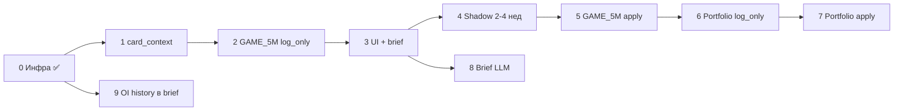

# Options sentiment (Polygon) → торговые контуры — план интеграции

**Статус документа:** живой чеклист — обновлять по мере фаз.  
**Последнее обновление:** 2026-06-24  
**Связано:** [OPTIONS_TOOLS.md](OPTIONS_TOOLS.md), [OPTIONS_MONEY_MAP.md](OPTIONS_MONEY_MAP.md), [GAME_5M_DECISION_ARCHITECTURE.md](GAME_5M_DECISION_ARCHITECTURE.md)

---

## Цель

Использовать **объективный** снимок опционной доски (Polygon: PCR, OI-плиты, max pain, score) как:

1. **Контекст** в карточках и brief (UI / LLM),
2. **Сигнал decision_stack** для GAME_5M и portfolio,
3. Сначала **`log_only` (shadow)**, затем **`apply`** по результатам analyzer.

Исторический OI «на дату прошлого earnings» — только из **cron** `options_chain_oi_snapshot`, не из Polygon snapshot API.

---

## Текущая база (уже в prod)

| Компонент | Статус |
|-----------|--------|
| Polygon Options Starter, `/options/tools`, `/options/map` | ✅ |
| Cron OI watchlist = GAME_5M + portfolio (акции) | ✅ |
| `GET /api/options/tickers`, listbox в UI | ✅ |
| Влияние на `get_decision_5m` / portfolio BUY | ⏳ этот план |

---

## Фазы и критерии готовности

| Фаза | Что | Режим | Критерий «готово» | Статус |
|------|-----|--------|-------------------|--------|
| **0** | Инфраструктура данных | — | Cron, watchlist, API map/sentiment | ✅ |
| **1** | `options_card_context` | — | Компактный JSON: score, PCR, max pain, плиты, exp, `data_as_of` | ✅ |
| **2** | GAME_5M shadow | `log_only` | Поля в `d5`, contribution `options_sentiment` в `decision_snapshot`, вход **не** меняется | ✅ |
| **3** | UI / prompt | — | Блок в `game5m_cards`, `/prompt_entry`, earnings brief overview | ✅ |
| **4** | Shadow-анализ | `log_only` | 2–4 недели: analyzer / ручной срез «сколько BUY отсекли бы» | 🔄 |
| **5** | GAME_5M apply | `apply` | `DECISION_STACK_OPTIONS_SENTIMENT_GATE_MODE=apply`, пороги согласованы | ⏳ |
| **6** | Portfolio shadow | `log_only` | `portfolio_entry_guards` + contribution в `decision_stack/portfolio.py` | ⏳ |
| **7** | Portfolio apply | `apply` | Отдельные пороги, не конфликтовать с CatBoost / event_reaction | ⏳ |
| **8** | LLM earnings | — | Блок в `build_event_brief` + `earnings_llm_context` | ⏳ |
| **9** | История OI в brief | cron | `plate_shift` из БД при ≥2 снимках; пометка `data_as_of: snapshot` | ⏳ данных |

**Легенда статусов:** ✅ сделано · 🔄 в работе · ⏳ не начато · ⏸ отложено

---

## Фаза 1 — `services/options_card_context.py`

**Функция:** `build_options_card_context(ticker, *, expiration_date=None) -> dict`

**Выход (компактно, без полной доски):**

```json
{
  "status": "ok",
  "source": "polygon",
  "data_as_of": "live",
  "expiration_date": "2026-06-26",
  "spot": 1093.0,
  "sentiment_label": "BULLISH",
  "sentiment_score": 0.43,
  "pcr_volume": 0.65,
  "pcr_open_interest": 0.78,
  "max_pain_strike": 1050.0,
  "support_plate_strikes": [1000, 900, 1100],
  "resistance_ceiling_strikes": [1200, 1300, 1100],
  "one_liner_ru": "…",
  "gate_hint": "neutral"
}
```

**Правила:**

- Экспирация: ближайшая из Polygon или `_suggest_expiration` при earnings.
- Ошибка API / нет ключа → `status: error`, gate **не** блокирует торговлю.
- Кэш in-memory TTL **15 мин** на тикер (config `OPTIONS_CARD_CONTEXT_CACHE_SEC`).

**Тесты:** monkeypatch Polygon, MU fixture из `test_options_tools.py`.

**Чеклист фазы 1:**

- [x] Модуль `options_card_context.py`
- [x] Unit-тесты
- [x] Док: поля в этом файле § «Фаза 1»

---

## Фаза 2 — GAME_5M decision_stack (shadow)

**Точки в коде:**

| Файл | Изменение |
|------|-----------|
| `services/recommend_5m.py` | После KB-news: `opts = build_options_card_context(ticker)` → `d5["options_sentiment"] = opts` |
| `services/decision_stack/game5m.py` | `_collect_options_sentiment_contribution(d5)` |
| `services/decision_stack/_types.py` | Добавить `options_sentiment` в `GAME5M_VETO_ORDER` (после `kb_news`) |

**Логика contribution (черновик):**

| Условие | action при `apply` | strength |
|---------|-------------------|----------|
| BEARISH score ≤ порог **и** PCR vol ≥ 1.15 | `downgrade` | −0.45 |
| BULLISH score ≥ порог **и** PCR vol ≤ 0.87 | `signal` | +0.25 |
| Иначе | `telemetry` | 0 |

**Фаза 2 — только `DECISION_STACK_OPTIONS_SENTIMENT_GATE_MODE=log_only`:** в snapshot видно `would_downgrade` / `would_veto`, `technical_decision_effective` **не** меняется.

**Чеклист фазы 2:**

- [x] Поля `options_sentiment` в `get_decision_5m`
- [x] Contribution в `collect_game5m_contributions`
- [x] `gate_hint` в context для `/prompt_entry`
- [x] config.env.example

---

## Фаза 3 — UI и операторские отчёты

| Поверхность | Что показать |
|-------------|--------------|
| `game5m_cards.html` | 3–4 строки: label, score, PCR vol, max pain, one-liner |
| `telegram_bot` `_build_prompt_entry_game5m_html` | Секция «Options (Polygon)» + gate_hint |
| `earnings_intelligence.html` overview | Блок в brief (live, `data_as_of`) |
| `GET /api/game5m/cards` | Проброс `options_sentiment` из d5 |

**Чеклист фазы 3:**

- [x] Карточки 5m
- [x] prompt_entry HTML
- [x] Earnings brief API + UI
- [x] Ссылка «подробнее → /options/map»

---

## Фаза 4 — Shadow-анализ (2–4 недели)

**Не менять prod-вход.** Скрипт `scripts/analyze_options_gate_shadow.py` собирает:

| Метрика | Смысл |
|---------|--------|
| `bull_core_total` | Закрытые GAME_5M, где на входе CORE ∈ {BUY, STRONG_BUY} |
| `bull_with_would_downgrade` | Из них options gate = `would_downgrade` (shadow) |
| `downgrade_false_positive` | would_downgrade, но **сделка в плюсе** (ложное отсечение) |
| `downgrade_true_positive` | would_downgrade и убыток (gate «помог бы») |
| `live_scan.bull_would_downgrade_rate` | Текущий срез: доля CORE=BUY с shadow-downgrade |

**Артефакт:** `local/logs/ml_data_quality/last_options_gate_shadow.json` (prod: `/app/logs/ml/ml_data_quality/...`).

```bash
# локально / на VM
python3 scripts/analyze_options_gate_shadow.py --days 28

# быстрее (без live get_decision_5m по кластеру)
python3 scripts/analyze_options_gate_shadow.py --days 28 --no-live-scan

# prod
docker exec lse-bot python scripts/analyze_options_gate_shadow.py
```

**Критерий перехода к фазе 5:** согласование порогов; нет доминирующих ложных downgrade на SNDK/MU/LITE; `recommendation.ready_for_apply_discussion` — только для обсуждения, apply вручную через config.

**Чеклист фазы 4:**

- [x] Скрипт `analyze_options_gate_shadow.py` + `services/options_gate_shadow.py`
- [x] Unit-тесты
- [ ] 2–4 недели накопления context_json с `options_sentiment` (cron + новые входы)
- [ ] Запись в журнал решений после среза

| Фаза | Статус |
|------|--------|
| 4 Shadow-анализ | 🔄 скрипт готов, ждём данных |

---

## Фаза 5 — GAME_5M apply

```env
DECISION_STACK_OPTIONS_SENTIMENT_GATE_MODE=apply
OPTIONS_SENTIMENT_BEARISH_SCORE=-0.35
OPTIONS_SENTIMENT_BULLISH_SCORE=0.35
OPTIONS_SENTIMENT_PCR_VOL_BEARISH=1.15
OPTIONS_SENTIMENT_PCR_VOL_BULLISH=0.87
```

**Поведение:**

- `downgrade`: STRONG_BUY→BUY, BUY→HOLD (как entry_advice CAUTION)
- Не `veto` SELL и не форсировать BUY без техники

**Чеклист:** deploy → 1 неделя мониторинг → запись в журнал.

---

## Фаза 6–7 — Portfolio

**Паттерн:** как `portfolio_catboost_blocks_buy` + `collect_portfolio_contributions`.

| Сигнал | Portfolio (свинг) |
|--------|-------------------|
| Сильный BEARISH + earnings window (`event_reaction` active) | `veto` нового BUY |
| Умеренный BEARISH | `downgrade` / telemetry |
| BULLISH | telemetry only (не форсировать BUY) |

Сначала фаза 6 `log_only`, затем 7 `apply` с `DECISION_STACK_PORTFOLIO_OPTIONS_GATE_MODE`.

**Чеклист фазы 6–7:**

- [ ] `portfolio_entry_guards.options_sentiment_blocks_buy`
- [ ] Contribution в `decision_stack/portfolio.py`
- [ ] Shadow на закрытых portfolio-сделках
- [ ] Apply отдельным флагом

---

## Фаза 8–9 — Earnings brief и история

**Фаза 8:** `build_event_brief()` → `options_polygon`; exp = `_suggest_expiration(symbol, event_date)`; для прошлых событий — явно `data_as_of: live`.

**Фаза 9:** если в БД есть снимки **до** event_date — optional `options_snapshot_date`; иначе только live + cron forward.

Зависит от накопления cron (см. [OPTIONS_MONEY_MAP.md](OPTIONS_MONEY_MAP.md)).

---

## Конфиг (сводка)

| Ключ | Default | Назначение |
|------|---------|------------|
| `DECISION_STACK_OPTIONS_SENTIMENT_GATE_MODE` | `log_only` | GAME_5M gate |
| `DECISION_STACK_PORTFOLIO_OPTIONS_GATE_MODE` | `log_only` | Portfolio gate |
| `OPTIONS_SENTIMENT_BEARISH_SCORE` | `-0.35` | Порог label |
| `OPTIONS_SENTIMENT_BULLISH_SCORE` | `0.35` | Порог label |
| `OPTIONS_SENTIMENT_PCR_VOL_BEARISH` | `1.15` | Put-heavy flow |
| `OPTIONS_SENTIMENT_PCR_VOL_BULLISH` | `0.87` | Call-heavy flow |
| `OPTIONS_CARD_CONTEXT_CACHE_SEC` | `900` | Кэш Polygon |

---

## Риски и ограничения

1. **Горизонт:** опционы — дни/недели; 5m — минуты. Gate только как фильтр, не основной сигнал.
2. **Put OI** может быть хеджем, не медвежьей ставкой — не делать жёсткий veto без PCR vol.
3. **Rate limit Polygon:** кэш + не вызывать на каждый тик 1m cron без TTL.
4. **yfinance OI** не использовать для gate — только Polygon.

---

## Журнал решений (обновлять вручную)

| Дата | Фаза | Решение | Кто |
|------|------|---------|-----|
| 2026-06-24 | — | План принят; старт с фаз 1–2 shadow, без apply | — |
| 2026-06-16 | 1–2 | `options_card_context` + GAME_5M log_only contribution | — |
| 2026-06-16 | 3 | UI: game5m cards, prompt_entry, earnings brief overview | — |
| 2026-06-16 | 4 | Shadow script `analyze_options_gate_shadow.py` | — |
| | | | |

---

## Порядок работ (рекомендуемый)



**Следующий шаг по плану:** фаза 4 — периодический запуск `analyze_options_gate_shadow.py` (2–4 недели), затем решение о apply.
