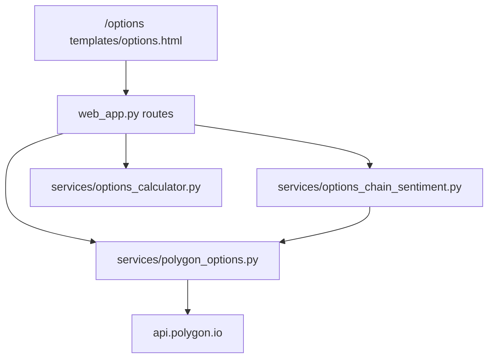

# Опционы: вкладка `/options` — постановка, реализация, эксплуатация

**Статус:** реализовано (2026-06-23), коммиты `3527211`, `2c8da73`.  
**Веб:** `/options` (пункт меню «Опционы»).  
**Зависимость:** `POLYGON_API_KEY` + подписка Polygon **Options** для snapshot chain (volume/OI).

---

## 1. Постановка задачи

### Задача 1 — Option Chain и рыночный сентимент

Анализ шорт-опционов по стокам из universe LSE. Эталонная доска — **Investing.com Option Chain** (call/put, strike, volume, bid/ask, OI):

| Источник | URL (пример MU) | Роль |
|----------|-----------------|------|
| **Investing.com** | [micron-tech-options](https://www.investing.com/equities/micron-tech-options) | HTML-таблица «как ордербук» — эталон постановки |
| **Yahoo / yfinance** | [finance.yahoo.com/quote/MU/options](https://finance.yahoo.com/quote/MU/options) | `Ticker.options` + `option_chain(date)` — strike, volume, OI, bid/ask, IV **без API-ключа** (задержка/дыры в bid вне RTH) |
| **Polygon snapshot** | `GET /v3/snapshot/options/MU` | Целевой источник для LSE: REST, пагинация, Greeks |

Требовалось:

1. Проверить, можно ли получать ту же доску через **Polygon API** (предпочтительнее парсинга HTML Investing).
2. На основе **Volume** и **Open Interest** по call/put выдавать аналитику:
   - куда целится рынок по бумаге;
   - где больше открывают позиций (перекос put vs call);
   - какие страйки — ключевые **барьеры** для цены;
   - простой **индикатор сентимента** (bullish / bearish / neutral).

### Задача 2 — Опционный калькулятор

Интерактивный расчёт P/L для:

- **Pure Put** — покупка одного put;
- **Put Spread** — long put + short put с более низким страйком.

Ввод: тикер, spot, даты earnings/экспирации (справочно), контракты, страйки и премии.  
Вывод: стоимость входа, breakeven, max loss/profit, таблица сценариев падения spot (0%, −2%, … −20%).

---

## 2. Решение по источнику данных

| Критерий | Investing.com | yfinance | Polygon reference | Polygon **snapshot** |
|----------|---------------|----------|-------------------|----------------------|
| Доступ | HTML | Python, без ключа | REST + ключ | REST + ключ + **Options-план** |
| Volume / OI | в таблице | да (`volume`, `openInterest`) | **нет** | да (`day.volume`, `open_interest`) |
| Bid/Ask/Last | да | да (bid/ask часто 0 вне сессии) | **нет** | `last_quote`, `last_trade` |
| Greeks / IV | нет | `impliedVolatility` | нет | да (Options-план) |
| Экспирации | UI dropdown | `Ticker.options` (19 для MU) | `reference/contracts` | фильтр `expiration_date` |

**Вывод:** для **Задачи 1 (сентимент)** нужен именно **Polygon snapshot** — аналог Investing. Reference API даёт только справочник контрактов (страйк, тип, дата), без live volume/OI.

**yfinance** — запасной/сверочный источник той же таблицы (см. `--compare-yfinance` в скрипте проверки), в прод-сентименте не используется.

| API | Назначение |
|-----|------------|
| `GET /v3/reference/options/contracts?underlying_ticker={T}` | список дат экспирации, метаданные контрактов (**не доска**) |
| `GET /v3/snapshot/options/{T}?expiration_date=...` | **live snapshot = Option Chain**: volume, OI, bid/ask, Greeks, underlying price |

Документация Polygon: [Options chain snapshot](https://polygon.io/docs/options/get_v3_snapshot_options__underlyingasset).

**Ограничение на проде (проверка 2026-06-23):** ключ `POLYGON_API_KEY` валиден; **reference** API → `200` (2 экспирации MU в ответе плана); **snapshot** → **403** без подписки **Options** ([pricing](https://polygon.io/pricing?product=options)). После апгрейда плана сентимент на `/options` заработает без смены кода.

### Проверка после оплаты подписки Options

```bash
# на GCP VM
docker exec lse-bot python scripts/verify_polygon_options_chain.py --ticker MU --compare-yfinance
```

Ожидаемый результат:
- `polygon_snapshot.status` = `ok`
- `contract_count` > 0 (для MU на одну экспирацию — десятки/сотни call+put)
- `contracts_with_oi` / `contracts_with_volume` > 0
- `VERDICT: OK — доска как Investing`

Сверка с yfinance на ту же дату: порядок величины calls/puts (у MU ~300+ строк на экспирацию в yfinance).

Если всё ещё **403 / NOT_AUTHORIZED** при оплаченном счёте — почти всегда оплачен **Stocks**, а не **Options** (отдельный продукт ~$29/мес Starter). Проверка на VM:

```bash
docker exec lse-bot python scripts/verify_polygon_options_chain.py --ticker MU --compare-yfinance
```

В [dashboard](https://polygon.io/dashboard) → Billing / Subscriptions должны быть **два** продукта (или bundle): Stocks **и** Options. Один API key — entitlements с обоих планов.

---

## 3. Архитектура



### Файлы репозитория

| Файл | Роль |
|------|------|
| `services/polygon_options.py` | клиент Polygon: expirations, chain snapshot, нормализация контрактов |
| `services/options_chain_sentiment.py` | PCR, max pain, ключевые страйки, sentiment score |
| `services/options_calculator.py` | Pure Put / Put Spread, сценарии P/L |
| `templates/options.html` | UI: две вкладки, fetch к API |
| `web_app.py` | маршруты страницы и JSON API |
| `templates/partials/site_nav_links.html` | ссылка «Опционы» в навбаре |
| `tests/test_options_tools.py` | unit-тесты калькулятора и сентимента |
| `config.env.example` | `POLYGON_API_KEY` (секрет только в `config.env` на VM, не в git) |

---

## 4. Вкладка «Опционы» в веб-UI

**URL:** `http://<host>:8000/options` (на проде — тот же порт, что у `lse-bot`).

### 4.1. Вкладка «Сентимент chain»

1. Поле **Тикер** (по умолчанию `MU`).
2. **Экспирация** — dropdown; кнопка «Загрузить даты» → `GET /api/options/expirations/{ticker}`.
3. «Анализ» → `GET /api/options/sentiment/{ticker}?expiration_date=YYYY-MM-DD`.

**На экране:**

- бейдж `BEARISH` / `BULLISH` / `NEUTRAL` + score −1…+1;
- краткое пояснение на русском;
- карточки: PCR volume, PCR OI, spot, max pain;
- таблица топ-страйков по open interest.

Клиентский JS — внизу `templates/options.html` (без отдельного bundler).

### 4.2. Вкладка «Калькулятор»

Поля:

- тикер, цена акции ($), дата earnings, экспирация, число контрактов;
- стратегия: Pure Put / Put Spread;
- long strike + premium; для спреда — short strike + premium.

Кнопки:

- **Рассчитать** → `POST /api/options/calculator`;
- **Подтянуть spot с Polygon** — берёт spot из последнего sentiment-запроса (если snapshot доступен);
- **Примеры (демо)** — три пресета без Polygon (см. ниже).

### Демо-примеры (без подписки Polygon)

Кнопки на вкладке «Калькулятор» загружают готовые параметры и сразу считают P/L:

| ID | Сценарий |
|----|----------|
| `mu_pure_put_earnings` | MU, Pure Put, spot $189, strike $190, 1 контракт |
| `mu_put_spread_2x` | MU, Put Spread 200/180, 2 контракта |
| `lite_otm_put` | LITE, далёкий OTM put, 3 контракта |

API: `GET /api/options/calculator/examples` — JSON с полями и `preview` (предрасчёт).

Код пресетов: `CALCULATOR_DEMO_EXAMPLES` в `services/options_calculator.py`.

**Итоги:** вход ($), breakeven, max loss, max profit.  
**Таблица сценариев:** падение %, цена, стоимость позиции, P/L, ROI %, статус (`Максимальный убыток`, `Прибыль`, …).

На странице `/options` те же формулы доступны во **вложенных секциях «Справка»** под калькулятором и сентиментом (раскрывающиеся блоки).

Модель P/L: **intrinsic value на экспирацию** (без временной стоимости). Для earnings-игры это базовый сценарий «что если spot окажется здесь к закрытию».

---

## 5. REST API

### `GET /api/options/expirations/{ticker}`

```json
{
  "ticker": "MU",
  "expirations": ["2026-06-26", "2026-07-03", "..."]
}
```

Если ключа нет: `expirations: []`, `error: "POLYGON_API_KEY not configured"`.

### `GET /api/options/sentiment/{ticker}?expiration_date=2026-06-26`

Пример успешного ответа (сокращённо):

```json
{
  "status": "ok",
  "ticker": "MU",
  "expiration_date": "2026-06-26",
  "spot": 189.21,
  "sentiment_label": "BEARISH",
  "sentiment_score": -0.42,
  "sentiment_summary_ru": "Перевес put по volume/OI...",
  "totals": {
    "pcr_volume": 1.35,
    "pcr_open_interest": 1.28,
    "call_volume": 12000,
    "put_volume": 16200
  },
  "max_pain_strike": 185.0,
  "key_strikes_oi": [
    {"strike": 190, "total_oi": 45000, "call_oi": 12000, "put_oi": 33000}
  ]
}
```

### `POST /api/options/calculator`

Тело (Pure Put):

```json
{
  "strategy": "pure_put",
  "ticker": "MU",
  "spot": 189.0,
  "contracts": 2,
  "long_strike": 190.0,
  "long_premium": 8.5,
  "earnings_date": "2026-06-25",
  "expiration_date": "2026-06-26"
}
```

Тело (Put Spread) — дополнительно `short_strike`, `short_premium`; требование `long_strike > short_strike`.

Ответ: `entry_cost_usd`, `breakeven`, `max_loss_usd`, `max_profit_usd`, массив `scenarios`.

---

## 6. Логика сентимента

Реализация: `analyze_options_chain()` в `services/options_chain_sentiment.py`.

| Метрика | Смысл |
|---------|--------|
| **PCR volume** | put_volume / call_volume |
| **PCR OI** | put_oi / call_oi |
| **NTM PCR** | то же в полосе ±8% от spot |
| **Max pain** | страйк S, минимизирующий суммарную выплату call/put держателям |
| **Ключевые страйки** | топ по total OI и по total volume |

**sentiment_score** — среднее по нормированным PCR (put-heavy → отрицательный score → `BEARISH`).

Окно страйков в отчёте: ±15% от spot (`strike_window_pct` в `build_chain_sentiment_report`).

---

## 7. Логика калькулятора

`services/options_calculator.py`

| Стратегия | Вход | Breakeven | Max loss | Max profit |
|-----------|------|-----------|----------|------------|
| Pure Put | premium × 100 × N | K − premium | = вход | не ограничен (в UI «∞») |
| Put Spread | (long_prem − short_prem) × 100 × N | K_long − net_debit | = вход | (width − net_debit) × 100 × N |

Сценарии: `SCENARIO_DROP_PCTS = (0, -2, -3, -5, -7, -8, -10, -12, -15, -20)`.

---

## 8. Конфигурация и прод

### config.env (на VM, не в git)

```env
POLYGON_API_KEY=<ключ из https://polygon.io/dashboard/api-keys>
```

Регистрация: [polygon.io/dashboard/signup](https://polygon.io/dashboard/signup).  
Ключи: [polygon.io/dashboard/api-keys](https://polygon.io/dashboard/api-keys).

После изменения `config.env`:

```bash
docker compose restart lse   # на GCP VM в каталоге lse
```

### Деплой кода

```bash
git push origin main
ssh <vm> "cd ~/lse && ./scripts/deploy_from_github.sh"
```

---

## 9. Тесты

```bash
pytest tests/test_options_tools.py -v
```

Покрытие: breakeven/max loss Pure Put, max profit Put Spread, bearish sentiment при put-heavy OI, валидация страйков спреда.

---

## 10. Дальнейшие улучшения (не в scope первой версии)

- Автозаполнение премий bid/ask с доски по выбранному страйку.
- Fallback-парсер Investing.com при отсутствии Options-плана Polygon.
- Учёт временной стоимости (Black-Scholes) для сценариев до экспирации.
- Кэш snapshot в PostgreSQL + cron для снижения квоты API.
- Интеграция сентимента в карточки GAME_5M / earnings brief.

---

## 11. Связанные документы

- [README.md](README.md) — навигация по документации
- [PORTFOLIO_GAME.md](PORTFOLIO_GAME.md) — портфельная игра (отдельный контур)
- [GAME_5M_WEB_CARDS.md](GAME_5M_WEB_CARDS.md) — веб-карточки 5m
