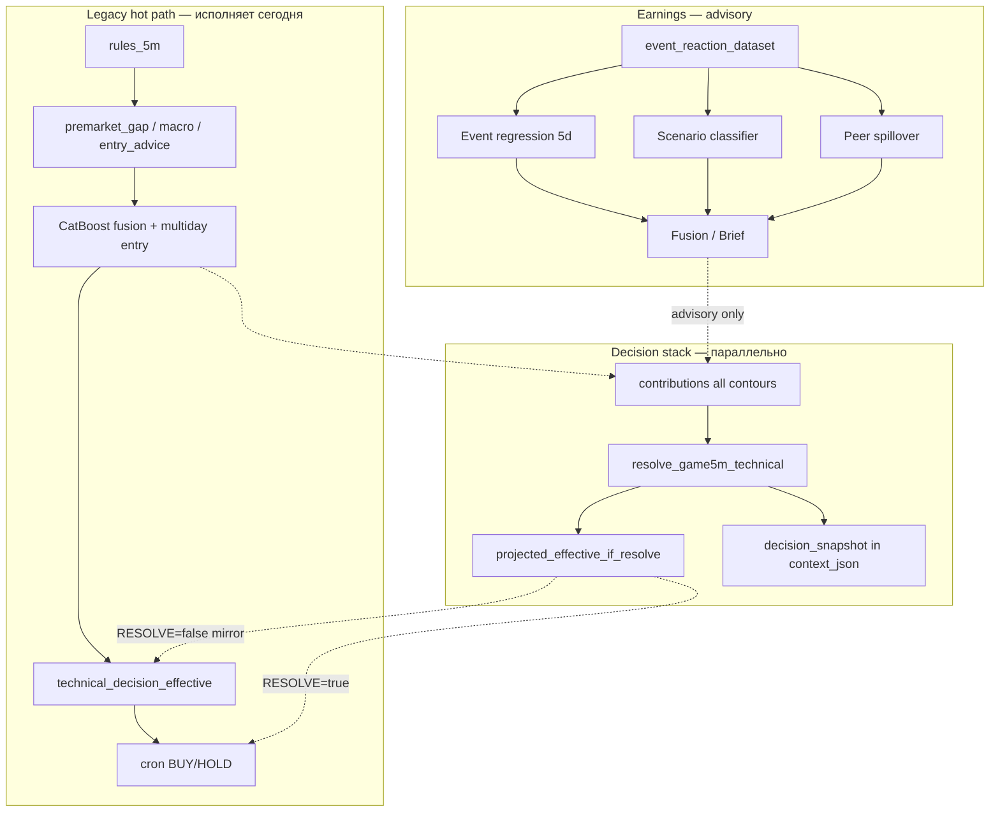

# CatBoost-сетки, ridge multiday и earnings grid: датасеты, метки, метрики и путь к единой точке решения

В репозитории **`lse`** несколько обучаемых **CatBoost**-моделей с разными юнитами наблюдения, признаками и типом предикта; отдельно — **ridge** по дневным log-доходностям на 1–3 торговых дня (не CatBoost) и **OLS gap forecast** (не CatBoost). Ниже — структура датасетов, метки, метрики L2, роль в **legacy hot path** и в **decision_stack** (путь к единому `decision_effective`).

**Связанные документы:**

| Тема | Документ |
|------|----------|
| Фазы калибровки A–E | [ML_CALIBRATION_PHASES.md](ML_CALIBRATION_PHASES.md) |
| Dual-track legacy + stack, prod-статус | [ML_STATUS_REPORT.md](ML_STATUS_REPORT.md) |
| Канон L1–L3, cron | [ML_AND_DECISION_ARCHITECTURE.md](ML_AND_DECISION_ARCHITECTURE.md) |
| Алгоритм GAME_5M, contributions | [GAME_5M_DECISION_ARCHITECTURE.md](GAME_5M_DECISION_ARCHITECTURE.md) |
| Earnings UI, Fusion | [earnings-event-agent-lse/EARNINGS_UI_GUIDE.md](earnings-event-agent-lse/EARNINGS_UI_GUIDE.md) |

**L1 retrain:** [ML_UNIFIED_RETRAIN_FRAMEWORK.md](ML_UNIFIED_RETRAIN_FRAMEWORK.md). Runtime-реестр: `services/ml_product_runtime.py`.

---

## Сводная матрица: датасет → метка → метрика → использование

| Контур | Юнит наблюдения | Источник / таблица | Target (y) | L2-метрика | Legacy (исполняет) | Stack (`decision_snapshot`) | Prod (2026-06) |
|--------|-----------------|-------------------|------------|------------|-------------------|----------------------------|----------------|
| **game5m_entry** | 1 закрытая GAME_5M сделка | `trade_history.context_json` | `net_pnl_pos` / `log_return_pos` | AUC valid ≥0.52 | `GAME_5M_CATBOOST_ENABLED` + fusion | `catboost_entry_5m` | ❌ off (AUC≈0.50) |
| **portfolio** | (ticker, trade_date) | `quotes` + `portfolio_ml_features` | `target_log_return` H=5d | RMSE, top-decile edge | `PORTFOLIO_CATBOOST_ENABLED` | `portfolio_catboost` | ✅ promoted |
| **recovery** | 1 бар удержания (5m) | JSONL анализатора | `h{H}_y_recovery` бинарный | AUC valid | D4a telemetry (`RECOVERY_ML_ENABLED`) | `recovery_ml` log_only | telemetry |
| **multiday_lr** | (ticker, day i) | daily `quotes` + opt. premarket | log-ret 1/2/3d forward | walk-forward OOS | `MULTIDAY_ENTRY/HOLD_GATE_MODE` | `multiday_lr` | entry apply |
| **gap_forecast** | (symbol, trade_date) | `game5m_gap_forecast_daily` | `open_gap_pct` (факт) | MAE pp, sign agreement | `premarket_gap_baseline` (observable) | `gap_forecast` caution | ML < naive |
| **event_reaction** | 1 earnings event | `event_reaction_dataset` | `forward_log_ret_5d` | RMSE valid ≤0.12 | advisory brief | `event_reaction` | advisory |
| **earnings_grid** | 1 earnings event | ERD + LLM labels | `final_label` (scenario class) | valid accuracy | shadow `/earnings` | — (Fusion) | shadow |
| **peer_spillover** | (source_event, peer) | ERD + `peer_graph_edge` | `peer_forward_log_ret_5d` | sign accuracy | brief context | — | advisory |
| **open_path** | (symbol, trade_date) pre-open | `game5m_open_path_labels` | `target_scenario` (rule) | accuracy, prerequisites | shadow | — | shadow |

Скрипты и артефакты:

| Сетка | Скрипт | Артефакт | Тип задачи |
|-------|--------|----------|------------|
| Вход GAME_5M (5m) | `train_game5m_catboost.py` | `game5m_entry_catboost.cbm` | классификация |
| Portfolio (дневка) | `train_portfolio_catboost.py` | `portfolio_return_catboost.cbm` | регрессия |
| Удержание / recovery | `train_game5m_recovery_catboost.py` | `game5m_recovery_catboost.cbm` | классификация |
| Event regression | `train_event_reaction_catboost.py` | `event_reaction_forward5d_catboost.cbm` | регрессия |
| Scenario classifier | `train_event_reaction_scenario_classifier.py` | `event_reaction_scenario_catboost.cbm` | классификация |
| Peer spillover | `train_peer_spillover_regressor.py` | `peer_spillover_forward5d_catboost.cbm` | регрессия |
| Open-path | `train_open_path_scenario_classifier.py` | `open_path_scenario_catboost.cbm` | классификация |
| Multiday ridge | `train_game5m_multiday_lr.py` | `multiday_lr/{TICKER}.json` | ridge регрессия |
| Gap forecast | `analyze_game5m_gap_forecast.py` | OLS coefs + metrics JSON | OLS (не .cbm) |

> **Про «макро-календарь» Investing в KB:** гейт новостей (`kb_news_report`, `calendar_ctx`) — **отдельно** от CatBoost; здесь «календарь событий» = строки **`event_reaction_dataset`** (earnings из KB + forward-исход по `quotes`).

> **Два слоя event ML не смешивать:** product-регрессия (`quotes_regime_v1`) ≠ earnings grid classifier (`quotes_regime_earnings_v1` + LLM labels). Вкладка **Spillover** на `/earnings` — **факты** forward log-ret peers из `quotes`, не ML-прогноз.

Контроль готовности: `scripts/run_ml_train_readiness_cron.py`, earnings grid: `scripts/run_earnings_ml_refresh.py` (флаги `ML_READINESS_SKIP_*`). **Переобучение по контурам (data-driven):** [ML_UNIFIED_RETRAIN_FRAMEWORK.md](ML_UNIFIED_RETRAIN_FRAMEWORK.md).

---

## 1. CatBoost входа в игру 5m (`game5m_entry_catboost`)

### Цель

Оценить **вероятность благоприятного исхода сделки** по признакам **только на момент входа** (тот же `context_json`, что пишет бот на BUY). Не заменяет правила; см. `docs/ML_GAME5M_CATBOOST.md`, `docs/GAME_5M_CATBOOST_FUSION.md`.

### Юнит наблюдения

Одна **закрытая** сделка `GAME_5M` с непустым нормализованным `context_json` на входе.

### Накопление фактов

- Источник: `trade_history` → `compute_closed_trade_pnls`.
- Признаки: `services/catboost_5m_signal.py` (`row_from_entry_context_dict`) — числовые поля + `ticker`; корреляции **только из сохранённого JSON**, без пересчёта «текущей» матрицы.
- Исключаются из обучения известные артефакты (ложный тейк по session high, выход на границе 09:25–09:30 ET) — см. `train_game5m_catboost.py`.

### Предикт (что учим)

**CatBoostClassifier**, `Logloss`, на выходе `P(y=1|X)`.

| `--label` | y = 1 (положительный класс) | y = 0 |
|-----------|-----------------------------|--------|
| `net_pnl_pos` (по умолчанию) | `net_pnl > 0` (после комиссий в модели PnL) | иначе |
| `log_return_pos` | `log_return > 0` | иначе |

### Метрики L2 / train

| Метрика | Порог readiness | Prod (2026-06) |
|---------|-----------------|----------------|
| `auc_valid` | ≥ `ML_READINESS_GAME5M_AUC_MIN` (0.52) | ≈0.50 ❌ |
| `n_valid` | ≥ min rows | 45 |
| Артефакт | `last_game5m_train_metrics.json` | dry-run/full в dispatcher |

### Результат в рантайме

`GAME_5M_CATBOOST_ENABLED` и путь к `.cbm`; поля `catboost_entry_proba_good` в 5m-рекомендациях. Fusion: `GAME_5M_CATBOOST_FUSION=hold_if_buy_below_p`. **Legacy** path: `apply_game5m_policy_gates()` или блок в `get_decision_5m` при `OWN_FINALIZE=false`. **Stack:** `catboost_entry_5m` contribution.

---

## 2. CatBoost portfolio (`portfolio_return_catboost`)

### Цель

**Справочная** дневная оценка **ожидаемой форвард лог-доходности** по тикеру в объединённом universe (портфель + GAME_5M + корреляционный список + leader/core). Не исполняет сделки автоматически; см. `services/portfolio_catboost_signal.py`.

### Юнит наблюдения

Одна строка **(ticker, торговая дата `date`)** — срез признаков на закрытии дня `t`, таргет — движение **после** `t`.

### Накопление фактов

- Модуль: `services/portfolio_ml_features.py`, функция `build_portfolio_ml_dataset`.
- Daily `quotes` по universe из `get_portfolio_ml_universe()` (портфель, `get_tickers_game_5m`, `get_tickers_for_5m_correlation`, `PORTFOLIO_LEADER_CLUSTER` / `PORTFOLIO_CORE_CLUSTER`).
- На дату `t` признаки строятся **только из данных до close[t]** (лог-реты за 1/3/5/10/20д, волатильности, RSI, корреляции с корзинами за `corr_window_days`, относительные реты и т.д.).
- Цель обучения: колонка **`target_log_return`** =  
  `log(close[t+H] / close[t])` в **торговых** днях, где `H` = `--horizon-days` (по умолчанию **5**). Дополнительно в датафрейме есть `target_good_entry` для метрик «лучше порога издержек» — см. `portfolio_ml_threshold_log()` (bps из config).

### Предикт

**CatBoostRegressor**, `RMSE`: модель выдаёт **число в лог-пространстве** (ожидаемая форвард лог-доходность на горизонте). Положительное предсказание ≠ гарантия прибыли; в инференсе скор может маппиться в 0–100 (`_score_from_expected_log_return` в `portfolio_catboost_signal.py`).

### Метрики L2 / train

| Метрика | Порог | Prod |
|---------|-------|------|
| `rmse_valid` | readiness gate | ≈0.078 ✅ |
| top-decile edge vs bps | analyzer | monitoring |
| Артефакт | `last_portfolio_train_metrics.json` | |

### Результат в рантайме

`PORTFOLIO_CATBOOST_ENABLED`, `PORTFOLIO_CATBOOST_MODEL_PATH`; `predict_portfolio_expected_returns` для карточек. **Единственный контур с L2✅ + L3✅ на legacy** (без RESOLVE).

---

## 3. CatBoost удержания (recovery, `game5m_recovery_catboost`)

### Цель

В контексте **раннего time-exit** оценить: **если в момент бара `t` подождать ещё H минут реального времени**, уложится ли цена в шаблон «достаточный отскок при ограниченной просадке» от **ref_close** на `t`. Офлайн / телеметрия и план D4 — см. `docs/GAME_5M_TIME_EXIT_RECOVERY_PLAN.md`.

### Юнит наблюдения

Одна строка = **один 5m-бар внутри удержания** закрытой long GAME_5M (псевдо-датасет из анализатора / экспорт JSONL), не целая сделка.

### Накопление фактов

- Схема и логика меток: `RECOVERY_ML_SCHEMA` и `_build_game5m_hold_recovery_dataset_stats` в `services/trade_effectiveness_analyzer.py`.
- Признаки на баре: тикер, `ref_close`, `entry_price`, PnL% от входа, время удержания, минуты после открытия RTH, календарные признаки, RSI/vol/momentum из контекста входа, усечённый `entry_decision` (категория).
- По OHLC **строго после** `t` до `t+H` считаются MFE/MAE вперёд; **`h{H}_y_recovery` = 1**, если MFE ≥ `eps_up` и MAE не хуже `max_adverse` (пороги из config), иначе **0**.

### Предикт

**CatBoostClassifier**: `P(y=1)` = вероятность «благоприятного» H-минутного окна в смысле заданных порогов. **y=0** — окно не удовлетворило критерию recovery.

### Обучение и данные

`scripts/train_game5m_recovery_catboost.py` читает JSONL экспорта (`export_recovery_ml` / `GAME_5M_RECOVERY_TRAIN_JSONL`). В вектор признаков **не** попадают post-hoc поля вроде `exit_signal` — см. `row_vector_from_export_record` в `services/game5m_recovery_catboost.py`.

---

## 4. Event regression — product advisory (`event_reaction_forward5d_catboost`)

### Цель

Предсказать **форвардную 5-дневную log-доходность source-тикера** после **конкретного earnings** (якорь = дата/время события в KB), зная только признаки **до отчёта**. Отдельный контур от GAME_5M; см. [EVENT_REACTION_PIPELINE.md](EVENT_REACTION_PIPELINE.md), `/earnings` → Brief / Fusion.

**Не путать с multiday ridge (§6):** ridge — на **любой** торговый день и горизонты 1–3d; event regression — только **даты earnings**, горизонт **5d после отчёта**, pooled CatBoost по событиям.

### Юнит наблюдения

Одна строка **`event_reaction_dataset`**: symbol, `event_time_et`, JSON **`features_before`**, **`outcomes_after`**.

Product dataset: **`v0_expanded_baseline`**, **`feature_builder_version=quotes_regime_v1`** (quotes + market regime + RSI и т.д.). Тексты call / LLM extract в **этой** регрессии пока **не** входят в X (идут в earnings grid и Brief).

### Накопление фактов

- Скелет из KB: `scripts/build_event_reaction_dataset.py`
- Разметка: `scripts/backfill_event_reaction_labeling.py`, `services/event_reaction_labeling.py`
- Исходы из daily **`quotes`**: `forward_log_ret_1d`, `_5d`, `_20d` в `outcomes_after`

### Предикт

**CatBoostRegressor**, цель **`outcomes_after.forward_log_ret_5d`**. Признаки — плоские числа из `features_before` + категориальный **`symbol`**.

Inference: `/api/ml/event-reaction/{ticker}?event_date=YYYY-MM-DD` (строка dataset на дату события; при нескольких версиях features приоритет у `quotes_regime_v1`).

### Результат в рантайме

Advisory в карточках и `/earnings` (Brief regression block). **`execution_blocked`** в Fusion — сделки не исполняются автоматически. Readiness: `event_reaction.gate` в `run_ml_train_readiness_cron.py`.

### Что даёт сверх ridge для GAME / earnings

| Аспект | Multiday ridge | Event regression |
|--------|----------------|------------------|
| Якорь | Конец **произвольного** дня | **Дата earnings** |
| Горизонт | 1 / 2 / 3 торг. дня | **5d после отчёта** |
| Частота | Каждый день | ~раз в квартал на тикер |
| Смысл | «Обычный краткий drift» | «Реакция **после этого отчёта**» |
| Peers / call | Нет (план: флаги календаря в X) | Regime; graph/tone — в **classifier** (§5) |

Ridge **не заменяется** — это фоновый контур GAME_5M; event regression — **event-conditioned** слой на редких высокоинформативных датах.

---

## 5. Scenario classifier — earnings grid (`event_reaction_scenario_catboost`)

### Цель

Предсказать **тип сценария реакции** на earnings (не «сколько процентов», а **какая история**): `gap_up_follow_through`, `capex_positive_for_infra_peers`, `beat_selloff_pullback`, `cross_earnings_contagion` и др. Разрешает кейсы, где **source и кластер идут в разные стороны** (META −10% / MU +28% — spillover facts, сценарий «infra peers»).

Оркестратор: `scripts/run_earnings_ml_refresh.py`. UI: `/earnings` → Shadow, Fusion. План: [earnings-event-agent-lse/EARNINGS_INTELLIGENCE_PLAN.md](earnings-event-agent-lse/EARNINGS_INTELLIGENCE_PLAN.md).

### Юнит наблюдения

Та же таблица **`event_reaction_dataset`**, но:

- **X:** `feature_builder_version=quotes_regime_earnings_v1` — quotes + regime + **earnings tone/timing** + **peer graph** (`peer_graph_out_degree`, `peer_graph_weight_sum`) + **peer momentum** до события
- **y:** `final_label` где `label_source=llm_scenario_v0` (из LLM `scenario_hints` через `scripts/apply_earnings_scenario_labels.py`)

LLM **не обучается** — только extractor и разметка из transcript/8-K.

### Предикт

**CatBoostClassifier**, multi-class по именам сценариев. Метрики: valid accuracy, live **shadow report** (sign/class vs созревший `forward_log_ret_5d`, pseudo-PnL после transaction costs).

### Что даёт сверх регрессии (§4)

| Вопрос | Event regression | Scenario classifier |
|--------|------------------|---------------------|
| Выход | Число: pred **5d log-ret source** | Класс: **какой нарратив** |
| META −0.5% pred, call про capex | Одна цифра по META | «Contagion / infra peers» → смотреть **peers** |
| Слабый pred ≈ 0 | Неясно | Сценарий + confidence в **Fusion** |
| Кластер | Не моделирует MU/SNDK | Связка с spillover / `cross_earnings_contagion` |

**Статус (pilot):** мало LLM labels (~15+), shadow на ~27 matured events — **advisory only**, не подключено к GAME_5M execution.

### Peer spillover и weighted score (не эта модель)

- **Spillover tab** — **факты** `forward_log_ret_*` peers от даты отчёта source (event-study по `quotes`). Это **история для валидации**, не forward ML.
- **Weighted spillover score** (план): `Σ weight_i × peer_ret_i` — одна метрика «как вёл себя кластер» для разметки и калибровки весов `peer_graph_edge`; в UI пока не вынесен.
- **Peer spillover ML (план):** отдельная регрессия `(source_event, peer) → peer_forward_log_ret_5d` или propagation `impulse_i = sign_i × w_i × pred_shock_source`.

---

## 6. Multiday ridge (дневка, 1–3 торговых дня, GAME_5M)

Отдельный контур GAME_5M: **ridge-регрессия** по дневным close (и опц. premarket / календарные флаги из БД), горизонты **1 / 2 / 3** торговых дня в log-доходности от **конца произвольного дня i**. Скрипт: `scripts/train_game5m_multiday_lr.py`. Рантайм: `services/log_return_multiday_forecast.py`. Полное описание: [GAME_5M_MULTIDAY_LR_RIDGE.md](GAME_5M_MULTIDAY_LR_RIDGE.md). План обогащения X: [GAME_5M_MULTIDAY_LR_FEATURE_ENRICHMENT_PLAN.md](GAME_5M_MULTIDAY_LR_FEATURE_ENRICHMENT_PLAN.md).

| Аспект | Содержание |
|--------|------------|
| **Зачем** | Справочный сигнал «куда смещена ожидаемая дневная доходность» на 1–3 торг. дня — **не** event-study |
| **Признаки** | Лаги daily log-ret, vol, cum5d; опц. premarket; live: vol/mom 5m; **план:** флаги earnings/macro как дневные колонки (не текст call) |
| **По умолчанию** | `GAME_5M_MULTIDAY_LR_REG_ENABLED` на prod **true**; entry gate **apply** на legacy |
| **vs event regression (§4)** | Ridge — **каждый день**; event CatBoost — **только earnings**, горизонт **5d** |
| **L2 gate** | `multiday_lr` block в `ml_train_readiness.jsonl`; arbiter `multiday_lr_gates_arbiter` |
| **Метрики train** | `last_multiday_lr_train_metrics.json` (n_tickers_fitted) |

---

## 7. Gap forecast (OLS, не CatBoost)

### Цель

Предсказать **фактический open gap %** (open vs prev close) по сектору SMH и тикеру. Сравнивается с **observable baseline** `premarket_gap_pct` (последняя premarket цена до 09:30 ET). ML promotion только если beat baseline на OOS — см. [GAME_5M_DECISION_ARCHITECTURE.md](GAME_5M_DECISION_ARCHITECTURE.md) §5.

### Юнит наблюдения

Строка **`game5m_gap_forecast_daily`**: `symbol`, `trade_date`, `open_gap_pct` (факт после open), premarket preds, sector proxy.

### Накопление фактов

- Ingest: `ingest_game5m_gap_forecast.py` (premarket + open phases)
- Анализ / coef: `analyze_game5m_gap_forecast.py` → `last_gap_forecast_metrics.json`
- L1 refresh: `run_gap_forecast_refresh.py`

### Предикт

Sector OLS + per-ticker v2; не `.cbm`. Поля в карточке: `ticker_open_gap_predicted_pct`, `forecast_layer`.

### Метрики L2

| Метрика | Baseline (premarket naive) | ML ridge (prod) |
|---------|---------------------------|-----------------|
| MAE (pp) | ≈1.41 | не beat (caution) |
| Sign agreement | ≈79% | — |

### Использование

- **Legacy:** `premarket_gap_baseline` (observable) — production в decision_stack; влияет на entry_advice
- **Stack:** `gap_forecast` — caution / log_only; `forecast_layer` объединяет envelope
- **Open-path:** `gf_*` признаки в open-path classifier (§8)

---

## 8. Open-path scenario classifier

### Цель

Классифицировать **сценарий первого RTH-часа** (gap fade, continuation, chop…) по pre-open признакам. MVP внутри earnings/open-play; **не** блокирует GAME_5M cron.

### Юнит наблюдения

Строка **`game5m_open_path_labels`**: `(symbol, trade_date)` с rule-label `target_scenario` после close.

### Накопление фактов

- Labels: `label_open_path_scenarios.py` (23:45 cron) из `game5m_gap_forecast_daily` + RTH OHLC
- X: `open_path_classifier_dataset.py` — premarket DB, gap preds, macro flags, multiday h1
- Train: `train_open_path_scenario_classifier.py`

### Предикт

**CatBoostClassifier**, multi-class `target_scenario`. Метрики: valid accuracy; readiness: `last_open_path_readiness.json`.

### Использование

Shadow на `/earnings` и autoprep; prerequisites (premarket rows, gap history) — gate перед product. **Не** в `decision_stack` GAME_5M hot path до sign-off.

---

## 9. Peer spillover regressor

### Цель

Предсказать **5d log-return peer-тикера** после earnings **source** (не source itself). Дополняет scenario classifier: «META −10%, MU +28%» — regression даёт число по source, spillover — по peer.

### Юнит наблюдения

Строка **(source_event, peer_ticker)** из `peer_spillover_dataset.py`: edge weight, relation_type, source outcomes, peer features.

### Target

`peer_forward_log_ret_5d` — регрессия, **CatBoostRegressor**. Метрика L2: sign accuracy на valid.

### Использование

Advisory в earnings Brief / Fusion context. **Spillover tab** в UI — факты из `quotes` (не ML); ML spillover — forward pred для калибровки весов `peer_graph_edge`.

---

## Связанные CSV (не CatBoost-модели)

Датасеты **`game5m_stuck_dataset`** и **`game5m_continuation_dataset`** — разметка зависания / post-take upside; отдельного train CatBoost нет — см. [GAME_5M_HANGER_AND_STALE_EXIT_PLAN.md](GAME_5M_HANGER_AND_STALE_EXIT_PLAN.md).

---

## 10. Как ML дополняют друг друга (ситуации)

Контуры отвечают на **разные вопросы** в **разное время**. Не заменяют друг друга — накладываются слоями.

| Ситуация | Первичный сигнал | Уточняющие ML | Что делает стек |
|----------|------------------|---------------|-----------------|
| **Обычный RTH-вход long** | rules_5m RSI/momentum | entry CatBoost P(good), multiday 1d drift | CatBoost fusion → HOLD; multiday entry gate → HOLD при bearish кворуме |
| **Премаркет, gap +1.8%** | `premarket_gap_baseline` boost | gap ML (caution), multiday 2–3d | Baseline production; ML gap только telemetry пока не beat naive |
| **NEAR_OPEN / NEAR_CLOSE** | rules даёт STRONG_BUY | session (stack only при RESOLVE) | Legacy исполняет; stack projected HOLD — divergence норма |
| **Удержание, TIME_EXIT_EARLY** | rules exit | recovery P(recovery), multiday hold gate | Recovery D4a log-only; hold gate log_only (3/5 would_defer) |
| **День earnings у тикера** | rules + macro | event 5d reg, scenario class, spillover | Advisory в Brief; **не** автоблок GAME_5M |
| **Earnings у peer (META)** | spillover facts | peer spillover reg, scenario | «Capex infra peers» → смотреть MU/SNDK в Fusion |
| **Портфельный BUY** | strategy rules | portfolio CatBoost score | `PORTFOLIO_CATBOOST_BLOCK_BUY_ON_WEAK` на legacy |
| **Open-path первый час** | rule labels (offline) | open-path classifier | Shadow до product gates |

**Правило complementarity:** более **редкий** и **event-anchored** слой (earnings) не подменяет **ежедневный** (ridge, entry); он добавляет контекст на датах отчётов. Более **быстрый** горизонт (5m entry, recovery H мин) не подменяет **дневной** (multiday 1–3d) — фильтрует вход/выход на другом масштабе.

---

## 11. Единая точка принятия решения: эволюция

### Сейчас (dual-track, prod)

```text
get_decision_5m() / cron
    │
    ├─ rules_5m → technical_decision_core
    ├─ KB, macro, entry_advice, premarket_gap_baseline  (legacy policy)
    ├─ apply_game5m_policy_gates()  [OWN_FINALIZE=true]
    │     ├─ CatBoost fusion      (если GAME_5M_CATBOOST_ENABLED)
    │     └─ multiday entry gate  (если ENTRY_GATE_MODE=apply)
    │           → technical_decision_effective  ◄── LEGACY EXECUTOR (cron BUY/HOLD)
    │
    └─ finalize_game5m_decision_stack()
          ├─ collect contributions (все контуры)
          ├─ resolve_game5m_technical() → projected_effective_if_resolve
          └─ RESOLVE=false → decision_effective = legacy (snapshot в context_json)
```

**Portfolio** — отдельная поверхность: `execution_agent` + `PORTFOLIO_CATBOOST_*`, свой decision_stack в `portfolio.py`.

**Earnings** — advisory surface: Fusion, Brief; `execution_blocked: true` по умолчанию.

### Целевое состояние (единый исполнитель)

```text
decision_snapshot.contributions[]
    rules_5m, session, entry_advice, macro, premarket_gap_baseline  [production]
    catboost_entry_5m, multiday_lr, recovery_ml, gap_forecast        [production по readiness]
    news_fusion, forecast_layer, cluster_context                     [caution / LLM]
         │
         ▼
resolve_game5m_technical()  — детерминированный veto/downgrade по gate_mode=apply
         │
         ▼
decision_effective  ◄── DECISION_STACK_RESOLVE_ENABLED=true
         │
         ▼
cron / execution (одно поле, полный audit trail)
```

### Дорожная карта без big-bang

| Этап | Что включается | Где | Не ждёт |
|------|----------------|-----|---------|
| **Сейчас** | portfolio, multiday entry | **legacy** flags | RESOLVE |
| **+entry CatBoost** | AUC gate | `GAME_5M_CATBOOST_ENABLED` на legacy | RESOLVE |
| **+recovery D4b** | defer TIME_EXIT | `game_5m.py` exit path | RESOLVE |
| **+multiday hold** | defer early exit | `send_sndk_signal_cron` hold apply | RESOLVE |
| **+gap ML** | beat naive OOS | `DECISION_STACK_FORECAST_GATE_MODE` или legacy | RESOLVE |
| **+RESOLVE** | session, news_fusion, единый resolve | `DECISION_STACK_RESOLVE_ENABLED=true` | — |

**Принцип:** каждый контур с закрытым L2 gate подключается на **legacy** через свой runtime flag **сразу**; `RESOLVE=true` — финальный шаг **унификации исполнителя**, а не первое включение ML.

Проверка: `scripts/print_ml_product_status.py`, отчёт [ML_STATUS_REPORT.md](ML_STATUS_REPORT.md).

### Вход vs выход (GAME_5M)

| Фаза сделки | Единая точка входа | Единая точка выхода (цель) |
|-------------|-------------------|---------------------------|
| Сейчас | `technical_decision_effective` | `should_close_position()` в `game_5m.py` (rules + recovery telemetry) |
| С RESOLVE | `decision_effective` | recovery_ml + multiday hold в stack contributions → exit defer (D4b) |

Вход и выход **разделены намеренно**: ML entry не должен ломать технический exit core до прохождения D4a/D4b.

---

## 12. Стек ML: вклад в решения (схема)



| Слой | Тип | Когда | Вопрос | Подключение |
|------|-----|-------|--------|-------------|
| **5m entry** | классификация | Вход long | P(сделка в плюс)? | Legacy fusion (когда ENABLED) |
| **Multiday ridge** | ridge | Любой день | Drift 1–3d? | Legacy entry/hold gates |
| **Recovery** | классификация | Бар в удержании | Ждать H минут? | D4a telemetry → D4b |
| **Gap baseline** | observable | Премаркет | Фактический gap? | Legacy production |
| **Gap ML** | OLS | Премаркет/open | Pred open gap? | Stack caution |
| **Portfolio** | регрессия | Дневной срез | H-day log-ret? | Legacy portfolio cards |
| **Event regression** | регрессия | Earnings | Source 5d? | Advisory |
| **Scenario classifier** | классификация | Earnings | Какой нарратив? | Shadow / Fusion |
| **Peer spillover** | регрессия | Earnings | Peer 5d? | Brief context |
| **Open-path** | классификация | Pre-open | Сценарий 1h? | Shadow |

**LLM:** extractor и разметка — не обучаемая модель. **Fusion:** regression + classifier + brief.

---

## Быстрая памятка «что за что отвечает»

| Сетка | Вопрос модели |
|-------|----------------|
| 5m entry | При **таком входе** чаще ли в истории получался **плюс по сделке**? |
| Portfolio | На **таком дневном срезе** какова **ожидаемая лог-доходность на H торговых дней**? |
| Recovery (удержание) | С **этого бара** за **H минут** цена пройдёт порог «upside без чрезмерной просадки»? |
| **Event regression** | После **этого earnings** каков **5d log-return source**? |
| **Scenario classifier** | После **этого earnings** какой **сценарий** (fade, contagion, capex peers…)? |
| **Multiday ridge** | На **конец обычного дня i** — log-доходность на **1 / 2 / 3** торговых дня вперёд? |
| **Gap forecast (OLS)** | Каков **open gap %** vs premarket naive? |
| **Open-path** | Какой **сценарий первого часа** по pre-open признакам? |
| **Peer spillover** | Каков **5d log-ret peer** после earnings source? |
| **Spillover UI (факты)** | На **прошлом** earnings — как **фактически** ходили peers 1d/5d? |
