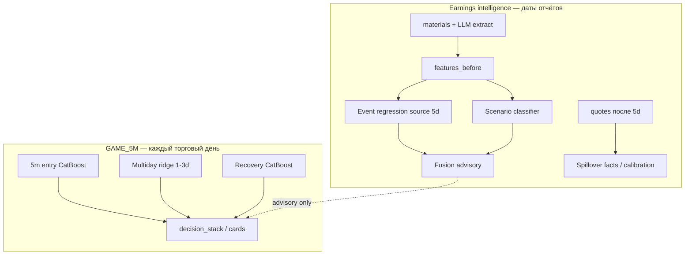

# CatBoost-сетки, ridge multiday и earnings grid: 5m вход, portfolio, удержание, события, дневка 1–3 дня

В репозитории **`lse`** несколько обучаемых **CatBoost**-моделей с разными юнитами наблюдения, признаками и типом предикта; отдельно — **ridge** по дневным log-доходностям на 1–3 торговых дня (не CatBoost). Ниже — цель каждой сетки, откуда накапливаются факты и как задаётся **положительный / отрицательный** (или знак) итог для обучения.

**Фазы калибровки** (данные → гиперпараметры → честная оценка → политика → прод): [ML_CALIBRATION_PHASES.md](ML_CALIBRATION_PHASES.md).

**Earnings intelligence (UI, spillover, Fusion):** [earnings-event-agent-lse/EARNINGS_UI_GUIDE.md](earnings-event-agent-lse/EARNINGS_UI_GUIDE.md), [EVENT_REACTION_PIPELINE.md](EVENT_REACTION_PIPELINE.md).

Сводка по скриптам и артефактам:

| Сетка | Скрипт | Артефакт | Тип задачи | Роль в решениях |
|-------|--------|----------|------------|-----------------|
| Вход GAME_5M (5m) | `scripts/train_game5m_catboost.py` | `game5m_entry_catboost.cbm` | классификация | Вход 5m (fusion / caution) |
| Portfolio (дневка) | `scripts/train_portfolio_catboost.py` | `portfolio_return_catboost.cbm` | регрессия | Справочно, карточки portfolio |
| Удержание / recovery | `scripts/train_game5m_recovery_catboost.py` | `game5m_recovery_catboost.cbm` | классификация | Time-exit / recovery (план D4) |
| **Event regression (product)** | `scripts/train_event_reaction_catboost.py` | `event_reaction_forward5d_catboost.cbm` | регрессия | Advisory: 5d log-ret **source** после earnings |
| **Scenario classifier (earnings grid)** | `scripts/train_event_reaction_scenario_classifier.py` | `event_reaction_scenario_catboost.cbm` | классификация | Advisory: **тип сценария**; Fusion / Shadow |
| **Multiday ridge (GAME_5M)** | `scripts/train_game5m_multiday_lr.py` | JSON в `GAME_5M_MULTIDAY_LR_MODEL_DIR` | регрессия (ridge) | Справочно: drift 1–3d на **любой** день |

> **Про «макро-календарь» Investing в KB:** гейт новостей (`kb_news_report`, `calendar_ctx`) — **отдельно** от CatBoost; здесь «календарь событий» = строки **`event_reaction_dataset`** (earnings из KB + forward-исход по `quotes`).

> **Два слоя event ML не смешивать:** product-регрессия (`quotes_regime_v1`) ≠ earnings grid classifier (`quotes_regime_earnings_v1` + LLM labels). Вкладка **Spillover** на `/earnings` — **факты** forward log-ret peers из `quotes`, не ML-прогноз.

Контроль готовности: `scripts/run_ml_train_readiness_cron.py`, earnings grid: `scripts/run_earnings_ml_refresh.py` (флаги `ML_READINESS_SKIP_*`).

---

## 1. CatBoost входа в игру 5m (`game5m_entry_catboost`)

### Цель

Оценить **вероятность благоприятного исхода сделки** по признакам **только на момент входа** (тот же `context_json`, что пишет бот на BUY). Не заменяет правила; см. `docs/ML_GAME5M_CATBOOST.md`, `docs/GAME_5M_CATBOOST_FUSION.md`.

### Юнит наблюдения

Одна **закрытая** сделка `GAME_5M` с непустым нормализованным `context_json` на входе.

### Накопление фактов

- Источник: `trade_history` → `compute_closed_trade_pnls`.
- Признаки: `services/catboost_5m_signal.py` (`row_from_entry_context_dict`) — числовые поля + `ticker`; корреляции **только из сохранённого JSON**, без пересчёта «текущей» матрицы.
- Исключаются из обучения известные артефакты (ложный тейк по session high, выход на границе 09:25–09:30 ET) — см. `train_game5m_catboost.py`.

### Предикт (что учим)

**CatBoostClassifier**, `Logloss`, на выходе `P(y=1|X)`.

| `--label` | y = 1 (положительный класс) | y = 0 |
|-----------|-----------------------------|--------|
| `net_pnl_pos` (по умолчанию) | `net_pnl > 0` (после комиссий в модели PnL) | иначе |
| `log_return_pos` | `log_return > 0` | иначе |

### Результат в рантайме

`GAME_5M_CATBOOST_ENABLED` и путь к `.cbm`; поля вроде `catboost_entry_proba_good` в ответе 5m-рекомендаций (`services/recommend_5m.py`).

---

## 2. CatBoost portfolio (`portfolio_return_catboost`)

### Цель

**Справочная** дневная оценка **ожидаемой форвард лог-доходности** по тикеру в объединённом universe (портфель + GAME_5M + корреляционный список + leader/core). Не исполняет сделки автоматически; см. `services/portfolio_catboost_signal.py`.

### Юнит наблюдения

Одна строка **(ticker, торговая дата `date`)** — срез признаков на закрытии дня `t`, таргет — движение **после** `t`.

### Накопление фактов

- Модуль: `services/portfolio_ml_features.py`, функция `build_portfolio_ml_dataset`.
- Daily `quotes` по universe из `get_portfolio_ml_universe()` (портфель, `get_tickers_game_5m`, `get_tickers_for_5m_correlation`, `PORTFOLIO_LEADER_CLUSTER` / `PORTFOLIO_CORE_CLUSTER`).
- На дату `t` признаки строятся **только из данных до close[t]** (лог-реты за 1/3/5/10/20д, волатильности, RSI, корреляции с корзинами за `corr_window_days`, относительные реты и т.д.).
- Цель обучения: колонка **`target_log_return`** =  
  `log(close[t+H] / close[t])` в **торговых** днях, где `H` = `--horizon-days` (по умолчанию **5**). Дополнительно в датафрейме есть `target_good_entry` для метрик «лучше порога издержек» — см. `portfolio_ml_threshold_log()` (bps из config).

### Предикт

**CatBoostRegressor**, `RMSE`: модель выдаёт **число в лог-пространстве** (ожидаемая форвард лог-доходность на горизонте). Положительное предсказание ≠ гарантия прибыли; в инференсе скор может маппиться в 0–100 (`_score_from_expected_log_return` в `portfolio_catboost_signal.py`).

### Результат в рантайме

`PORTFOLIO_CATBOOST_ENABLED`, `PORTFOLIO_CATBOOST_MODEL_PATH`; батч-предикт `predict_portfolio_expected_returns` для карточек портфеля.

---

## 3. CatBoost удержания (recovery, `game5m_recovery_catboost`)

### Цель

В контексте **раннего time-exit** оценить: **если в момент бара `t` подождать ещё H минут реального времени**, уложится ли цена в шаблон «достаточный отскок при ограниченной просадке» от **ref_close** на `t`. Офлайн / телеметрия и план D4 — см. `docs/GAME_5M_TIME_EXIT_RECOVERY_PLAN.md`.

### Юнит наблюдения

Одна строка = **один 5m-бар внутри удержания** закрытой long GAME_5M (псевдо-датасет из анализатора / экспорт JSONL), не целая сделка.

### Накопление фактов

- Схема и логика меток: `RECOVERY_ML_SCHEMA` и `_build_game5m_hold_recovery_dataset_stats` в `services/trade_effectiveness_analyzer.py`.
- Признаки на баре: тикер, `ref_close`, `entry_price`, PnL% от входа, время удержания, минуты после открытия RTH, календарные признаки, RSI/vol/momentum из контекста входа, усечённый `entry_decision` (категория).
- По OHLC **строго после** `t` до `t+H` считаются MFE/MAE вперёд; **`h{H}_y_recovery` = 1**, если MFE ≥ `eps_up` и MAE не хуже `max_adverse` (пороги из config), иначе **0**.

### Предикт

**CatBoostClassifier**: `P(y=1)` = вероятность «благоприятного» H-минутного окна в смысле заданных порогов. **y=0** — окно не удовлетворило критерию recovery.

### Обучение и данные

`scripts/train_game5m_recovery_catboost.py` читает JSONL экспорта (`export_recovery_ml` / `GAME_5M_RECOVERY_TRAIN_JSONL`). В вектор признаков **не** попадают post-hoc поля вроде `exit_signal` — см. `row_vector_from_export_record` в `services/game5m_recovery_catboost.py`.

---

## 4. Event regression — product advisory (`event_reaction_forward5d_catboost`)

### Цель

Предсказать **форвардную 5-дневную log-доходность source-тикера** после **конкретного earnings** (якорь = дата/время события в KB), зная только признаки **до отчёта**. Отдельный контур от GAME_5M; см. [EVENT_REACTION_PIPELINE.md](EVENT_REACTION_PIPELINE.md), `/earnings` → Brief / Fusion.

**Не путать с multiday ridge (§6):** ridge — на **любой** торговый день и горизонты 1–3d; event regression — только **даты earnings**, горизонт **5d после отчёта**, pooled CatBoost по событиям.

### Юнит наблюдения

Одна строка **`event_reaction_dataset`**: symbol, `event_time_et`, JSON **`features_before`**, **`outcomes_after`**.

Product dataset: **`v0_expanded_baseline`**, **`feature_builder_version=quotes_regime_v1`** (quotes + market regime + RSI и т.д.). Тексты call / LLM extract в **этой** регрессии пока **не** входят в X (идут в earnings grid и Brief).

### Накопление фактов

- Скелет из KB: `scripts/build_event_reaction_dataset.py`
- Разметка: `scripts/backfill_event_reaction_labeling.py`, `services/event_reaction_labeling.py`
- Исходы из daily **`quotes`**: `forward_log_ret_1d`, `_5d`, `_20d` в `outcomes_after`

### Предикт

**CatBoostRegressor**, цель **`outcomes_after.forward_log_ret_5d`**. Признаки — плоские числа из `features_before` + категориальный **`symbol`**.

Inference: `/api/ml/event-reaction/{ticker}?event_date=YYYY-MM-DD` (строка dataset на дату события; при нескольких версиях features приоритет у `quotes_regime_v1`).

### Результат в рантайме

Advisory в карточках и `/earnings` (Brief regression block). **`execution_blocked`** в Fusion — сделки не исполняются автоматически. Readiness: `event_reaction.gate` в `run_ml_train_readiness_cron.py`.

### Что даёт сверх ridge для GAME / earnings

| Аспект | Multiday ridge | Event regression |
|--------|----------------|------------------|
| Якорь | Конец **произвольного** дня | **Дата earnings** |
| Горизонт | 1 / 2 / 3 торг. дня | **5d после отчёта** |
| Частота | Каждый день | ~раз в квартал на тикер |
| Смысл | «Обычный краткий drift» | «Реакция **после этого отчёта**» |
| Peers / call | Нет (план: флаги календаря в X) | Regime; graph/tone — в **classifier** (§5) |

Ridge **не заменяется** — это фоновый контур GAME_5M; event regression — **event-conditioned** слой на редких высокоинформативных датах.

---

## 5. Scenario classifier — earnings grid (`event_reaction_scenario_catboost`)

### Цель

Предсказать **тип сценария реакции** на earnings (не «сколько процентов», а **какая история**): `gap_up_follow_through`, `capex_positive_for_infra_peers`, `beat_selloff_pullback`, `cross_earnings_contagion` и др. Разрешает кейсы, где **source и кластер идут в разные стороны** (META −10% / MU +28% — spillover facts, сценарий «infra peers»).

Оркестратор: `scripts/run_earnings_ml_refresh.py`. UI: `/earnings` → Shadow, Fusion. План: [earnings-event-agent-lse/EARNINGS_INTELLIGENCE_PLAN.md](earnings-event-agent-lse/EARNINGS_INTELLIGENCE_PLAN.md).

### Юнит наблюдения

Та же таблица **`event_reaction_dataset`**, но:

- **X:** `feature_builder_version=quotes_regime_earnings_v1` — quotes + regime + **earnings tone/timing** + **peer graph** (`peer_graph_out_degree`, `peer_graph_weight_sum`) + **peer momentum** до события
- **y:** `final_label` где `label_source=llm_scenario_v0` (из LLM `scenario_hints` через `scripts/apply_earnings_scenario_labels.py`)

LLM **не обучается** — только extractor и разметка из transcript/8-K.

### Предикт

**CatBoostClassifier**, multi-class по именам сценариев. Метрики: valid accuracy, live **shadow report** (sign/class vs созревший `forward_log_ret_5d`, pseudo-PnL после transaction costs).

### Что даёт сверх регрессии (§4)

| Вопрос | Event regression | Scenario classifier |
|--------|------------------|---------------------|
| Выход | Число: pred **5d log-ret source** | Класс: **какой нарратив** |
| META −0.5% pred, call про capex | Одна цифра по META | «Contagion / infra peers» → смотреть **peers** |
| Слабый pred ≈ 0 | Неясно | Сценарий + confidence в **Fusion** |
| Кластер | Не моделирует MU/SNDK | Связка с spillover / `cross_earnings_contagion` |

**Статус (pilot):** мало LLM labels (~15+), shadow на ~27 matured events — **advisory only**, не подключено к GAME_5M execution.

### Peer spillover и weighted score (не эта модель)

- **Spillover tab** — **факты** `forward_log_ret_*` peers от даты отчёта source (event-study по `quotes`). Это **история для валидации**, не forward ML.
- **Weighted spillover score** (план): `Σ weight_i × peer_ret_i` — одна метрика «как вёл себя кластер» для разметки и калибровки весов `peer_graph_edge`; в UI пока не вынесен.
- **Peer spillover ML (план):** отдельная регрессия `(source_event, peer) → peer_forward_log_ret_5d` или propagation `impulse_i = sign_i × w_i × pred_shock_source`.

---

## 6. Multiday ridge (дневка, 1–3 торговых дня, GAME_5M)

Отдельный контур GAME_5M: **ridge-регрессия** по дневным close (и опц. premarket / календарные флаги из БД), горизонты **1 / 2 / 3** торговых дня в log-доходности от **конца произвольного дня i**. Скрипт: `scripts/train_game5m_multiday_lr.py`. Рантайм: `services/log_return_multiday_forecast.py`. Полное описание: [GAME_5M_MULTIDAY_LR_RIDGE.md](GAME_5M_MULTIDAY_LR_RIDGE.md). План обогащения X: [GAME_5M_MULTIDAY_LR_FEATURE_ENRICHMENT_PLAN.md](GAME_5M_MULTIDAY_LR_FEATURE_ENRICHMENT_PLAN.md).

| Аспект | Содержание |
|--------|------------|
| **Зачем** | Справочный сигнал «куда смещена ожидаемая дневная доходность» на 1–3 торг. дня — **не** event-study |
| **Признаки** | Лаги daily log-ret, vol, cum5d; опц. premarket; live: vol/mom 5m; **план:** флаги earnings/macro как дневные колонки (не текст call) |
| **По умолчанию** | `GAME_5M_MULTIDAY_LR_REG_ENABLED=false` — caution в decision stack |
| **vs event regression (§4)** | Ridge — **каждый день**; event CatBoost — **только earnings**, горизонт **5d** |

---

## Связанные CSV (не CatBoost-модели)

Датасеты **`game5m_stuck_dataset`** и **`game5m_continuation_dataset`** — разметка зависания / post-take upside; отдельного train CatBoost нет — см. [GAME_5M_HANGER_AND_STALE_EXIT_PLAN.md](GAME_5M_HANGER_AND_STALE_EXIT_PLAN.md).

---

## 7. Стек ML: вклад в решения (GAME_5M vs earnings)

Слои **не дублируют** друг друга — разные якоря, горизонты и вопросы.

| Слой | Тип | Когда | Вопрос | Подключение к сделкам |
|------|-----|-------|--------|------------------------|
| **5m entry** | классификация | Вход long | P(сделка в плюс)? | Fusion / gates GAME_5M |
| **Multiday ridge** | регрессия | Любой день | Drift 1–3d? | Caution (по умолчанию выкл.) |
| **Recovery** | классификация | Бар в удержании | Ждать H минут? | План time-exit |
| **Portfolio CatBoost** | регрессия | Дневной срез | H-day log-ret? | Карточки portfolio |
| **Event regression** | регрессия | **Earnings** | Source **5d** после отчёта? | Brief, Fusion; **не** бот |
| **Scenario classifier** | классификация | **Earnings** | **Какой сценарий** / peers vs source? | Shadow, Fusion; **pilot** |
| **Spillover UI** | факты | Прошлые earnings | Как peers **реально** ходили? | Валидация, не pred |
| **Peer graph weights** | структура | Каталог + план калибровки | Кого peer, с каким весом? | Features, будущий weighted score |

**LLM:** extractor и разметка (`affected_tickers`, `scenario_hints`) — не обучаемая модель. **Fusion:** regression + classifier + brief; `execution_blocked: true`.

---

## Быстрая памятка «что за что отвечает»

| Сетка | Вопрос модели |
|-------|----------------|
| 5m entry | При **таком входе** чаще ли в истории получался **плюс по сделке**? |
| Portfolio | На **таком дневном срезе** какова **ожидаемая лог-доходность на H торговых дней**? |
| Recovery (удержание) | С **этого бара** за **H минут** цена пройдёт порог «upside без чрезмерной просадки»? |
| **Event regression** | После **этого earnings** каков **5d log-return source**? |
| **Scenario classifier** | После **этого earnings** какой **сценарий** (fade, contagion, capex peers…)? |
| **Multiday ridge** | На **конец обычного дня i** — log-доходность на **1 / 2 / 3** торговых дня вперёд? |
| **Spillover (не ML)** | На **прошлом** earnings — как **фактически** ходили peers 1d/5d? |
