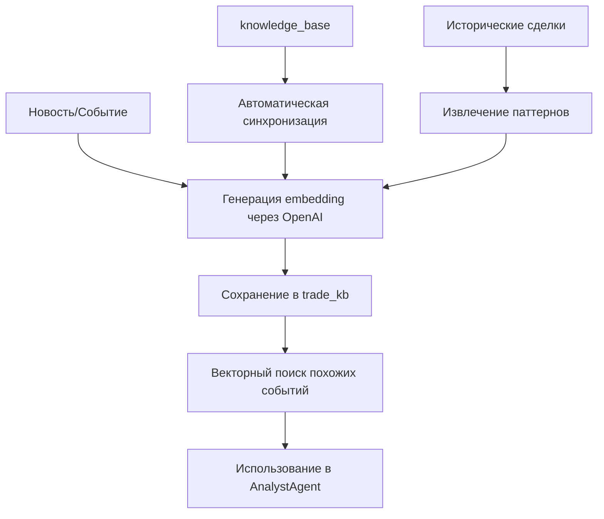
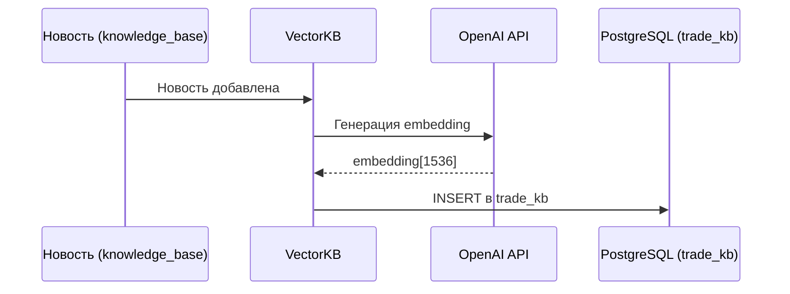
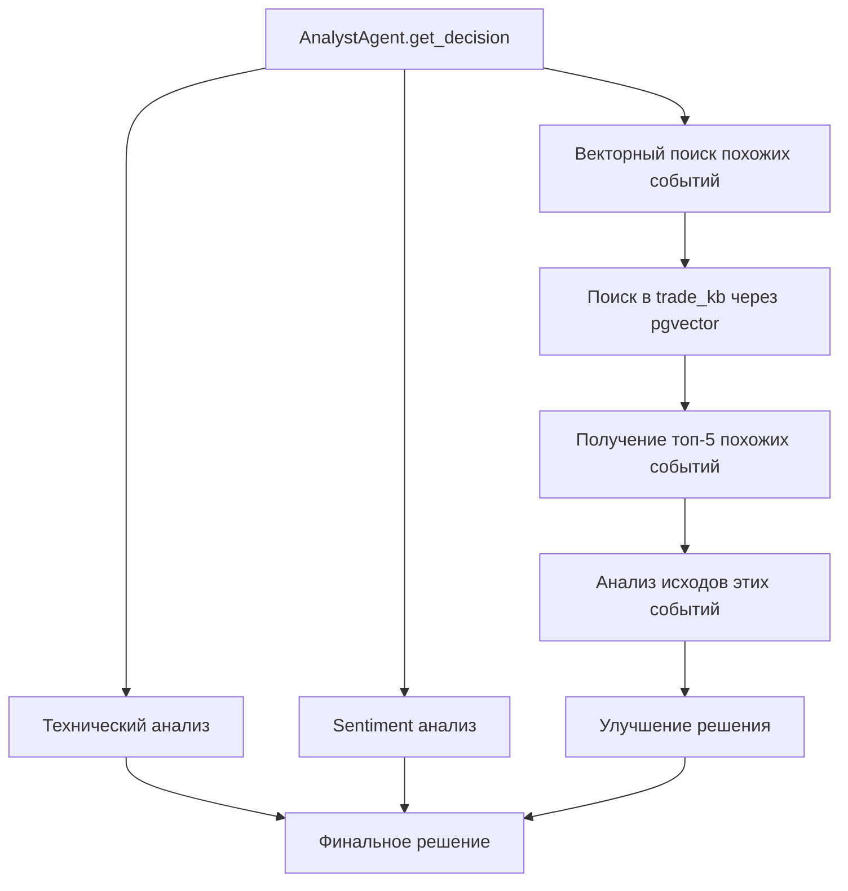

# Реализация векторной базы знаний (Vector Knowledge Base)

## Текущее состояние

### Что есть
- ✅ Таблица `trade_kb` в PostgreSQL с полем `embedding vector(1536)`
- ✅ Расширение `pgvector` установлено
- ✅ Структура таблицы готова для хранения векторных embeddings

### Что отсутствует
- ❌ Генерация embeddings для новостей/событий
- ❌ Вставка данных в `trade_kb`
- ❌ Векторный поиск похожих событий
- ❌ Интеграция с `AnalystAgent` для улучшения решений

---

## Назначение векторной базы знаний

Векторная БЗ (`trade_kb`) предназначена для:

1. **Семантический поиск исторических паттернов**
   - Поиск похожих ситуаций из прошлого
   - Анализ, как рынок реагировал на похожие новости/события
   - Улучшение качества торговых решений через контекст

2. **RAG (Retrieval-Augmented Generation)**
   - Использование исторического контекста для улучшения анализа
   - Комбинирование технических индикаторов + sentiment + исторические паттерны

3. **Обогащение новостей**
   - Автоматическое добавление новостей из `knowledge_base` в `trade_kb` с embeddings
   - Поиск связанных новостей по смыслу, а не только по тикеру

---

## Архитектура решения

### Схема данных



### Разделение ролей таблиц

| Таблица | Назначение | Использование |
|---------|-----------|---------------|
| `knowledge_base` | Новости с sentiment анализом | Временной поиск по тикеру, расчет sentiment |
| `trade_kb` | Семантический поиск через embeddings | Поиск похожих событий по смыслу, RAG |

---

## Что нужно для реализации

### 1. Зависимости

Добавить в `requirements.txt`:

```txt
openai>=1.0.0  # Для генерации embeddings
# или альтернатива:
# sentence-transformers>=2.2.0  # Для локальных embeddings (бесплатно)
```

### 2. API ключ OpenAI

Добавить в `../brats/config.env`:

```env
OPENAI_API_KEY=sk-...
```

**Альтернатива**: Использовать `sentence-transformers` для локальной генерации embeddings (бесплатно, но требует больше ресурсов).

### 3. Создать модуль `vector_kb.py`

Основные функции:

```python
class VectorKB:
    def __init__(self):
        # Инициализация подключения к БД
        # Инициализация OpenAI клиента или sentence-transformers
    
    def generate_embedding(self, text: str) -> list[float]:
        """Генерирует embedding для текста"""
    
    def add_event(self, ticker: str, event_type: str, content: str, ts: datetime):
        """Добавляет событие в trade_kb с embedding"""
    
    def search_similar(self, query: str, ticker: str = None, limit: int = 5) -> pd.DataFrame:
        """Ищет похожие события через векторный поиск"""
    
    def sync_from_knowledge_base(self):
        """Синхронизирует новости из knowledge_base в trade_kb"""
```

### 4. Интеграция с AnalystAgent

Добавить в `analyst_agent.py`:

```python
def get_historical_context(self, ticker: str, current_situation: str) -> str:
    """Ищет похожие исторические ситуации через векторную БЗ"""
    vector_kb = VectorKB()
    similar_events = vector_kb.search_similar(
        query=current_situation,
        ticker=ticker,
        limit=5
    )
    # Формирует контекст для улучшения решения
```

---

## Процесс работы

### Шаг 1: Добавление данных в векторную БЗ



### Шаг 2: Использование в анализе



---

## Примеры использования

### Пример 1: Автоматическая синхронизация новостей

```python
from vector_kb import VectorKB

vector_kb = VectorKB()

# Синхронизировать все новости из knowledge_base
vector_kb.sync_from_knowledge_base()
```

### Пример 2: Поиск похожих событий

```python
# Текущая ситуация: "MSFT объявил о новом продукте, цена выросла на 3%"
similar = vector_kb.search_similar(
    query="MSFT объявил о новом продукте, цена выросла",
    ticker="MSFT",
    limit=5
)

# Результат: похожие события из прошлого с их исходами
# Можно проанализировать, как рынок реагировал на похожие новости
```

### Пример 3: Интеграция с AnalystAgent

```python
# В analyst_agent.py
def get_decision(self, ticker: str) -> str:
    # ... существующий код ...
    
    # Новое: поиск исторического контекста
    current_situation = f"{ticker}: close={close}, sentiment={weighted_sentiment}"
    historical_context = self.get_historical_context(ticker, current_situation)
    
    # Использовать контекст для улучшения решения
    if historical_context:
        # Анализ похожих ситуаций и их исходов
        pass
```

---

## Технические детали

### Генерация embeddings

**Вариант 1: OpenAI API** (рекомендуется для начала)
- Модель: `text-embedding-3-small` (1536 измерений) или `text-embedding-ada-002` (1536)
- Стоимость: ~$0.02 за 1M токенов
- Требует API ключ

**Вариант 2: Sentence Transformers** (бесплатно)
- Модель: `all-MiniLM-L6-v2` (384 измерения) или `all-mpnet-base-v2` (768)
- Работает локально, не требует API
- Требует больше памяти и CPU

### Векторный поиск в PostgreSQL

```sql
-- Поиск похожих событий
SELECT 
    id, ticker, event_type, content, ts,
    1 - (embedding <=> :query_embedding) as similarity
FROM trade_kb
WHERE ticker = :ticker OR ticker IN ('MACRO', 'US_MACRO')
ORDER BY embedding <=> :query_embedding
LIMIT 5;
```

Оператор `<=>` - это cosine distance в pgvector.

### Индексы для производительности

```sql
-- Создать индекс для быстрого поиска
CREATE INDEX IF NOT EXISTS trade_kb_embedding_idx 
ON trade_kb 
USING ivfflat (embedding vector_cosine_ops)
WITH (lists = 100);
```

---

## План реализации

### Этап 1: Базовая функциональность (1-2 дня)
1. ✅ Создать модуль `vector_kb.py`
2. ✅ Реализовать генерацию embeddings через OpenAI
3. ✅ Реализовать добавление событий в `trade_kb`
4. ✅ Реализовать векторный поиск

### Этап 2: Интеграция (1 день)
1. ✅ Синхронизация из `knowledge_base` в `trade_kb`
2. ✅ Добавить метод `get_historical_context()` в `AnalystAgent`
3. ✅ Использовать контекст при принятии решений

### Этап 3: Оптимизация (1 день)
1. ✅ Создать индексы для быстрого поиска
2. ✅ Добавить кэширование частых запросов
3. ✅ Мониторинг использования API

---

## Метрики успеха

- ✅ Все новости из `knowledge_base` автоматически попадают в `trade_kb`
- ✅ Векторный поиск возвращает релевантные результаты (< 1 секунды)
- ✅ Исторический контекст улучшает качество решений (Win Rate +2-5%)
- ✅ Стоимость OpenAI API < $10/месяц при текущем объеме данных

---

## Риски и митигация

### Риск 1: Высокая стоимость OpenAI API
**Митигация**: 
- Использовать `sentence-transformers` для локальной генерации
- Кэшировать embeddings для одинаковых текстов
- Использовать более дешевую модель `text-embedding-3-small`

### Риск 2: Низкое качество поиска
**Митигация**:
- Тестировать разные модели embeddings
- Настраивать параметры поиска (threshold, limit)
- Добавить фильтрацию по времени (не искать события старше 1 года)

### Риск 3: Производительность поиска
**Митигация**:
- Создать индексы `ivfflat` для быстрого поиска
- Ограничить количество результатов (limit=5-10)
- Использовать фильтры по тикеру для уменьшения пространства поиска

---

## Следующие шаги

1. **Создать `vector_kb.py`** с базовой функциональностью
2. **Добавить тесты** для проверки качества поиска
3. **Интегрировать с `AnalystAgent`** для улучшения решений
4. **Мониторинг** использования и стоимости API

---

**Статус**: 🟡 Планируется  
**Приоритет**: Средний (улучшение качества сигналов)  
**Зависимости**: OpenAI API ключ или sentence-transformers

