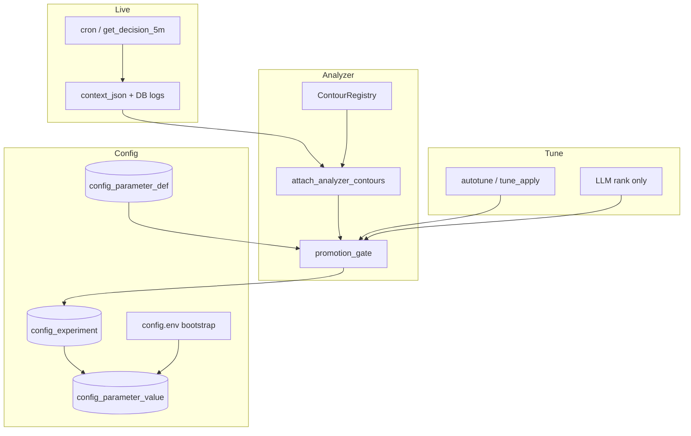

# План оптимизации архитектуры: контуры, promotion gate, config registry

> **Архив (2026-06-09).** Актуально: [ML_AND_DECISION_ARCHITECTURE.md](../ML_AND_DECISION_ARCHITECTURE.md), [ML_CONSOLIDATION_ROLLOUT_PLAN.md](../ML_CONSOLIDATION_ROLLOUT_PLAN.md), [CONSOLIDATION_NEXT_PLAN.md](../CONSOLIDATION_NEXT_PLAN.md).

**Статус:** согласован поэтапный rollout — имплементация **фазами 0–14**, без big bang.  
**Связанные документы:**

- [ANALYZER_CONTOUR_ARCHITECTURE.md](ANALYZER_CONTOUR_ARCHITECTURE.md) — контуры анализатора, роли блоков, реестр
- [CONFIG_REGISTRY_ARCHITECTURE.md](CONFIG_REGISTRY_ARCHITECTURE.md) — гибрид config.env + PostgreSQL
- [ML_CALIBRATION_PHASES.md](ML_CALIBRATION_PHASES.md) — фазы A–E калибровки ML
- [TRADE_EFFECTIVENESS_ANALYZER.md](TRADE_EFFECTIVENESS_ANALYZER.md) — отчёт, autotune, снимки
- [GAME_5M_MULTIDAY_LR_GATES_ROLLOUT_PLAN.md](GAME_5M_MULTIDAY_LR_GATES_ROLLOUT_PLAN.md) — пример контурного rollout (multiday gates)

---

## 1. Проблема

| Симптом | Причина |
|---------|---------|
| Разные имена (`*_review`, `*_arbiter`, `reality_check`) | Нет единой терминологии ролей блоков |
| Новый контур = правки в 3+ местах | Нет `ContourRegistry` и одной точки сборки отчёта |
| LLM и арбитр могут противоречить | Нет `promotion_gate` между вердиктом и apply |
| `config.env` + JSON ledger + autotune | Нет каталога ключей, audit и experiments в БД |
| Сложный per-ticker конфиг | Метаданные только в `config.env.example` |

**Цель:** стройная расширяемая архитектура при **сохранении** `config.env` как bootstrap и **обратной совместимости** JSON отчёта анализатора.

---

## 2. Целевая картина



**Принципы:**

1. Три роли блоков: `model_eval` | `diagnostic` | `policy_gate`.
2. Один контракт JSON (`AnalyzerBlock`) для всех контуров.
3. Реестр контуров — новая фича = запись в registry.
4. Promote только через `promotion_gate` → experiment → dual-write.
5. `config.env` — секреты и инфра; БД — каталог, эксперименты, audit.

---

## 3. Фазы имплементации

### Фаза 0 — Контракты и документация (без поведения в проде)

| Deliverable | Содержание |
|-------------|------------|
| `docs/ANALYZER_CONTOUR_ARCHITECTURE.md` | роли, alias-таблица, реестр |
| `docs/CONFIG_REGISTRY_ARCHITECTURE.md` | L0/L1/L2, dual-write |
| `services/analyzer_contours/schema.py` | `AnalyzerBlock`, `PromotionCandidate` |
| `services/analyzer_contours/__init__.py` | пакет |

**Критерий:** типы импортируются в тестах. **Откат:** удалить файлы.

---

### Фаза 1 — Хелперы ответов + пилотный контур

- `make_analyzer_block(...)` — единый формат ответа.
- Пилот: `build_game5m_gap_forecast_arbiter` через хелпер.
- В payload **дублировать** legacy-ключ `game5m_gap_forecast_arbiter`.
- Опционально: `contours.gap_forecast.policy_gate`.

**Критерий:** потребители старого ключа не ломаются. **Тест:** `tests/test_analyzer_block_schema.py`.

---

### Фаза 2 — ContourRegistry (read-only сборка)

- `services/analyzer_contours/registry.py` — `ContourSpec`, `DEFAULT_REGISTRY`.
- `attach_analyzer_contours(payload, ctx)` — одна точка сборки.
- `_attach_multiday_lr_and_ml_arbiter` → обёртка.
- `payload["contours"]` + **все legacy-ключи на корне**.

| Контур | Legacy keys |
|--------|-------------|
| `multiday_lr` | `multiday_lr_reality_check`, `multiday_lr_gates_arbiter` |
| `gap_forecast` | `game5m_gap_forecast_arbiter` |
| `product_ideas` | `product_ideas_arbiter` |
| `ml_summary` | `ml_production_arbiter` |

**Критерий:** diff отчёта только добавляет `contours`. **Флаг:** `ANALYZER_CONTOURS_ENABLED`.

---

### Фаза 3 — `time_exit_early` diagnostic

- Обернуть `_build_time_exit_early_review` → `contours.time_exit_early.diagnostic`.
- `tuning_candidates[]` из `config_candidates.proposals` (дубли в старые поля).
- `time_exit_early_action_summary` — alias на корне.

**Критерий:** `auto_config_override` строится как сейчас.

---

### Фаза 4 — `time_exit_early` policy_gate

- `build_time_exit_early_policy_gate(diagnostic, multiday_hold, recovery)`.
- Вердикты: `insufficient_data` / `caution` / `ready_for_tune`.
- Зависимости в registry: `multiday_lr.model_eval`, diagnostic.

**Критерий:** не меняет cron; согласован с `n` и `insufficient_data_for_ml`.

---

### Фаза 5 — `build_contours_summary`

- Агрегатор читает `payload.contours`.
- `ml_production_arbiter` = legacy alias.

---

### Фаза 6 — Config registry L1 (каталог в БД, read-only)

| DDL | `db/knowledge_pg/sql/027_config_parameter_def.sql` |
|-----|-----------------------------------------------------|
| Таблица | `config_parameter_def` (key, value_type, scope, phase, contour_id, editable, step_policy, description_ru) |
| Скрипт | `scripts/seed_config_parameter_def.py` из `config.env.example` |

**Критерий:** runtime **не** читает БД; опционально `GET /api/config/registry`.

---

### Фаза 7 — Config change log (append-only)

| DDL | `028_config_change_log.sql` |
|-----|------------------------------|
| Хук | `update_config_key` / `apply_game5m_update` при `CONFIG_CHANGE_LOG_ENABLED=true` |

---

### Фаза 8 — Experiments в БД

| DDL | `029_config_experiment.sql` |
|-----|------------------------------|
| Сервис | `services/config_experiment.py` |
| Интеграция | `game5m_tuning_controller`, web apply proposal |
| Миграция | import из file ledger (если есть) |

**Флаг:** `CONFIG_EXPERIMENT_DB_ENABLED=false` по умолчанию; file ledger — dual-write или fallback 2 недели.

---

### Фаза 9 — `promotion_gate` (report only)

- `services/promotion_gate.py` → `payload["promotion_plan"]`.
- Правила v1: `policy_gate.promotion.eligible` ∧ нет active experiment ∧ editable ∧ не DENY_KEYS ∧ model_eval OK.
- **Не применять** env автоматически.

**Флаг:** `PROMOTION_GATE_ENABLED=true`.

---

### Фаза 10 — UI analyzer

- Секция «Контуры» из `payload.contours`.
- Секция «Promote» из `promotion_plan`.
- Legacy-секции — deprecated, не удалять.

---

### Фаза 11 — Autotune → promotion_plan

- `analyzer_autotune.py` — первый low-risk candidate из plan.
- `analyzer_tune_apply.py` — experiment в БД, затем dual-write env.
- **Флаг:** `ANALYZER_AUTOTUNE_USE_PROMOTION_PLAN=false` до staging OK.

---

### Фаза 12 — `get_config_value` dual-read (узкий whitelist)

- `CONFIG_REGISTRY_DB_READ_ENABLED` + префиксы ключей.
- Порядок: env → `config_parameter_value` → file.
- Promote: VAL + `update_config_key` (dual-write).

**Только после 2+ недель без инцидентов на staging.**

---

### Фаза 13 — LLM: ранжирование promotion_plan

- Вход LLM: `promotion_plan`, summary контуров.
- Запрет: ключи вне plan; не противоречить `remove` / `insufficient_data`.
- TE-пороги только из `diagnostic.tuning_candidates`.

---

### Фаза 14 — Deprecation (после 4–6 недель stable)

- Убрать дубли legacy keys на корне payload (после обновления cron/scripts).
- Убрать file ledger.
- Прямые вызовы `build_*_arbiter` только через registry.

---

## 4. Сводная таблица рисков

| Фаза | Меняет прод? | DDL |
|------|--------------|-----|
| 0–5 | нет* | нет |
| 6–7 | нет** | 027–028 |
| 8 | нет*** | 029 |
| 9–10 | нет | нет |
| 11–12 | да**** | 030 (value) |
| 13–14 | нет / cleanup | — |

\* только новое поле `contours`  
\** только при включённом логе  
\*** только при `CONFIG_EXPERIMENT_DB_ENABLED`  
\**** только явные флаги на sandbox

---

## 5. Feature flags (рекомендуемые)

```env
ANALYZER_CONTOURS_ENABLED=true
ANALYZER_LEGACY_ROOT_KEYS=true

CONFIG_PARAMETER_DEF_ENABLED=true
CONFIG_CHANGE_LOG_ENABLED=false
CONFIG_EXPERIMENT_DB_ENABLED=false
CONFIG_REGISTRY_DB_READ_ENABLED=false
CONFIG_REGISTRY_DB_READ_KEYS=GAME_5M_MULTIDAY_

PROMOTION_GATE_ENABLED=true
ANALYZER_AUTOTUNE_USE_PROMOTION_PLAN=false
```

---

## 6. Порядок PR

1. **0 → 1 → 2** — каркас анализатора (2–3 PR).
2. **6 → 7** — БД каталог + audit (параллельно с 3–5).
3. **3 → 4 → 5** — TE + summary.
4. **9 → 10** — promotion_plan + UI.
5. **8 → 11** — experiments + autotune на staging.
6. **12 → 13** — после стабилизации.
7. **14** — cleanup по метрикам.

**Между фазами:** прогон `/analyzer` на VM + `diff_analyzer_snapshots` + неделя без autotune apply.

---

## 7. Критерии принятия архитектуры

- [ ] Новый контур = 1 запись registry + 1 модуль builder + тест.
- [ ] Promote виден в `promotion_plan` + `config_change_log`.
- [ ] Нет правки tune-ключей в обход experiment.
- [ ] LLM строится после `promotion_plan`.
- [ ] Alias-таблица в `ANALYZER_CONTOUR_ARCHITECTURE.md` актуальна.

---

## 8. Отложено (v2)

- Полный перенос всех ключей в БД без dual-write.
- Автоматический `apply` multiday gates без operator approve.
- Per-ticker gap OLS как отдельный контур.
- Единая таблица `calibration_daily` для всех pred/fact.

---

## 9. Роли: арбитр vs LLM vs оператор

| Слой | Роль |
|------|------|
| `model_eval` | Качество прогноза (OOS) |
| `diagnostic` | Контрфакт, кандидаты тюнинга |
| `policy_gate` | Готовность к promote (`eligible`) |
| `promotion_gate` | Фильтр + очередь кандидатов |
| LLM | Ранжирование plan, пояснение |
| Оператор | approve / reject, apply в config |

Арбитр **не меняет** `config.env`. LLM **не** является authority для live-решений.
