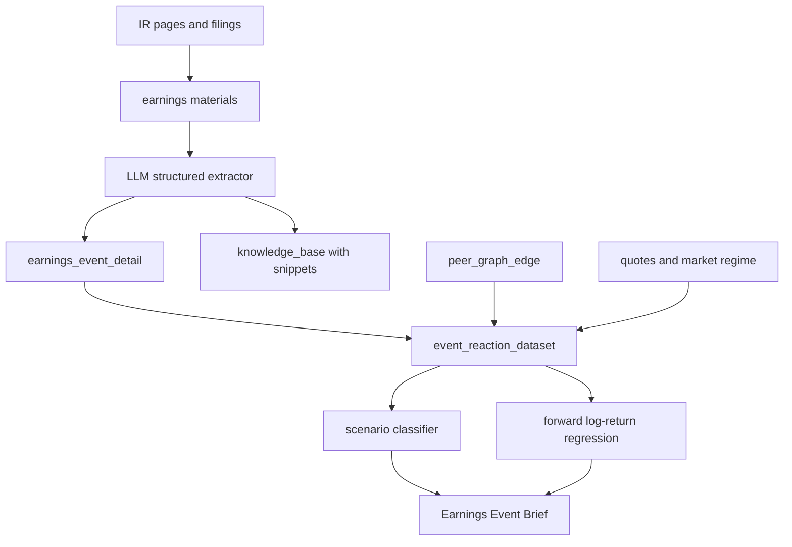

# Earnings Intelligence Plan

## Промежуточные итоги (2026-05-28, вечер)

### Этап 1 — materials → extract → universe (prod)

| Шаг | Статус | Артефакты / prod |
|-----|--------|------------------|
| Universe (21 equity) | ✅ | `services/earnings_intelligence_universe.py` — GAME_5M + portfolio + NVDA/GOOGL/… |
| Materials registry + SEC auto | ✅ | `sync_earnings_material_registry.py`, `services/earnings_material_auto_sources.py` |
| Hybrid ingest | ✅ | HTML + pypdf, cron каждые 2 ч |
| LLM extractor | ✅ | 16+ tickers с `management_tone`, 22 events с `scenario_hints` (prod) |
| Peer graph | ✅ | **96 рёбер** (`peer_graph_catalog.py`, `seed_peer_graph_edges.py`) |
| Cron materials | ✅ | sync :18, ingest :20, extract :25 (каждые 2–6 ч) |

### Этап 2 — Event Brief + UI (prod)

| Шаг | Статус | Артефакты |
|-----|--------|-----------|
| Event Brief + peer spillover | ✅ | `services/earnings_event_brief.py` — forward log-ret peers 1d/5d |
| Web UI | ✅ | `/earnings`, API `/api/earnings/*`, tabs Peer graph / Spillover / Shadow / Fusion / ML |
| **UI guide (RU)** | ✅ | [EARNINGS_UI_GUIDE.md](./EARNINGS_UI_GUIDE.md), web: `/earnings/guide` |
| **План сессии** | 📋 | [EARNINGS_PLAN_2026-05-29.md](./EARNINGS_PLAN_2026-05-29.md) |
| Telegram | ✅ | `/earnings` в `services/telegram_bot.py` |
| Pipeline orchestrator | ✅ | `scripts/run_earnings_intelligence_pipeline.py` |

### Этап 3 — ML grid (deploy 681f8ef, full train in progress)

Два слоя ML **не смешиваются**:

| Слой | Target | Feature builder | Train script | Роль |
|------|--------|-----------------|--------------|------|
| **Регрессия (prod advisory)** | `forward_log_ret_5d` | `quotes_regime_v1` | `train_event_reaction_catboost.py` | Карточки/API, nightly cron 23:51 |
| **Earnings grid (pilot)** | `final_label` (LLM scenario) | `quotes_regime_earnings_v1` | `train_event_reaction_scenario_classifier.py` | Сценарный классификатор, дообучаемая сетка |

**Сравнение с ridge и роль каждого ML-слоя:** [TRADE_ML_DATASETS_AND_TARGETS_RU.md](../TRADE_ML_DATASETS_AND_TARGETS_RU.md) §4–§7.

**Новые скрипты (2026-05-28):**

| Скрипт | Назначение |
|--------|------------|
| `apply_earnings_scenario_labels.py` | LLM `scenario_hints` → `final_label`, `label_source=llm_scenario_v0` |
| `backfill_event_reaction_labeling.py` | При `EVENT_REACTION_FEATURE_BUILDER_VERSION=quotes_regime_earnings_v1` — tone, peer graph, peer momentum |
| `run_earnings_ml_refresh.py` | Оркестратор: labels → earnings_v1 backfill → scenario classifier → readiness JSON |
| `train_event_reaction_scenario_classifier.py` | CatBoostClassifier multi-class (min 8 rows) |
| `services/earnings_intelligence_readiness.py` | Гейты: sources, features, scenario_labels, classifier, regression |

**Prod snapshot (2026-05-28, во время full train):**

| Метрика | Значение |
|---------|----------|
| Universe | 21 equity |
| Events с LLM tone (since 2026-01-01) | ~73% events |
| `scenario_hints` в `earnings_event_detail` | 22 |
| `llm_scenario_v0` labels | **15** (14 applied в full run) |
| `quotes_regime_earnings_v1` features | **~267 ожидается** (dry-run: 267/300 ok, 33 `no_quotes`; full backfill ~20 мин) |
| Peer graph edges | 96 |
| Scenario classifier | train после backfill (≥8 labels ✓) |

**Dry-run `run_earnings_ml_refresh` (prod, exit 0):** backfill проверил 267/300 строк; readiness `overall_grid_ready=false` (ожидаемо без записи в БД).

### Этап 4 — Analyzer readiness (prod)

| Компонент | Статус |
|-----------|--------|
| `last_earnings_intelligence_readiness.json` | Пишется после каждого `run_earnings_ml_refresh` |
| Блок в `/analyzer` | «Earnings intelligence grid» — coverage, гейты, missing materials |
| `ml_train_readiness.jsonl` | Поле `earnings_intelligence` + `overall_earnings_grid_ready` |
| Пороги | `ML_READINESS_EARNINGS_*` в `config.env` |

### Сессия 2026-05-29

| Шаг | Статус | Артефакты |
|-----|--------|-----------|
| P0 UI: Brief + regression по event_date, shadow labels, spillover union | ✅ prod | `fe26776`, `2b0664d` |
| Док: ridge vs event regression vs classifier | ✅ | [TRADE_ML_DATASETS_AND_TARGETS_RU.md](../TRADE_ML_DATASETS_AND_TARGETS_RU.md) §4–§7 |
| P1: ML layers Shadow/Fusion/readiness paths | ✅ | `0525849`, API 8 layers incl. shadow/fusion/readiness |
| P1: materials prod eval (--skip-ml-refresh) | ✅ | shadow n_matured=27→33, grid_ready=true |
| P1: ANET/AVGO/GOOGL/PLTR + train | ✅ | ERD 527, earnings_v1 ~482, deploy `838e9fa` |
| P1: UI actions, scenario column, quotes, event date | ✅ | `6b17e91`, `7f142b0`, `45f04d5` |
| P1: CatBoost FBV mismatch + fusion predict path | ✅ | `ddbd5d3` |
| P1: Brief tab, intros, context bar | ✅ | `15e3c96`…`4a144cf` |
| P1: cron earnings_v1 nightly backfill | ✅ | `23:37` в `lse-docker.crontab` |

План сессии: [EARNINGS_PLAN_2026-05-29.md](./EARNINGS_PLAN_2026-05-29.md) · **30.05:** [EARNINGS_PLAN_2026-05-30.md](./EARNINGS_PLAN_2026-05-30.md).

**Cron (актуально в `crontab/lse-docker.crontab`):**

| Время | Скрипт | Режим |
|-------|--------|-------|
| `:30 */6 * * *` | `run_earnings_ml_refresh.py` | dry-run (default `ML_READINESS_TRAIN_MODE`) |
| `23:36 пн–пт` | `backfill_event_reaction_labeling.py` | `quotes_regime_v1` |
| `23:37 пн–пт` | `backfill_event_reaction_labeling.py` | `quotes_regime_earnings_v1`, `--include-earnings-universe` |
| `23:50 пн–пт` | `run_ml_train_readiness_cron.py` | + `ML_READINESS_SKIP_EARNINGS_INTELLIGENCE=0` |
| `23:52 пн–пт` | `run_earnings_ml_refresh.py` | full train (scenario `.cbm`) |

### Известные gaps (актуально)

- **Deploy:** последние UI-коммиты (`4a144cf`) — проверить prod после `deploy_from_github.sh` (см. план 30.05).
- **ERD skeleton:** ✅ mitigated — `--include-earnings-universe` в build/backfill/cron.
- **Материалы:** Fool 429 / ARM junk — периодический cleanup; DELL path ✅.
- **Backfill:** ~11% строк (`features:no_quotes`) — seed quotes для редких тикеров.
- **Регрессия vs grid:** product CatBoost на `quotes_regime_v1`; classifier на `quotes_regime_earnings_v1`; nightly regime backfill больше не ломает predict (FBV rebuild).
- **Classifier train:** мало rows (~21), holdout `n_valid` может быть 0 — накапливать LLM labels.
- **Trading gate:** scenario classifier — advisory/shadow; hard-block сделок не включён.
- **`run_earnings_intelligence_pipeline.py`** — не в cron (ручной оркестратор sync→extract→brief).

---

## Промежуточные итоги (2026-05-28, утро — pilot META/NVDA)

Этап **materials → ingest → LLM extract → peer graph** выполнен на prod для pilot META/NVDA.

| Шаг | Статус | Артефакты / prod |
|-----|--------|------------------|
| 1. Materials registry | ✅ | `earnings_material`, `services/earnings_material_catalog.py`, `scripts/sync_earnings_material_registry.py` |
| 2. Hybrid ingest | ✅ | HTML + **pypdf** (`services/earnings_material_parser.py`), `scripts/ingest_earnings_materials.py` |
| 3. LLM extractor | ✅ pilot | `services/earnings_material_extractor.py`, `scripts/extract_earnings_material_facts.py` → `earnings_event_detail` |
| 4. Peer graph v0 | ✅ | `services/peer_graph_catalog.py`, `scripts/seed_peer_graph_edges.py` — **27 рёбер** в prod |
| 5. Cron | ✅ | `crontab/lse-docker.crontab`: sync / ingest / extract каждые 2–6 ч |
| 6. Token audit | ✅ | `scripts/audit_earnings_materials_pipeline.py --symbols META,NVDA` — event-level ~**27k tok/событие** |

**Pilot extraction (prod):**

| Ticker | Date | tone | scenario (LLM) | affected |
|--------|------|------|----------------|----------|
| META | 2026-04-29 | bullish | capex_positive_for_infra_peers | 9 |
| NVDA | 2026-05-20 | bullish | gap_up_follow_through | 13 |

**LLM cost (claude-sonnet-4-6, ProxyAPI):** ~25k input + ~2.5k output ≈ **~27k tok/event** (transcript PDF + press/SEC; без дубля Fool). Legacy «1 pass на материал» ≈ 120k tok на META+NVDA.

**Известные gaps:**

- KB calendar может отставать от IR (NVDA 2026-05-20 пришлось добавить вручную) — нужен auto-ensure KB в sync.
- `discover-links` для ARM шумный (много PDF без текста) — фильтр в backlog.
- Старый failed URL META presentation (404) — можно пометить `skipped`.

**Следующий этап (план):**

1. **Дождаться завершения** первого prod full `run_earnings_ml_refresh` → проверить `overall_grid_ready`, classifier `.cbm`, analyzer.
2. **Materials coverage** — догнать DELL/ANET/AVGO/GOOGL/PLTR; фильтр ARM discover-links noise.
3. **Peer outcomes в train** — использовать spillover history как feature или validation set для classifier.
4. **Live shadow** — сравнивать scenario prediction vs фактический 5d log-ret / peer spillover после созревания.
5. **Trading metric gate** — PnL/top-k после transaction costs для решения о fusion с GAME_5M (не RMSE alone).
6. **Event fusion** — склеить earnings grid signal с portfolio/GAME_5M только после shadow-статистики.

---

## Что Уже Есть
- В `[docs/earnings-event-agent-lse/EARNINGS_EVENT_AGENT_IMPLEMENTATION_PLAN.md](/media/cnn/home/cnn/lse/docs/earnings-event-agent-lse/EARNINGS_EVENT_AGENT_IMPLEMENTATION_PLAN.md)` уже зафиксирован MVP: `event_reaction_dataset`, `features_before`, `outcomes_after`, CatBoost-регрессия `forward_log_ret_5d`.
- В `[scripts/sql/ml_event_analytics_schema.sql](/media/cnn/home/cnn/lse/scripts/sql/ml_event_analytics_schema.sql)` уже есть таблицы под расширение: `earnings_event_detail`, `peer_graph_edge`, `market_regime_daily`, `event_reaction_dataset`.
- В `[docs/earnings-event-agent-lse/PUBLIC_IR_EARNINGS_SOURCES.md](/media/cnn/home/cnn/lse/docs/earnings-event-agent-lse/PUBLIC_IR_EARNINGS_SOURCES.md)` уже собраны IR-источники META, ASML, ARM, SNDK, NVDA и других.

## Что Предложить По Задаче Шефа
- Сделать не просто “прогноз логдоходности”, а карточку события: `Earnings Event Brief`.
- Для каждого отчёта хранить материалы: press release, presentation, transcript, follow-up transcript, SEC/IR ссылки.
- LLM использовать как extractor: достать факты, а не принимать торговое решение.
- Основной вывод: сценарий реакции и влияние на peers, например `capex_positive_for_infra_peers`, `beat_selloff_pullback`, `guide_breakdown`, `gap_up_fade`.
- Для META-like кейса явно выделить “source ticker reaction” и “affected tickers reaction”: META падает, но MU/SNDK/AMD/LITE получают позитивный spillover.

## Архитектура

## Минимальный Следующий Инкремент
- `Earnings materials registry`: добавлена таблица `earnings_material` в `scripts/sql/ml_event_analytics_schema.sql` и starter seed `scripts/seed_earnings_material_registry.py` для ссылок/статусов скачивания материалов.
- `LLM extraction schema`: фиксированный JSON: revenue/EPS surprise, guidance up/down/inline, capex, AI demand, margin pressure, inventory, management tone, Q&A concerns, affected tickers.
- `Peer graph v0`: вручную задать связи для AI infra/chips: META/NVDA/ASML/ARM -> MU/SNDK/AMD/LITE/INTC/QCOM и веса/тип связи.
- `Scenario labels v0`: начать с 6 классов из дизайна: `beat_selloff_pullback`, `beat_revaluation_down`, `miss_or_guide_breakdown`, `gap_up_follow_through`, `gap_up_fade`, `cross_earnings_contagion`.
- `Event Brief UI/Bot`: показывать по событию: источник, тезисы call, scenario, affected tickers, expected log-return 1/5/20d, confidence, invalidation.

## Что Не Делать Сразу
- Не пытаться обучать LLM. LLM только читает и структурирует документы.
- Не делать hard-block сделок на первом этапе. Только advisory/shadow.
- Не смешивать ежедневный macro-calendar ridge с earnings-call intelligence: это разные слои, их можно соединить позже в event_fusion.

## Практичный MVP На 1-2 Темы
- Начать с META capex -> infra/chips и NVDA earnings -> AI basket.
- Исторические кейсы: META 29.04.2026, ASML 15.04.2026, ARM 06.05.2026, SNDK 30.04.2026, NVDA 20.05.2026.
- Для каждого кейса вручную/LLM заполнить extracted JSON и проверить, как менялись source ticker и peers на 1d/2d/5d/20d log-returns.

## Порядок Реализации
1. **Материалы:** зафиксировать, где храним ссылки/файлы earnings: press release, presentation, transcript, follow-up transcript, SEC/IR.
   Реализация: `earnings_material` хранит `source_url`, `material_type`, `parse_status`, `local_path`, `content_sha256`, `content_text` и связь с `knowledge_base_id`, если событие уже есть в KB.
2. **Hybrid ingest:** `scripts/ingest_earnings_materials.py` + `services/earnings_material_parser.py` (HTML + pypdf PDF). Audit: `scripts/audit_earnings_materials_pipeline.py`.
3. **Extractor:** `services/earnings_material_extractor.py`, `scripts/extract_earnings_material_facts.py` — JSON в `earnings_event_detail.guidance_summary` / `affected_tickers`.
4. **Peer graph:** `services/peer_graph_catalog.py`, `scripts/seed_peer_graph_edges.py`.
5. **Outcomes:** для source ticker и affected tickers считать log-returns 1d/2d/5d/20d — **следующий шаг** (brief + peer spillover).
6. **Scenario labels:** `scripts/apply_earnings_scenario_labels.py` — LLM `scenario_hints` → `event_reaction_dataset.final_label` (`llm_scenario_v0`). ✅ 15 labels на prod.
7. **Event Brief:** `services/earnings_event_brief.py`, `scripts/build_earnings_event_brief.py` — JSON для UI/бота. ✅ + peer spillover.
8. **Earnings ML grid:** `quotes_regime_earnings_v1` + `run_earnings_ml_refresh.py` + scenario classifier. 🔄 первый full train на prod.
9. **Analyzer readiness:** `services/earnings_intelligence_readiness.py`, блок в `/analyzer`, cron. ✅

## Результат Для Пользователя
- В карточке/боте будет не просто “макро-календарь · фичей: 25”, а отдельный блок:
  - `Earnings intelligence: META capex positive for AI infra peers`
  - `Affected: MU, SNDK, AMD, LITE`
  - `Scenario: cross_earnings_contagion`
  - `Expected peer reaction: 1d/5d log-return`
  - `Evidence: call quote / guidance / capex line`

## Словарь Для Этого Плана

Источник полного словаря: `[docs/earnings-event-agent-lse/EARNINGS_EVENT_AGENT_DESIGN.md](/media/cnn/home/cnn/lse/docs/earnings-event-agent-lse/EARNINGS_EVENT_AGENT_DESIGN.md)`.

| Термин | Что значит у нас |
|---|---|
| `earnings` | Квартальная отчётность listed company: дата/время заранее известны, событие попадает в `knowledge_base` и `event_reaction_dataset`. |
| `earnings call` / `transcript` | Текст звонка CEO/CFO с инвесторами. Для шефа это важнее сухого report, потому что там future view, guidance и ответы на вопросы. |
| `press release` | Официальный релиз с цифрами квартала. Нужен как источник EPS/revenue/guidance facts. |
| `presentation` | Слайды к отчёту; часто дают сегменты, capex, demand drivers и risk language. |
| `follow-up transcript` | Дополнительный звонок/расшифровка после основного call, если есть. |
| `guidance` | Ориентиры менеджмента на будущий квартал/год: revenue, EPS, margin, capex, demand. |
| `capex` | Capital expenditures. В META-like кейсе высокий capex может быть негативом для META, но позитивом для AI infrastructure peers. |
| `affected_tickers` | Тикеры, на которые событие source ticker может повлиять: peers, supply chain, beneficiaries, competitors. |
| `peers` | Аналоги или связанные компании. Например AI infra/chips: MU, SNDK, AMD, LITE, INTC, QCOM. |
| `cross-impact` / `spillover` | Кросс-влияние: отчёт A двигает B. Пример: META падает из-за capex worries, но suppliers/infra растут. |
| `source ticker reaction` | Реакция самой компании, которая отчиталась. Например META после своего call. |
| `affected tickers reaction` | Реакция группы/цепочки поставок на событие source ticker. Например MU/SNDK после META capex. |
| `event_reaction_dataset` | Таблица “событие + признаки до + исходы после”. Это материал для регрессии и классификатора. |
| `features_before` | JSONB с признаками до события: цена, режим рынка, earnings facts, peer graph, позже extracted call facts. |
| `outcomes_after` | JSONB с тем, что случилось после события: log-returns 1d/2d/5d/20d, drawdown, rebound, volume. |
| `final_label` | Итоговая метка сценария реакции. Сейчас есть UP/DOWN/FLAT, нужно перейти к сценариям ниже. |
| `log-return` | Логарифмическая доходность. Все прогнозы/исходы для ML считаем в log-пространстве. |
| `horizon` | Горизонт прогноза/исхода: для event layer обычно 1d/2d/5d/20d, для GAME_5M отдельно 30/60/120m. |
| `LLM extractor` | LLM не “торгует”, а структурирует документы в JSON: guidance, capex, tone, affected tickers, evidence quotes. |
| `Hybrid ingest` | Сначала пробуем локально скачать/распарсить IR/PDF/HTML; если сайт сложный, используем ScrapeGraphAI как fallback. |
| `ProxyAPI` | Наш существующий OpenAI-compatible LLM endpoint (`PROXYAPI_KEY`, `OPENAI_BASE_URL`). Подходит для LLM extractor после того, как текст уже получен. |
| `ScrapeGraphAI` | Отдельный сервис для web extraction. Требует отдельный `SGAI_API_KEY`; не заменяет ProxyAPI, а помогает достать структурированные данные со сложных страниц. |
| `evidence` | Цитата/факт из call/report, объясняющий scenario или affected tickers. |
| `RAG` | Поиск похожих исторических событий по embeddings и фильтрам: сектор, scenario, market regime. |
| `event_fusion` | Будущий слой, который склеит event intelligence с GAME_5M/portfolio сигналами перед policy. |
| `transaction costs` | Комиссии/проскальзывание. Нужны в анализаторе для trading-facing readiness. |

## Классы Сценариев v0

| Класс | Смысл |
|---|---|
| `beat_selloff_pullback` | Компания бьёт ожидания, но акция падает как откат/фиксация, без явного развала тезиса. |
| `beat_revaluation_down` | Цифры хорошие, но рынок снижает мультипликатор: capex, margin, risk, overinvestment. |
| `miss_or_guide_breakdown` | Недобор или плохой guidance, реальное ухудшение инвестиционного тезиса. |
| `gap_up_follow_through` | Позитивный гэп и продолжение роста после отчёта. |
| `gap_up_fade` | Позитивный гэп не удержался, рынок “продал новость”. |
| `cross_earnings_contagion` | Отчёт одного эмитента двигает связанных тикеров/группу. META capex -> AI infra peers — базовый пример. |

## Проверка Готовности
- Метрики качества сценариев и регрессий держать в анализаторе.
- На карточке показывать только прогноз и объяснимые факты.
- Readiness: покрытие материалов, заполненность extracted JSON, зрелые outcomes, качество scenario classifier, PnL/expectancy после transaction costs для trading-facing решений.
