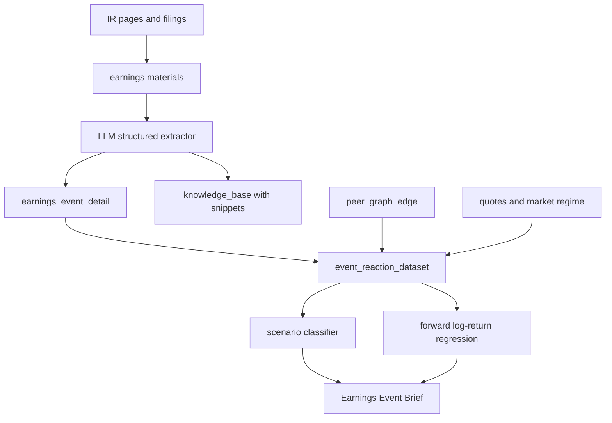

# Earnings Intelligence Plan

## Что Уже Есть
- В `[docs/earnings-event-agent-lse/EARNINGS_EVENT_AGENT_IMPLEMENTATION_PLAN.md](/media/cnn/home/cnn/lse/docs/earnings-event-agent-lse/EARNINGS_EVENT_AGENT_IMPLEMENTATION_PLAN.md)` уже зафиксирован MVP: `event_reaction_dataset`, `features_before`, `outcomes_after`, CatBoost-регрессия `forward_log_ret_5d`.
- В `[scripts/sql/ml_event_analytics_schema.sql](/media/cnn/home/cnn/lse/scripts/sql/ml_event_analytics_schema.sql)` уже есть таблицы под расширение: `earnings_event_detail`, `peer_graph_edge`, `market_regime_daily`, `event_reaction_dataset`.
- В `[docs/earnings-event-agent-lse/PUBLIC_IR_EARNINGS_SOURCES.md](/media/cnn/home/cnn/lse/docs/earnings-event-agent-lse/PUBLIC_IR_EARNINGS_SOURCES.md)` уже собраны IR-источники META, ASML, ARM, SNDK, NVDA и других.

## Что Предложить По Задаче Шефа
- Сделать не просто “прогноз логдоходности”, а карточку события: `Earnings Event Brief`.
- Для каждого отчёта хранить материалы: press release, presentation, transcript, follow-up transcript, SEC/IR ссылки.
- LLM использовать как extractor: достать факты, а не принимать торговое решение.
- Основной вывод: сценарий реакции и влияние на peers, например `capex_positive_for_infra_peers`, `beat_selloff_pullback`, `guide_breakdown`, `gap_up_fade`.
- Для META-like кейса явно выделить “source ticker reaction” и “affected tickers reaction”: META падает, но MU/SNDK/AMD/LITE получают позитивный spillover.

## Архитектура

## Минимальный Следующий Инкремент
- `Earnings materials registry`: добавлена таблица `earnings_material` в `scripts/sql/ml_event_analytics_schema.sql` и starter seed `scripts/seed_earnings_material_registry.py` для ссылок/статусов скачивания материалов.
- `LLM extraction schema`: фиксированный JSON: revenue/EPS surprise, guidance up/down/inline, capex, AI demand, margin pressure, inventory, management tone, Q&A concerns, affected tickers.
- `Peer graph v0`: вручную задать связи для AI infra/chips: META/NVDA/ASML/ARM -> MU/SNDK/AMD/LITE/INTC/QCOM и веса/тип связи.
- `Scenario labels v0`: начать с 6 классов из дизайна: `beat_selloff_pullback`, `beat_revaluation_down`, `miss_or_guide_breakdown`, `gap_up_follow_through`, `gap_up_fade`, `cross_earnings_contagion`.
- `Event Brief UI/Bot`: показывать по событию: источник, тезисы call, scenario, affected tickers, expected log-return 1/5/20d, confidence, invalidation.

## Что Не Делать Сразу
- Не пытаться обучать LLM. LLM только читает и структурирует документы.
- Не делать hard-block сделок на первом этапе. Только advisory/shadow.
- Не смешивать ежедневный macro-calendar ridge с earnings-call intelligence: это разные слои, их можно соединить позже в event_fusion.

## Практичный MVP На 1-2 Темы
- Начать с META capex -> infra/chips и NVDA earnings -> AI basket.
- Исторические кейсы: META 29.04.2026, ASML 15.04.2026, ARM 06.05.2026, SNDK 30.04.2026, NVDA 20.05.2026.
- Для каждого кейса вручную/LLM заполнить extracted JSON и проверить, как менялись source ticker и peers на 1d/2d/5d/20d log-returns.

## Порядок Реализации
1. **Материалы:** зафиксировать, где храним ссылки/файлы earnings: press release, presentation, transcript, follow-up transcript, SEC/IR.
   Реализация: `earnings_material` хранит `source_url`, `material_type`, `parse_status`, `local_path`, `content_sha256`, `content_text` и связь с `knowledge_base_id`, если событие уже есть в KB.
2. **Hybrid ingest:** сначала локальный downloader/parser (`scripts/ingest_earnings_materials.py`, HTML v0) + наш LLM через ProxyAPI; ScrapeGraphAI использовать как fallback для сложных IR-страниц/JS при наличии отдельного `SGAI_API_KEY`.
3. **Extractor:** сделать фиксированный JSON, который LLM заполняет из материалов: факты отчёта, guidance, capex, tone, Q&A concerns, affected tickers.
4. **Peer graph:** руками задать первые связи для AI infra/chips, чтобы кейс META -> MU/SNDK/AMD/LITE был машинно читаемым.
5. **Outcomes:** для source ticker и affected tickers считать log-returns 1d/2d/5d/20d, drawdown/rebound и сохранять как исходы события.
6. **Scenario labels:** разметить 5-10 кейсов сценариями из словаря ниже, сначала вручную/LLM-assisted.
7. **Event Brief:** вывести в карточку/бот только прогноз и факты: scenario, affected tickers, expected log-return, evidence, invalidation.
8. **Analyzer readiness:** качество сценариев, покрытие материалов, OOS/PnL после transaction costs держать в анализаторе, не в карточке.

## Результат Для Пользователя
- В карточке/боте будет не просто “макро-календарь · фичей: 25”, а отдельный блок:
  - `Earnings intelligence: META capex positive for AI infra peers`
  - `Affected: MU, SNDK, AMD, LITE`
  - `Scenario: cross_earnings_contagion`
  - `Expected peer reaction: 1d/5d log-return`
  - `Evidence: call quote / guidance / capex line`

## Словарь Для Этого Плана

Источник полного словаря: `[docs/earnings-event-agent-lse/EARNINGS_EVENT_AGENT_DESIGN.md](/media/cnn/home/cnn/lse/docs/earnings-event-agent-lse/EARNINGS_EVENT_AGENT_DESIGN.md)`.

| Термин | Что значит у нас |
|---|---|
| `earnings` | Квартальная отчётность listed company: дата/время заранее известны, событие попадает в `knowledge_base` и `event_reaction_dataset`. |
| `earnings call` / `transcript` | Текст звонка CEO/CFO с инвесторами. Для шефа это важнее сухого report, потому что там future view, guidance и ответы на вопросы. |
| `press release` | Официальный релиз с цифрами квартала. Нужен как источник EPS/revenue/guidance facts. |
| `presentation` | Слайды к отчёту; часто дают сегменты, capex, demand drivers и risk language. |
| `follow-up transcript` | Дополнительный звонок/расшифровка после основного call, если есть. |
| `guidance` | Ориентиры менеджмента на будущий квартал/год: revenue, EPS, margin, capex, demand. |
| `capex` | Capital expenditures. В META-like кейсе высокий capex может быть негативом для META, но позитивом для AI infrastructure peers. |
| `affected_tickers` | Тикеры, на которые событие source ticker может повлиять: peers, supply chain, beneficiaries, competitors. |
| `peers` | Аналоги или связанные компании. Например AI infra/chips: MU, SNDK, AMD, LITE, INTC, QCOM. |
| `cross-impact` / `spillover` | Кросс-влияние: отчёт A двигает B. Пример: META падает из-за capex worries, но suppliers/infra растут. |
| `source ticker reaction` | Реакция самой компании, которая отчиталась. Например META после своего call. |
| `affected tickers reaction` | Реакция группы/цепочки поставок на событие source ticker. Например MU/SNDK после META capex. |
| `event_reaction_dataset` | Таблица “событие + признаки до + исходы после”. Это материал для регрессии и классификатора. |
| `features_before` | JSONB с признаками до события: цена, режим рынка, earnings facts, peer graph, позже extracted call facts. |
| `outcomes_after` | JSONB с тем, что случилось после события: log-returns 1d/2d/5d/20d, drawdown, rebound, volume. |
| `final_label` | Итоговая метка сценария реакции. Сейчас есть UP/DOWN/FLAT, нужно перейти к сценариям ниже. |
| `log-return` | Логарифмическая доходность. Все прогнозы/исходы для ML считаем в log-пространстве. |
| `horizon` | Горизонт прогноза/исхода: для event layer обычно 1d/2d/5d/20d, для GAME_5M отдельно 30/60/120m. |
| `LLM extractor` | LLM не “торгует”, а структурирует документы в JSON: guidance, capex, tone, affected tickers, evidence quotes. |
| `Hybrid ingest` | Сначала пробуем локально скачать/распарсить IR/PDF/HTML; если сайт сложный, используем ScrapeGraphAI как fallback. |
| `ProxyAPI` | Наш существующий OpenAI-compatible LLM endpoint (`PROXYAPI_KEY`, `OPENAI_BASE_URL`). Подходит для LLM extractor после того, как текст уже получен. |
| `ScrapeGraphAI` | Отдельный сервис для web extraction. Требует отдельный `SGAI_API_KEY`; не заменяет ProxyAPI, а помогает достать структурированные данные со сложных страниц. |
| `evidence` | Цитата/факт из call/report, объясняющий scenario или affected tickers. |
| `RAG` | Поиск похожих исторических событий по embeddings и фильтрам: сектор, scenario, market regime. |
| `event_fusion` | Будущий слой, который склеит event intelligence с GAME_5M/portfolio сигналами перед policy. |
| `transaction costs` | Комиссии/проскальзывание. Нужны в анализаторе для trading-facing readiness. |

## Классы Сценариев v0

| Класс | Смысл |
|---|---|
| `beat_selloff_pullback` | Компания бьёт ожидания, но акция падает как откат/фиксация, без явного развала тезиса. |
| `beat_revaluation_down` | Цифры хорошие, но рынок снижает мультипликатор: capex, margin, risk, overinvestment. |
| `miss_or_guide_breakdown` | Недобор или плохой guidance, реальное ухудшение инвестиционного тезиса. |
| `gap_up_follow_through` | Позитивный гэп и продолжение роста после отчёта. |
| `gap_up_fade` | Позитивный гэп не удержался, рынок “продал новость”. |
| `cross_earnings_contagion` | Отчёт одного эмитента двигает связанных тикеров/группу. META capex -> AI infra peers — базовый пример. |

## Проверка Готовности
- Метрики качества сценариев и регрессий держать в анализаторе.
- На карточке показывать только прогноз и объяснимые факты.
- Readiness: покрытие материалов, заполненность extracted JSON, зрелые outcomes, качество scenario classifier, PnL/expectancy после transaction costs для trading-facing решений.
