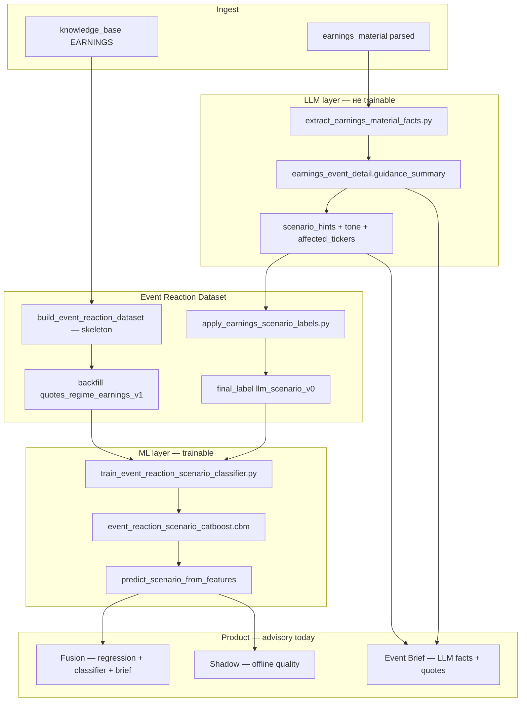

# Earnings Intelligence: LLM-метки, ML-метки, обучение и путь в prod

**Аудитория:** разработка, аналитика, руководство.  
**Связанные документы:** [EARNINGS_INTELLIGENCE_PLAN.md](./EARNINGS_INTELLIGENCE_PLAN.md), [TRADE_ML_DATASETS_AND_TARGETS_RU.md](../TRADE_ML_DATASETS_AND_TARGETS_RU.md) §5–§7, [EARNINGS_UI_GUIDE.md](./EARNINGS_UI_GUIDE.md), [EVENT_REACTION_PIPELINE.md](../EVENT_REACTION_PIPELINE.md).  
**Решение source vs peer по классам:** §8 этого документа.

---

## 1. Зачем два типа «меток»

В earnings-контуре одновременно живут **три разных сущности**, которые часто называют «метками», но они не взаимозаменяемы:

| Сущность | Где хранится | Кто создаёт | Роль |
|----------|--------------|-------------|------|
| **LLM `scenario_hints`** | `earnings_event_detail.guidance_summary` (JSON) | LLM-extractor из transcript/8-K | Факты для Brief, **источник разметки** для ML |
| **LLM scenario label (y)** | `event_reaction_dataset.final_label`, `label_source=llm_scenario_v0` | Скрипт `apply_earnings_scenario_labels.py` | **Target обучения** классификатора |
| **ML prediction** | Не в БД как label; runtime: Fusion / Shadow / API | CatBoostClassifier `.cbm` | **Прогноз** сценария на новом событии |
| **Rule label UP/DOWN/FLAT** | `final_label`, `label_source=auto_quotes_v1` | `backfill_event_reaction_labeling.py` по котировкам | Baseline для **регрессии**, не для scenario train |

**Ключевая идея:** LLM **не обучается** end-to-end. LLM — **экстрактор и разметчик** из текстов earnings. CatBoost учится **повторять** именованные сценарии LLM по **числовым** признакам (котировки, режим рынка, tone, peer graph), без текста transcript в X.

---

## 2. Связь LLM и ML (схема)



**Поток данных одной фразой:** materials → LLM JSON → top `scenario_hint` → `final_label` в ERD → CatBoost учится `(features_before, symbol) → scenario` → на новом отчёте модель выдаёт `predicted_scenario` без повторного LLM (если features есть).

---

## 3. LLM: что извлекается и как выбирается сценарий

### 3.1 Extractor

Скрипт: `scripts/extract_earnings_material_facts.py` (оркестрация через materials pipeline / prod eval).

LLM возвращает структурированный JSON; поле `scenario_hints` — список до **3** объектов:

```json
{
  "scenario": "gap_up_follow_through",
  "confidence": "high",
  "rationale": "..."
}
```

Допустимые значения `scenario` (v0, зашиты в промпт `services/earnings_material_extractor.py`):

| ID сценария | Смысл | Source / peer (кратко) |
|-------------|--------|------------------------|
| `beat_selloff_pullback` | Beat по цифрам, акция падает (фиксация) | Source: краткосрочно −; peers не в приоритете |
| `beat_revaluation_down` | Цифры ок, но рынок снижает мультипликатор (capex, margin, risk) | Source: bearish; peers сектора — осторожно |
| `miss_or_guide_breakdown` | Miss / плохой guidance — ломается тезис | Source: избегать long; peers: contagion − |
| `gap_up_follow_through` | Позитивный гэп и продолжение роста | Source: bullish; peers: умеренный + spillover |
| `gap_up_fade` | Гэп вверх не удержался | Source: слабый −; peers слабее source |
| `cross_earnings_contagion` | Отчёт двигает связанный кластер | Source: знак 0; **все peers** из graph |
| `capex_positive_for_infra_peers` | Сильный capex/AI infra у source | Source: часто −; **infra peers**: MU, SNDK… + |

Подробные шаги и примеры META / NVDA — **§8**.

Параллельно LLM даёт `management_tone`, `affected_tickers`, `evidence_quotes` — это **продуктовый слой Brief**, не признаки CatBoost product-регрессии.

### 3.2 Перенос hints → label в ERD

Скрипт: `scripts/apply_earnings_scenario_labels.py`.

| Правило | Деталь |
|---------|--------|
| Источник | `earnings_event_detail` JOIN `event_reaction_dataset` по `knowledge_base_id` |
| Выбор hint | Сортировка по confidence: `high` < `medium` < `low` (берётся лучший) |
| Запись | `final_label = scenario`, `label_source = llm_scenario_v0` |
| Не трогаем | `label_source = manual` (без `--force`) |
| Universe | По умолчанию `--universe` = earnings intelligence (~21 equity) |

**Важно:** одна строка ERD = одно earnings-событие одного тикера. LLM-метка описывает **историю этого события**, а не «тикер вообще».

---

## 4. Rule-метки UP/DOWN/FLAT (не scenario ML)

Скрипт: `scripts/backfill_event_reaction_labeling.py` (режим без `--only-features`).

По **фактическим** forward log-return после отчёта автоматически ставится `UP` / `DOWN` / `FLAT`, `label_source=auto_quotes_v1`.

| Использование | Scenario classifier | Event regression (5d) |
|---------------|--------------------|-------------------------|
| UP/DOWN/FLAT | **Исключаются** из train (`RULE_LABELS` в train script) | Могут использоваться как альтернативный target |
| `llm_scenario_v0` | **Единственный** target train | Не target регрессии |

Классификатор и регрессия — **разные задачи**: «какая история» vs «сколько log-ret за 5d».

---

## 5. Признаки ML (X) — что видит CatBoost

**Feature builder:** `quotes_regime_earnings_v1` (`services/event_reaction_labeling.py`).

| Группа | Примеры полей в `features_before` |
|--------|-------------------------------------|
| Quotes до события | log-ret окна, RSI, drawdown, … |
| Market regime | `mkt_*` из `market_regime_daily` |
| Earnings context | tone, timing flags из LLM **как скаляры** (не текст) |
| Peer graph | `peer_graph_out_degree`, `peer_graph_weight_sum` — рёбра из [PEER_GRAPH_PRINCIPLES.md](./PEER_GRAPH_PRINCIPLES.md) / `peer_graph_catalog.py` |
| Peer momentum | агрегаты по топ-N соседям из `peer_graph_edge` |
| Категориальный | `symbol` |

**Текст transcript / цитаты в X классификатора не входят.** LLM влияет на обучение **косвенно** — через метку y и через уже агрегированные scalar-поля tone/timing.

Backfill: `backfill_event_reaction_labeling.py` с `EVENT_REACTION_FEATURE_BUILDER_VERSION=quotes_regime_earnings_v1`.

Cron prod (пн–пт):

| Время | Действие |
|-------|----------|
| 23:33 | skeleton ERD (`--include-earnings-universe`) |
| 23:36 | backfill `quotes_regime_v1` (все символы) |
| 23:37 | backfill `quotes_regime_earnings_v1` (earnings universe) |
| 23:52 | `run_earnings_ml_refresh.py` full train (если `ML_READINESS_TRAIN_MODE=full`) |

---

## 6. Обучение scenario classifier (пошагово)

Оркестратор: `scripts/run_earnings_ml_refresh.py`  
Train: `scripts/train_event_reaction_scenario_classifier.py`

### 6.1 Выборка для train

SQL-условия (упрощённо):

```sql
FROM event_reaction_dataset
WHERE dataset_version = 'v0_expanded_baseline'
  AND label_source = 'llm_scenario_v0'
  AND final_label NOT IN ('UP','DOWN','FLAT')
  AND features_before->>'feature_builder_version' = 'quotes_regime_earnings_v1'
  AND features_before заполнены конечными числами
```

Минимум строк: **8** (`--min-rows`, gate `ML_READINESS_EARNINGS_MIN_SCENARIO_LABELS`).

### 6.2 Holdout

- По умолчанию **25%** последних по времени событий — valid.
- Если в valid есть **классы, которых нет в train** — holdout **отключается**, train на всей выборке, `valid_accuracy = null` (типично при ~21 train row и 4+ классах).

### 6.3 Модель и артефакты

| Параметр | Значение |
|----------|----------|
| Алгоритм | CatBoostClassifier, MultiClass |
| Версия | `event_reaction_scenario_v0` |
| Prod path | `/app/logs/ml/models/event_reaction_scenario_catboost.cbm` |
| Метрики | `last_event_reaction_scenario_train_metrics.json` |

Inference: `services/earnings_scenario_signal.py` → `predict_scenario_from_features()`.

### 6.4 Что модель предсказывает

На вход: `symbol` + numeric features **до** даты отчёта.  
На выход:

- `predicted_scenario` — строка-ID сценария;
- `predicted_scenario_proba` — вероятность выбранного класса;
- `predicted_scenario_sign` — эвристика знака 5d **source** (для Shadow/Fusion, не факт).

Карта знаков source — см. **§8** (талицы `SCENARIO_SOURCE_SIGN` / `SCENARIO_PEER_SIGN` и примеры META / NVDA). Краткая матрица датасетов — [TRADE_ML_DATASETS_AND_TARGETS_RU.md](../TRADE_ML_DATASETS_AND_TARGETS_RU.md) §5.

---

## 7. Параллельный контур: регрессия 5d (не путать с classifier)

| | Scenario classifier | Event regression |
|--|---------------------|------------------|
| Target | `final_label` (LLM scenario) | `outcomes_after.forward_log_ret_5d` |
| Features | `quotes_regime_earnings_v1` | `quotes_regime_v1` или `quotes_regime_earnings_v1` (зависит от артефакта `.cbm`) |
| Train script | `train_event_reaction_scenario_classifier.py` | `train_event_reaction_catboost.py` |
| Prod UI | Fusion scenario block, Shadow | Brief CatBoost 5d, Fusion regression block |

Регрессия отвечает «**сколько**», классификатор — «**какая история**». META −10% при MU +28% — кейс, где **сценарий + spillover** информативнее одной цифры регрессии по source.

---

## 8. Как класс сценария используется в решении: source vs peer

Этот раздел — **практическая инструкция для оператора**. Сегодня всё ниже — **advisory only** (`execution_blocked: true` в Fusion); ордера не выставляются.

### 8.1 Главное правило

| Что | Кому относится | Кто выдаёт |
|-----|----------------|------------|
| `predicted_scenario` + proba | **Source-тикер** (кто отчитался: META, NVDA, …) | Scenario classifier (`earnings_scenario_signal.py`) |
| `predicted_scenario_sign` | Ожидаемый знак 5d **source** | Эвристика `SCENARIO_SOURCE_SIGN` |
| `peer_spillover_ml[].peer_forward_log_ret_5d_pred` | **Конкретный peer** (MU, SNDK, …) | Отдельная регрессия `peer_spillover_signal.py` |
| Peer «куда смотреть» по сценарию | Список peers + приоритет | `SCENARIO_PEER_SIGN` + `peer_graph_edge` + LLM `affected_tickers` |

**Классификатор не предсказывает peer.** Он говорит: «на отчёте META разворачивается история X». Дальше по X решаем, усиливать ли позицию по META и **каких** пиров открыть в Spillover tab.

```text
Earnings у SOURCE
    │
    ├─ Regression 5d (source)     → число: pred log-ret META за 5d
    ├─ Scenario classifier        → класс + proba (только source event)
    ├─ LLM Brief                  → tone, affected_tickers, цитаты
    │
    ├─ Ветка SOURCE (торговать ли сам отчитавшийся тикер?)
    │     regression_bias + scenario_bias + alignment → conviction
    │
    └─ Ветка PEER (есть ли идея на зависимом имени?)
          peer_sign из сценария → приоритет списка
          peer_spillover_outcomes → факты 1d/5d после этого отчёта
          peer_spillover_ml → pred 5d для пары (source_event, peer)
```

Код Fusion: `services/earnings_intelligence_fusion.py` → `build_earnings_fusion_advisory()`.

### 8.2 Таблицы знаков (код)

**Source** — `SCENARIO_SOURCE_SIGN` (`services/earnings_scenario_signal.py`):

| Класс | Sign | `scenario_bias` в Fusion |
|-------|------|--------------------------|
| `gap_up_follow_through` | **+1.0** | `scenario_bullish` |
| `beat_selloff_pullback` | −0.5 | `scenario_bearish` |
| `beat_revaluation_down` | **−1.0** | `scenario_bearish` |
| `miss_or_guide_breakdown` | **−1.0** | `scenario_bearish` |
| `gap_up_fade` | −0.3 | `scenario_bearish` |
| `cross_earnings_contagion` | **0.0** | `scenario_mixed` — знак не у source |
| `capex_positive_for_infra_peers` | **−0.5** | `scenario_bearish` по source; peers отдельно |

**Peers** — `SCENARIO_PEER_SIGN` (`services/earnings_scenario_shadow.py`):

| Класс | Peer sign | Когда смотреть peers |
|-------|-----------|----------------------|
| `capex_positive_for_infra_peers` | **+1.0** | Infra supply: memory, storage, networking |
| `cross_earnings_contagion` | +0.5 | Весь кластер из graph + `affected_tickers` |
| `gap_up_follow_through` | +0.3 | Умеренный позитив spillover |
| `miss_or_guide_breakdown` | −0.3 | Осторожность по связанным именам |
| Остальные | *(нет в карте)* | Только `peer_spillover_ml` / факты, без peer-sign |

Порог Fusion для regression: `±0.004` log (≈ ±0.4%) → `bullish_5d` / `bearish_5d` / `neutral_5d`.

### 8.3 По каждому классу: что делать с source и с peer

| Класс | Решение по **source** | Решение по **peer** |
|-------|----------------------|---------------------|
| `gap_up_follow_through` | Regression и scenario обычно **согласны bullish** → можно рассматривать long source при `conviction ≥ medium` | Spillover tab: peers с `peer_spillover_ml` pred > 0; peer_sign +0.3 |
| `gap_up_fade` | Осторожность long source; слабый bearish sign (−0.3) | Peers часто слабее source — не экстраполировать силу source на пиров |
| `beat_selloff_pullback` | Не путать с полным развалом: краткосрочный откат после beat | Peers не в приоритете; смотреть только если в `affected_tickers` |
| `beat_revaluation_down` | Bearish source (−1.0); не усиливать long даже при слабо + regression | Сектор под вопросом — peer_spillover для supply-chain, но без автоматического long |
| `miss_or_guide_breakdown` | **Избегать** long source; сильный bearish | peer_sign −0.3: проверить слабых peers на contagion |
| `cross_earnings_contagion` | source_sign = 0 — **не** торговать source только по сценарию | Открыть **всех** peers из graph + LLM `affected_tickers`; сравнить pred по каждому |
| `capex_positive_for_infra_peers` | Source часто под давлением (−0.5) — **не** long META «потому что AI» | **Главный peer-кейс:** MU, SNDK, LITE, AMD… peer_sign +1.0 + `peer_spillover_ml` |

### 8.4 Пример 1 — META capex (`capex_positive_for_infra_peers`)

**Контекст:** hyperscaler поднимает capex → рынок давит на мультипликатор source, но читает рост spend как спрос на infra-поставщиков. Типичный паттерн: META −5…−10% при MU +15…+30% за 5d.

**Входы (ориентир prod smoke, 2026-04-29):**

| Слой | Значение |
|------|----------|
| Regression source | `forward_log_ret_5d_pred` ≈ **+0.19%** → `bullish_5d` (слабо) |
| Scenario ML | `capex_positive_for_infra_peers`, proba **~94%** |
| Source sign | **−0.5** → `scenario_bearish` |
| LLM Brief | `affected_tickers`: MU, SNDK, …; headline: *watch peer spillover* |
| Peer graph | META→MU (0.85), META→SNDK (0.75), META→LITE (0.65) |

**Шаги оператора:**

1. **SOURCE (META):** regression говорит «чуть вверх», scenario — «source под давлением capex». Fusion: `alignment = conflict`, `conviction = low`.  
   → **Не** усиливать long META только из-за слабого + regression.

2. **PEER (MU, SNDK):** сценарий явно перенаправляет внимание: `SCENARIO_PEER_SIGN = +1.0`.  
   → Вкладка **Spillover** / блок Brief `peer_spillover_ml`: для каждого peer смотреть `peer_forward_log_ret_5d_pred` и факты 1d/5d после **этого** отчёта.

3. **Сверка:** если MU pred +3% log, SNDK +2%, а META regression +0.19% — картина **согласована с классом**: идея на **пирах**, не на source.

4. **Итог advisory (не ордер):** watchlist MU/SNDK; META — hold/не добавлять до прояснения re-rating.

```bash
# Fusion JSON для разбора
curl -s 'https://<host>/api/earnings/fusion/META?event_date=2026-04-29' | jq '{
  regression: .regression_ml.forward_log_ret_5d_pred,
  scenario: .scenario_ml.predicted_scenario,
  proba: .scenario_ml.predicted_scenario_proba,
  source_sign: .scenario_ml.predicted_scenario_sign,
  advisory: .advisory,
  peers: [.peer_spillover_ml[] | select(.peer_spillover_ml_status=="ok") | {peer:.peer_ticker, pred:.peer_forward_log_ret_5d_pred}]
}'
```

### 8.5 Пример 2 — NVDA `gap_up_follow_through` (source = peer-лидер)

**Контекст:** сильный отчёт GPU-лидера, гэп вверх держится — bullish и по source, и с умеренным spillover на memory/optics.

| Слой | Типичное значение |
|------|-------------------|
| Regression source | pred **> +0.8%** log → `bullish_5d` |
| Scenario ML | `gap_up_follow_through`, proba высокая |
| Source sign | **+1.0** → `scenario_bullish` |
| Fusion | `alignment = aligned_or_weak`, при сильном pred → `conviction = medium` |
| Peers | NVDA→MU, NVDA→ASML…; peer_sign **+0.3** |

**Шаги:**

1. **SOURCE (NVDA):** regression и scenario **согласны** → основной фокус на long/hold source (всё ещё advisory, не авто-ордер).

2. **PEER (MU, ASML):** peer_sign слабее (+0.3), не дублировать размер NVDA на пирах. Смотреть `peer_spillover_ml`: если MU pred тоже +, можно добавить в watchlist с **меньшим** весом, чем source.

3. **Итог:** сценарий **не противоречит** регрессии — класс подтверждает «торгуем лидера», peers — опциональное усиление.

### 8.6 Пример 3 — `miss_or_guide_breakdown` (source bearish, peers осторожно)

**Контекст:** miss EPS или слабый guidance ломает тезис.

| Ветка | Действие |
|-------|----------|
| Source | source_sign **−1.0**; при любом конфликте с regression — `conviction = low`; **не** открывать новый long |
| Peers | peer_sign **−0.3**; проверить supply-chain peers на отрицательный spillover в `peer_spillover_outcomes` |
| Итог | Приоритет — **защита / выход** по source; peers только для risk-check, не для агрессивного long |

### 8.7 Что именно читать в Fusion / Brief

| Поле JSON | Для какого тикера | Как использовать |
|-----------|-------------------|------------------|
| `regression_ml.forward_log_ret_5d_pred` | Source | Числовой bias 5d |
| `scenario_ml.predicted_scenario` | Source event | Класс истории |
| `scenario_ml.predicted_scenario_sign` | Source | Знак для `scenario_bias` |
| `scenario_ml.scenario_class_probs` | Source | Уверенность / альтернативные классы |
| `advisory.alignment` | Source decision | `conflict` → не доверять одному слою |
| `advisory.conviction` | Source decision | `medium` только при согласии + сильный regression |
| `brief_headline.llm_scenario` | Source (LLM) | Сверка ML vs LLM hint |
| `peer_spillover[]` | Каждый peer | Факт 1d/5d **после этого отчёта** |
| `peer_spillover_ml[]` | Каждый peer | Pred 5d для пары (source_event, peer) |

Список peers в Brief собирается так: сначала `peer_graph_edge` по весу, затем LLM `affected_tickers` (`_peer_tickers_for_brief` в `earnings_event_brief.py`), до 12 имён.

### 8.8 Частые ошибки интерпретации

| Ошибка | Правильно |
|--------|-----------|
| «ML scenario = MU bullish» | Класс всегда про **source**; MU смотрим в `peer_spillover_ml` |
| «Regression +0.2% → long META при capex class» | При `capex_positive_for_infra_peers` source_sign отрицательный → `conflict`, низкая conviction |
| «Один класс на тикер навсегда» | Класс привязан к **событию**; следующий квартал может быть другой |
| «Высокая proba = можно торговать» | При ~23 LLM labels редкие классы ненадёжны; см. §12 чеклист |
| «Shadow sign accuracy = разрешение на сделку» | Shadow — offline quality; Fusion всё равно `execution_blocked` до фазы D (§11) |

UI-примеры тех же экранов: [EARNINGS_UI_GUIDE.md](./EARNINGS_UI_GUIDE.md) §1 (Brief META), §4 (Spillover), §5 (Fusion).

---

## 9. Readiness gates (когда ML «готов» технически)

Snapshot: `/app/logs/ml/ml_data_quality/last_earnings_intelligence_readiness.json`  
Код: `services/earnings_intelligence_readiness.py`

### 9.1 Гейты сетки (`overall_grid_ready`)

| Gate | Порог (config.env) | Смысл |
|------|-------------------|--------|
| `sources` | materials coverage, LLM rate, peer graph rows | Данные для extract + graph |
| `features` | `earnings_v1_feature_rows ≥ 8` | `ML_READINESS_EARNINGS_MIN_FEATURE_ROWS` |
| `scenario_labels` | `llm_scenario_labels ≥ 8` | `ML_READINESS_EARNINGS_MIN_SCENARIO_LABELS` |
| `scenario_classifier` | train status ok, `n_train ≥ 6` | `ML_READINESS_EARNINGS_SCENARIO_MIN_TRAIN` |

`overall_grid_ready = true` означает: **pipeline может крутиться**, модель **существует** — не «можно торговать».

### 9.2 Shadow gate (`overall_trading_shadow_ready`)

Отчёт: `last_earnings_scenario_shadow.json`  
Скрипт: `scripts/run_earnings_scenario_shadow_report.py`

Offline-сравнение **predicted scenario** vs созревший `forward_log_ret_5d` (+ peer spillover).

| Метрика | Назначение |
|---------|------------|
| **Sign accuracy** | Угадан знак 5d source vs эвристика сценария |
| **Class accuracy** | Pred = LLM label (только где есть `llm_scenario_v0`) |
| **Peer sign accuracy** | Направление среднего 5d пиров |
| **Pseudo PnL** | Условная доходность «торговли знаком сценария» минус round-trip cost |

Пороги shadow (`compute_trading_metric_gate`):

- `ML_READINESS_EARNINGS_SHADOW_MIN_MATURED` (default 6)
- `ML_READINESS_EARNINGS_SHADOW_MIN_SIGN_ACCURACY` (default 0.55)
- `ML_READINESS_EARNINGS_SHADOW_MIN_MEAN_PNL_LOG` (default 0.0)

**Явная оговорка в коде:** shadow gate **не включает** live trading; Fusion остаётся advisory до backtest + ручного approval.

---

## 10. Что уже в prod сегодня (2026-05)

| Слой | Статус | Ограничение |
|------|--------|-------------|
| **Brief** | Prod | LLM facts + quotes + spillover facts |
| **Fusion** | Prod | `execution_blocked: true` всегда |
| **Shadow tab** | Prod | Offline quality, advisory only |
| **Classifier predict** | Prod | ~21–23 LLM labels, holdout часто пустой |
| **Telegram /earnings** | Prod | Brief-level, не торговый сигнал |
| **GAME_5M / portfolio bot** | Не подключено | Нет event_fusion policy |

Типичный prod snapshot (после train 29.05): ERD ~527 rows, earnings_v1 ~482, LLM labels ~23, shadow n_matured ~33, sign acc ~64%.

---

## 11. Когда предсказания ML можно использовать «по-настоящему» в product

Ниже — **целевые фазы**, не текущий статус. Сегодня всё ML на `/earnings` — **advisory / research**.

### Фаза A — Advisory UI (✅ сейчас)

**Можно:** показывать Fusion, Shadow, ML layers, Brief с CatBoost 5d и scenario proba.  
**Нельзя:** интерпретировать как разрешение на сделку.  
**Критерий:** `execution_blocked` + подписи «advisory only» в UI.

### Фаза B — Усиленный advisory (ближайший горизонт)

**Цель:** оператор доверяет подсказкам при разборе earnings вручную.

| Критерий | Ориентир |
|----------|----------|
| LLM labels | **≥ 80–120** именованных сценариев, **≥ 10** на класс |
| Matured shadow events | **≥ 50** с outcomes 5d |
| Sign accuracy (shadow) | **≥ 58–60%** стабильно на rolling window |
| Class accuracy | **≥ 40%** при ≥ 5 классах (жёстче random) |
| Valid holdout | `n_valid ≥ 15`, все классы в train |
| Materials | coverage universe **≥ 90%**, junk cleanup (ARM и т.п.) |

**Product:** Fusion с % рядом log-ret, легенды Shadow, sticky Context — уже частично сделано.

### Фаза C — Pre-trade research / event desk (ещё не prod)

**Можно начинать обсуждать**, если выполнены B **и**:

- Shadow pseudo-PnL **> 0** после transaction costs на **≥ 50** событиях;
- Отдельный backtest «если бы торговали sign сценария на source» с walk-forward;
- Документированные **failure modes** (AMD +34% при pred capex, ANET gap_up при −19% и т.д.);
- Ручной sign-off владельца стратегии.

**Product:** алерты в Telegram «event desk», watchlist peers из Brief — **без** автоматического ордера.

### Фаза D — Soft influence на GAME_5M / portfolio (долгосрочно)

**Только после** C + явной policy:

| Требование | Зачем |
|------------|--------|
| `event_fusion` policy module | Слияние earnings signal с GAME_5M gates |
| Hard caps | Не более X% sizing от scenario proba |
| Veto rules | Блок BUY при `miss_or_guide_breakdown` + high proba — только если доказано на shadow |
| `EARNINGS_SCENARIO_CLASSIFIER_ENABLED` + feature flags | Постепенное включение |
| Analyzer contour | Одна ручка за итерацию, snapshot до/после |

**Критерий включения:** не accuracy на train, а **out-of-sample expectancy** после costs на созревших событиях + согласование с существующими stop/take GAME_5M.

### Фаза E — Autonomous trading on earnings (не запланировано)

Потребует: сотни размеченных событий, стабильный peer-level ML или validated spillover score, юридически/операционно отдельный контур. **GNN / peer propagation** — R&D, не блокер для A–C.

---

## 12. Чеклист «можно ли доверять pred на конкретном отчёте»

Перед использованием `predicted_scenario` в решении (даже вручную):

1. **Brief status = ok?** Есть LLM tone/scenario hints или только partial?
2. **Materials** parsed для `(symbol, event_date)`?
3. **Features** — `feature_builder_version = quotes_regime_earnings_v1`, нет `feature_version_mismatch` в Fusion?
4. **Proba** — при `< 0.6` трактовать как weak; при доминировании одного класса в train — осторожность.
5. **Regression vs scenario** — при `alignment=conflict` conviction = low (см. §8 и `earnings_intelligence_fusion.py`).
6. **Spillover** — для `capex_*` / `contagion` сверить **peer 1d/5d** и `peer_spillover_ml`, не только source pred (§8.4).
7. **Shadow row** — есть ли похожий тикер/сценарий в истории с ✓/✗?

---

## 13. Операционные команды

```bash
# 1. LLM labels из hints → ERD
python scripts/apply_earnings_scenario_labels.py --universe --dataset-version v0_expanded_baseline

# 2. Features earnings_v1
EVENT_REACTION_FEATURE_BUILDER_VERSION=quotes_regime_earnings_v1 \
  python scripts/backfill_event_reaction_labeling.py \
  --dataset-version v0_expanded_baseline --only-features --force-features \
  --include-earnings-universe --limit 600

# 3. Full stack (labels → backfill → train → readiness → shadow)
ML_READINESS_TRAIN_MODE=full python scripts/run_earnings_ml_refresh.py

# 4. Только shadow report
python scripts/run_earnings_scenario_shadow_report.py
```

Prod (в `lse-bot`):

```bash
docker exec lse-bot python scripts/run_earnings_ml_refresh.py
docker exec lse-bot cat /app/logs/ml/ml_data_quality/last_earnings_intelligence_readiness.json
```

---

## 14. Резюме

| Вопрос | Ответ |
|--------|--------|
| LLM обучает модель? | **Нет.** LLM даёт JSON и **метки y** из `scenario_hints`. |
| ML метки — это что? | **Predicted scenario** от CatBoost + proba; хранятся в runtime/API, не заменяют LLM в Brief. |
| Когда train? | Nightly `run_earnings_ml_refresh` (full в 23:52) при достаточных LLM labels и features. |
| Когда в prod product? | **Сейчас:** advisory UI. **Торговля:** только после фаз C–D (§11), shadow expectancy, policy, manual gate — не по `overall_grid_ready` alone. |
| Source vs peer? | Класс — про **source event**; peers — `peer_spillover_ml` + `SCENARIO_PEER_SIGN` (§8). |
| Главный риск пилота | Мало LLM labels (~23), классы несбалансированы, holdout пустой — высокая proba **не** = надёжный сигнал. |

---

*Документ актуален на 2026-06-05. Обновлять при изменении train gates, fusion policy или подключении event_fusion к GAME_5M.*
