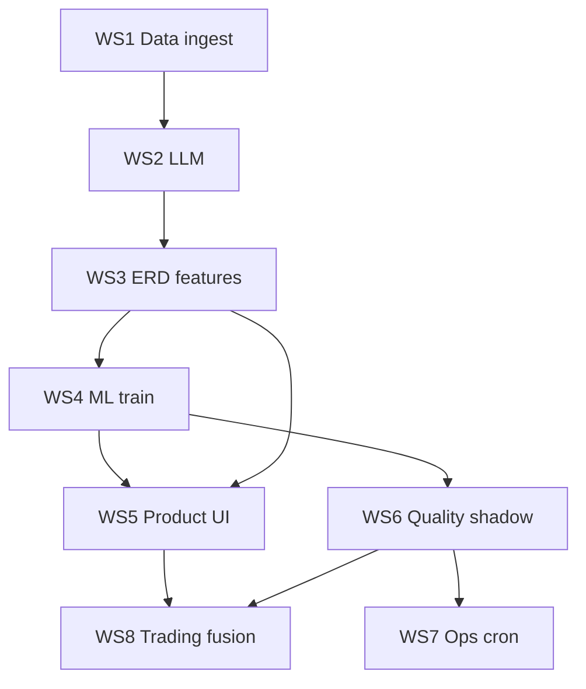

# Earnings Intelligence — roadmap полного продуктового решения

**Аудитория:** продукт, разработка, ops.  
**Связанные документы:**

- [EARNINGS_INTELLIGENCE_PLAN.md](./EARNINGS_INTELLIGENCE_PLAN.md) — архитектура
- [EARNINGS_LLM_ML_LABELS_AND_TRAINING.md](./EARNINGS_LLM_ML_LABELS_AND_TRAINING.md) — LLM ↔ ML, фазы prod
- [EARNINGS_UI_GUIDE.md](./EARNINGS_UI_GUIDE.md) — вкладки `/earnings`
- [EARNINGS_EVENT_AGENT_IMPLEMENTATION_PLAN.md](./EARNINGS_EVENT_AGENT_IMPLEMENTATION_PLAN.md) — фазы 1–5 + стратегия §2
- [TRADE_ML_DATASETS_AND_TARGETS_RU.md](../TRADE_ML_DATASETS_AND_TARGETS_RU.md) §5–§7

**Статус snapshot:** 2026-05-30, prod `110c4fc`.

---

## 1. Что такое «полное продуктовое решение»

Пользователь (оператор / шеф) открывает **один контур** вокруг earnings и получает:

| Этап | Результат | Не торговля |
|------|-----------|-------------|
| **Календарь** | Все отчёты universe с материалами / LLM / ML статусом | — |
| **Brief** | Факты call, scenario, affected peers, **фактические** 1d/5d source + spillover | — |
| **Fusion** | Регрессия 5d + classifier scenario + alignment/conviction | `execution_blocked` до phase D |
| **Spillover** | История: как пиры ходили после прошлых отчётов source | Event-study, не `/corr` |
| **Shadow** | Offline-качество ML на созревших событиях | Advisory gate |
| **Telegram** | Тот же Brief, что UI | — |
| **Analyzer** | Readiness gates, метрики train/shadow | — |

**Полный prod (phase C+)** дополнительно: event-desk алерты, стабильный ML (≥50 LLM labels, valid holdout), закрытые data gaps (quotes, materials junk).

**Полный prod с влиянием на сделки (phase D)** — отдельное решение: `event_fusion` policy + GAME_5M caps, только после backtest и sign-off.

---

## 2. Матрица зрелости (сейчас)

| Слой | Готово | Пробел |
|------|--------|--------|
| **KB / календарь** | ✅ yfinance seed, EARNINGS в KB | Редкие тикеры без KB |
| **Materials** | ✅ sync/ingest cron, SEC, coverage ~100% universe | Fool 429, ARM junk, DELL edge cases |
| **LLM extract** | ✅ tone, scenario_hints, affected, quotes | ~73% events with tone; не все с hints |
| **ERD skeleton** | ✅ 527 rows, `--include-earnings-universe` | 45 rows `no_quotes` |
| **Features earnings_v1** | ✅ 482/527 (91.5%) | 45 без quotes; nightly cron ok |
| **LLM labels** | ⚠️ 23 `llm_scenario_v0` | Нужно **≥80–120** для stable ML |
| **Classifier** | ✅ .cbm, 4 classes, shadow sign 73% | n_train=21, n_valid=0 |
| **Regression** | ✅ Fusion pred, FBV fix | Product .cbm vs earnings grid — разные builders |
| **UI /earnings** | ✅ 7 вкладок, Context bar, intros | Fusion % bias — в работе |
| **Spillover API** | ✅ peer_outcomes (META 10/12 ok) | — |
| **Telegram** | ✅ format_brief_telegram | Нет Fusion в боте |
| **Cron** | ✅ materials, ERD, earnings_v1, ml_refresh | Pipeline не в одном cron (ручной prod_eval) |
| **Trading** | ❌ execution_blocked | event_fusion не реализован |

---

## 3. Восемь workstreams (всё, что нужно)



### WS1 — Data ingest (materials + quotes)

| # | Задача | Скрипт / артефакт | Критерий готовности |
|---|--------|-------------------|---------------------|
| 1.1 | Sync materials registry | `sync_earnings_material_registry.py` cron `:18 */2` | `materials_symbol_coverage_rate ≥ 0.9` |
| 1.2 | Ingest HTML/PDF | `ingest_earnings_materials.py` | parsed/extracted по universe |
| 1.3 | KB anchor для orphan materials | `ensure_kb_and_link_orphan_materials` в sync | DELL-class кейсы закрыты |
| 1.4 | Seed quotes для ERD gaps | `seed_quotes_for_event_reaction_dataset.py --include-all-dataset-symbols` | **45 → &lt;10** `no_quotes` |
| 1.5 | yfinance KB events | `ingest_earnings_event_details_yfinance.py --ensure-kb-events` | Все universe с ≥1 EARNINGS row |

### WS2 — LLM extraction & labels

| # | Задача | Скрипт | Критерий |
|---|--------|--------|----------|
| 2.1 | Extract facts | `extract_earnings_material_facts.py` cron `:25 */6` | `events_llm_rate ≥ 0.8` |
| 2.2 | Apply scenario labels | `apply_earnings_scenario_labels.py --universe` | **`llm_scenario_labels ≥ 80`** |
| 2.3 | Junk cleanup | audit + filter ARM/Fool PDFs | Меньше ложных hints |
| 2.4 | Manual override | `label_source=manual` для спорных | Документировать в runbook |

См. [EARNINGS_LLM_ML_LABELS_AND_TRAINING.md](./EARNINGS_LLM_ML_LABELS_AND_TRAINING.md) §3–§6.

### WS3 — ERD & features

| # | Задача | Скрипт | Cron |
|---|--------|--------|------|
| 3.1 | Skeleton from KB | `build_event_reaction_dataset.py --include-earnings-universe` | 23:33 пн–пт |
| 3.2 | Outcomes + rule labels | `backfill_event_reaction_labeling.py` | 23:36 regime_v1 all symbols |
| 3.3 | Earnings grid features | same + `quotes_regime_earnings_v1` | 23:37 `--include-earnings-universe` |
| 3.4 | Peer graph | `seed_peer_graph_edges.py`, `peer_graph_edge`, [PEER_GRAPH_PRINCIPLES.md](./PEER_GRAPH_PRINCIPLES.md) | 69 edges, 16 sources (META/NVDA/…) |

Target: **earnings_v1 ≥ 95%** строк ERD universe.

### WS4 — ML train (regression + classifier)

| # | Задача | Скрипт | Gate |
|---|--------|--------|------|
| 4.1 | Scenario classifier | `train_event_reaction_scenario_classifier.py` | n_train ≥ 50, n_valid ≥ 15 |
| 4.2 | Event regression | `train_event_reaction_catboost.py` | RMSE_valid ≤ 0.12 |
| 4.3 | Orchestrator | `run_earnings_ml_refresh.py` | dry `:30 */6`, full 23:52 |
| 4.4 | Prod eval end-to-end | `run_earnings_intelligence_prod_eval.py` | JSON `last_earnings_intelligence_prod_eval.json` |

Config: `ML_READINESS_EARNINGS_*` в [ML_DATA_QUALITY_PIPELINE.md](../ML_DATA_QUALITY_PIPELINE.md).

### WS5 — Product UI / API / Telegram

| # | Задача | Где | Статус |
|---|--------|-----|--------|
| 5.1 | Sticky Context (ticker/date) | `earnings_intelligence.html` | ✅ |
| 5.2 | Brief tab + spillover table | API + UI | ✅ |
| 5.3 | Fusion: reg **%** + bias labels | UI Fusion block | 🔄 |
| 5.4 | ML layers актуальные counts | `/api/earnings/ml-layers` | ✅ |
| 5.5 | Shadow legend + scored counts | UI | ✅ |
| 5.6 | Telegram `/earnings` = Brief | `format_brief_telegram` | ✅ |
| 5.7 | Telegram Fusion (optional) | bot handler | ❌ backlog |
| 5.8 | Guide `/earnings/guide` | sync с roadmap | 🔄 |

### WS6 — Quality & shadow

| # | Задача | Метрика | Target (phase B) |
|---|--------|---------|------------------|
| 6.1 | Shadow report | `run_earnings_scenario_shadow_report.py` | n_matured ≥ 50 |
| 6.2 | Sign accuracy | aggregate | ≥ 58% stable |
| 6.3 | Class accuracy | llm_scenario_v0 only | ≥ 40% при ≥5 классах |
| 6.4 | Pseudo PnL | after round-trip cost | &gt; 0 на rolling window |
| 6.5 | Analyzer block | `earnings_intelligence.gate` | `overall_grid_ready` + shadow |

### WS7 — Ops & monitoring

| # | Задача | Деталь |
|---|--------|--------|
| 7.1 | Deploy path | git push → `deploy_from_github.sh` |
| 7.2 | Crontab parity | VM = `crontab/lse-docker.crontab` |
| 7.3 | Logs | `logs/earnings_*`, `event_reaction_*` |
| 7.4 | Readiness JSON | `/app/logs/ml/ml_data_quality/last_earnings_intelligence_readiness.json` |
| 7.5 | Weekly prod_eval | cron или runbook (materials→ML) |

### WS8 — Trading integration (phase D+, не сейчас)

| # | Задача | Зависимость |
|---|--------|-------------|
| 8.1 | `event_fusion` policy module | phase C sign-off |
| 8.2 | GAME_5M sizing cap from scenario proba | backtest |
| 8.3 | Veto rules (miss_or_guide_breakdown) | shadow evidence |
| 8.4 | `EARNINGS_SCENARIO_CLASSIFIER_ENABLED` in bot | feature flag |
| 8.5 | Analyzer one-knob tuning | existing contour |

---

## 4. Фазы delivery (Definition of Done)

### Phase A — Advisory MVP ✅ (2026-05-29…30)

- [x] `/earnings` UI + API
- [x] Brief + Spillover + Fusion + Shadow + ML layers
- [x] Classifier pilot + shadow gate ready
- [x] Cron ERD + earnings_v1 + ml_refresh
- [x] Docs: LLM/ML, plans 29–30

### Phase B — Data & ML maturity (цель: 2–4 недели)

| Критерий | Сейчас | Target |
|----------|--------|--------|
| LLM scenario labels | 23 | **≥ 80** |
| Classifier n_train | 21 | **≥ 50** |
| n_valid holdout | 0 | **≥ 15** |
| earnings_v1 coverage | 91.5% | **≥ 95%** |
| Shadow n_matured | 33 | **≥ 50** |
| Materials LLM rate | ~73% | **≥ 80%** |

**Exit:** Fusion/Shadow стабильны; оператор доверяет advisory при разборе отчётов.

### Phase C — Event desk product (цель: +2 недели после B)

- [ ] Алерт Telegram: «META отчитался → Brief link + top scenario + top 3 peers»
- [ ] Fusion reg в **%** + явные bias labels в UI
- [ ] Events table: фильтры согласованы с Context
- [ ] Runbook: «что делать если brief partial / no materials»
- [ ] Weekly readiness review в analyzer

**Exit:** ежедневный workflow без ручного prod_eval.

### Phase D — Soft influence GAME_5M (только после C + backtest)

- [ ] `services/event_fusion_policy.py` (draft)
- [ ] Shadow walk-forward backtest documented
- [ ] Config flags + analyzer promotion_plan
- [ ] Manual sign-off

**Exit:** опциональный cap/veto в боте, не автоторговля.

### Phase E — Autonomous earnings trading (не в scope 2026-Q2)

Peer-level ML, GNN R&D, hundreds of labels — см. [EARNINGS_LLM_ML_LABELS_AND_TRAINING.md](./EARNINGS_LLM_ML_LABELS_AND_TRAINING.md) §10.

---

## 5. Приорitized backlog (единый список)

| P | ID | Workstream | Задача | Оценка |
|---|-----|------------|--------|--------|
| **P0** | B1 | WS2 | Поднять extract limit + прогнать extract по events без hints | 1 день |
| **P0** | B2 | WS2 | `apply_earnings_scenario_labels` → **≥40** labels | после B1 |
| **P0** | B3 | WS1 | `seed_quotes` для 45 `no_quotes` | 0.5 дня |
| **P1** | B4 | WS5 | Fusion UI: reg **%**, regression_bias, scenario_bias | 2 ч |
| **P1** | B5 | WS4 | Дождаться **≥50** matured shadow events | время + cron |
| **P1** | B6 | WS7 | Weekly `run_earnings_intelligence_prod_eval` в runbook/cron | 0.5 дня |
| **P2** | B7 | WS5 | Telegram краткий Fusion (scenario + reg %) | 1 день |
| **P2** | B8 | WS1 | Materials junk audit (ARM, bare PDF) | 1 день |
| **P2** | B9 | WS6 | Weighted spillover score (validation metric) | 2–3 дня |
| **P3** | B10 | WS8 | event_fusion policy design doc | после phase C |

---

## 6. Единый smoke-checklist (после каждого deploy)

```bash
# На VM в lse-bot:
# 1. HTML context bar
curl -s http://127.0.0.1:8080/earnings | grep -q eiContextBar && echo OK context

# 2. META + MSFT Brief/Fusion/Spillover 2026-04-29 (python urllib — см. runbook)

# 3. Readiness
cat /app/logs/ml/ml_data_quality/last_earnings_intelligence_readiness.json | jq .gates.overall_grid_ready

# 4. Shadow
cat /app/logs/ml/ml_data_quality/last_earnings_scenario_shadow.json | jq .aggregate.n_matured,.aggregate.sign_accuracy
```

**Критерии PASS:** Brief status ok; Fusion mismatch=null; spillover peer_outcomes ok≥5 для META; overall_grid_ready=true.

---

## 7. Метрики «product ready» (phase B exit)

| Метрика | SQL / JSON path |
|---------|-----------------|
| LLM labels | `event_reaction_dataset` WHERE `label_source='llm_scenario_v0'` |
| earnings_v1 rows | readiness `labels_and_features.earnings_v1_feature_rows` |
| Classifier train | `last_event_reaction_scenario_train_metrics.json` → n_train, n_valid |
| Shadow | `last_earnings_scenario_shadow.json` → aggregate |
| Materials | readiness `sources.materials_symbol_coverage_rate` |

---

## 8. Ссылки на исполнение

| День | План |
|------|------|
| 2026-05-29 | [EARNINGS_PLAN_2026-05-29.md](./EARNINGS_PLAN_2026-05-29.md) ✅ |
| 2026-05-30 | [EARNINGS_PLAN_2026-05-30.md](./EARNINGS_PLAN_2026-05-30.md) ✅ |
| **2026-05-31** | [EARNINGS_PLAN_2026-05-31.md](./EARNINGS_PLAN_2026-05-31.md) — sprint phase B ✅ (ev1 494/494) |
| **2026-06-01** | [EARNINGS_PLAN_2026-06-01.md](./EARNINGS_PLAN_2026-06-01.md) — Phase C peer spillover ML |

---

*Обновлять при закрытии phase B/C и при изменении trading policy.*
